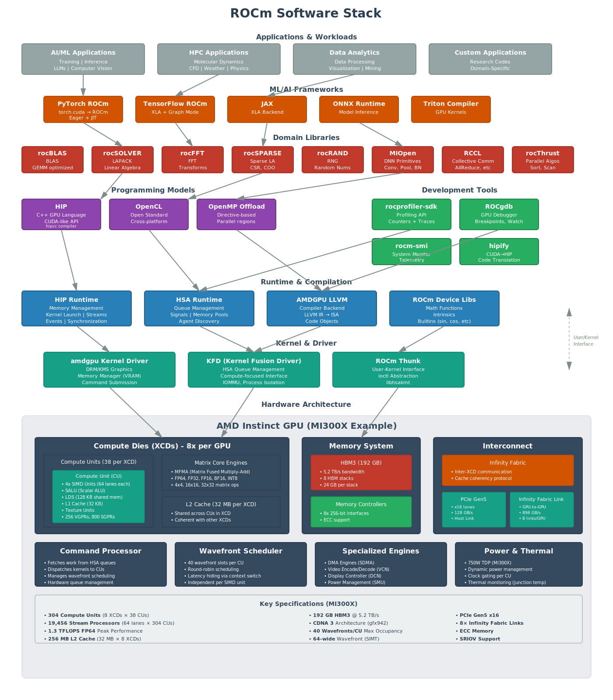

# ROCm Stack Overview

A comprehensive visualization of the complete AMD ROCm software and hardware stack, showing how all components interconnect from applications down to silicon.

## Complete ROCm Stack Diagram



<details>
<summary>View text description of stack layers</summary>

### Layer 7: Applications & Workloads
- **AI/ML Applications**: Training, Inference, LLMs, Computer Vision
- **HPC Applications**: Molecular Dynamics, CFD, Weather Simulation, Physics
- **Data Analytics**: Data Processing, Visualization, Data Mining
- **Custom Applications**: Research Codes, Domain-Specific Software

### Layer 6: ML/AI Frameworks
- **PyTorch ROCm**: Native ROCm backend, torch.cuda compatibility
- **TensorFlow ROCm**: XLA compiler, graph optimizations
- **JAX**: XLA backend for automatic differentiation
- **ONNX Runtime**: Model inference optimization
- **Triton Compiler**: GPU kernel programming language

### Layer 5: Domain Libraries
**Math Libraries:**
- **rocBLAS**: BLAS operations, highly optimized GEMM
- **rocSOLVER**: LAPACK linear algebra solvers
- **rocFFT**: Fast Fourier Transforms
- **rocSPARSE**: Sparse linear algebra (CSR, COO formats)
- **rocRAND**: Random number generation

**ML/Communication Libraries:**
- **MIOpen**: Deep neural network primitives (convolution, pooling, batch norm)
- **RCCL**: Collective communication (AllReduce, AllGather, etc.)
- **rocThrust**: Parallel algorithms (sort, scan, reduce)

### Layer 4: Programming Models & Development Tools
**Programming Models:**
- **HIP**: C++ GPU language with CUDA-like API (hipcc compiler)
- **OpenCL**: Open standard for cross-platform GPU programming
- **OpenMP Offload**: Directive-based parallel programming

**Development Tools:**
- **rocprofiler-sdk**: Comprehensive profiling API with counters and traces
- **ROCgdb**: GPU debugger with breakpoints and variable inspection
- **rocm-smi**: System management interface for GPU telemetry
- **hipify**: Automated CUDA to HIP code translation

### Layer 3: Runtime & Compilation
- **HIP Runtime**: Memory management, kernel launch, streams, events, synchronization
- **HSA Runtime**: Queue management, signals, memory pools, agent discovery
- **AMDGPU LLVM**: Compiler backend (LLVM IR to ISA, code object generation)
- **ROCm Device Libs**: Math functions, intrinsics, built-in operations

### Layer 2: Kernel & Driver
- **amdgpu Kernel Driver**: DRM/KMS graphics, VRAM management, command submission
- **KFD (Kernel Fusion Driver)**: HSA queue management, compute interface, IOMMU
- **ROCm Thunk**: User-kernel interface abstraction (libhsakmt)

### Layer 1: Hardware Architecture (MI300X Example)
**Compute:**
- 8 Compute Dies (XCDs)
- 304 Compute Units (38 per XCD)
- Each CU: 4 SIMD units (64 lanes each), SALU, 128KB LDS, 32KB L1 cache
- Matrix Core Engines: MFMA operations for FP64/32/16, BF16, INT8
- 256 MB total L2 cache (32 MB per XCD)

**Memory:**
- 192 GB HBM3 memory
- 5.2 TB/s bandwidth
- 8 HBM stacks (24 GB each)
- ECC support

**Interconnect:**
- Infinity Fabric: Inter-XCD communication with cache coherency
- PCIe Gen5 x16: 128 GB/s host link
- Infinity Fabric Links: 896 GB/s GPU-to-GPU (8 links per GPU)

**Execution:**
- Command Processor: Fetches from HSA queues, dispatches to CUs
- Wavefront Scheduler: 40 slots per CU, round-robin scheduling
- Specialized Engines: DMA (SDMA), Video (VCN), Display (DCN)

</details>

## Understanding the Stack

### Data Flow

The ROCm stack enables seamless data flow from high-level applications to low-level hardware:

1. **Application Layer** → Frameworks transform neural networks or algorithms into computation graphs
2. **Framework Layer** → Libraries provide optimized implementations of common operations
3. **Library Layer** → Programming models (HIP/OpenCL) express parallel computations
4. **Runtime Layer** → HSA runtime manages queues and hardware resources
5. **Driver Layer** → Kernel drivers control hardware access and memory
6. **Hardware Layer** → Physical execution on Compute Units and memory system

### Key Integration Points

**Applications ↔ Frameworks:**
- PyTorch/TensorFlow provide high-level APIs
- Frameworks generate computation graphs
- Automatic differentiation for training

**Frameworks ↔ Libraries:**
- Frameworks call rocBLAS for matrix operations
- MIOpen provides optimized DNN kernels
- RCCL enables multi-GPU training

**Libraries ↔ Programming Models:**
- Libraries implemented in HIP for portability
- Direct use of wavefront intrinsics for performance
- Leverage shared memory (LDS) and synchronization

**Programming Models ↔ Runtime:**
- HIP runtime manages memory and kernel launches
- HSA runtime provides low-level queue access
- Asynchronous execution via streams

**Runtime ↔ Drivers:**
- User-space queue submission (minimal overhead)
- Memory mapping and management
- Signal-based synchronization

**Drivers ↔ Hardware:**
- Direct hardware queue access
- Command processor dispatches wavefronts
- Memory controllers manage HBM access

## Architecture Highlights

### CDNA 3 Architecture (MI300X)

**Compute Specifications:**
- **304 Compute Units** across 8 XCDs
- **19,456 Stream Processors** (64 lanes × 304 CUs)
- **1.3 PFLOPS FP64** peak performance
- **40 wavefronts/CU** maximum occupancy
- **64-wide wavefronts** (SIMT execution)

**Memory Hierarchy:**
- **Registers**: 256 VGPRs, 800 SGPRs per wavefront
- **LDS**: 128 KB per CU (shared within workgroup)
- **L1 Cache**: 32 KB per CU
- **L2 Cache**: 256 MB total (32 MB per XCD)
- **HBM3**: 192 GB at 5.2 TB/s

**Matrix Acceleration:**
- MFMA instructions for AI/ML workloads
- FP64, FP32, FP16, BF16, INT8 datatypes
- 4×4, 16×16, 32×32 matrix sizes
- Optimized for GEMM operations

### Execution Model

**Kernel Dispatch:**
1. Application launches kernel via HIP
2. Runtime submits packet to HSA queue
3. Command processor picks up work
4. Wavefronts dispatched to available CUs
5. SIMD units execute 64 threads in lockstep

**Wavefront Execution:**
- 64 work-items execute as single wavefront
- All threads execute same instruction (SIMT)
- Divergence causes serial execution of branches
- Scheduler switches between wavefronts to hide latency

**Memory Access:**
- Coalesced accesses combine into fewer transactions
- L1 cache per CU (32 KB)
- L2 cache shared across XCD (32 MB)
- HBM provides massive bandwidth (5.2 TB/s)

## Development Workflow

### Typical HIP Application Development

```
1. Write HIP Kernel
   ↓
2. Compile with hipcc
   ↓ (AMDGPU LLVM)
3. Generate Code Object
   ↓
4. Launch via HIP Runtime
   ↓ (HSA Runtime)
5. Queue Submission
   ↓ (Kernel Driver)
6. Execute on CUs
   ↓
7. Profile with rocprofiler
   ↓
8. Debug with ROCgdb
   ↓
9. Optimize and Iterate
```

### Performance Optimization Cycle

```
1. Profile with rocprofiler-sdk
   → Identify bottlenecks (compute vs memory)

2. Analyze Metrics
   → Occupancy, VALU utilization, memory bandwidth

3. Optimize Code
   → Coalesce memory access
   → Maximize occupancy
   → Minimize divergence
   → Use LDS effectively

4. Verify with ROCgdb
   → Check correctness
   → Inspect register usage

5. Measure Improvement
   → Re-profile with counters
   → Compare before/after
```

## Multi-GPU Scaling

### Communication Options

**Infinity Fabric:**
- Direct GPU-to-GPU communication
- 896 GB/s per link (8 links total)
- Cache coherent across GPUs
- Ideal for tightly coupled workloads

**RCCL:**
- Collective operations (AllReduce, Broadcast)
- Optimized communication patterns
- Multi-node support via RDMA
- Essential for distributed training

**PCIe:**
- Host-GPU communication
- 128 GB/s (Gen5 x16)
- Sufficient for most data transfers

## ROCm Ecosystem

### Supported Platforms

**Operating Systems:**
- Ubuntu 20.04, 22.04
- RHEL 8.x, 9.x
- SLES 15 SP3+

**GPU Generations:**
- **CDNA**: MI300X, MI250X, MI210, MI100
- **RDNA**: RX 7900 series (gaming GPUs with compute)
- **GCN**: Legacy support (Vega, Polaris)

### Installation

```bash
# Ubuntu example
wget https://repo.radeon.com/amdgpu-install/latest/ubuntu/focal/amdgpu-install_*.deb
sudo apt install ./amdgpu-install_*.deb
sudo amdgpu-install --usecase=rocm
```

### Verification

```bash
# Check ROCm installation
rocminfo

# List GPUs
rocm-smi

# Verify HIP
hipconfig

# Run sample
cd /opt/rocm/samples/0_Introduction/bit_extract
make
./bit_extract
```

## Common Use Cases

### AI/ML Training
- **Frameworks**: PyTorch, TensorFlow
- **Libraries**: rocBLAS (GEMM), MIOpen (convolutions), RCCL (multi-GPU)
- **Hardware**: Matrix cores for FP16/BF16, HBM bandwidth

### Scientific Computing
- **Programming**: HIP, OpenMP
- **Libraries**: rocBLAS, rocSOLVER, rocFFT
- **Hardware**: FP64 performance, large memory capacity

### Inference Deployment
- **Frameworks**: ONNX Runtime, TensorRT-like optimizations
- **Libraries**: MIOpen for operators
- **Hardware**: Batching for throughput, FP16 for speed

## Comparison to Other Stacks

### ROCm vs CUDA

| Aspect | ROCm | CUDA |
|--------|------|------|
| **Language** | HIP (C++) | CUDA C++ |
| **Portability** | AMD + NVIDIA | NVIDIA only |
| **Open Source** | Yes (mostly) | No |
| **Wavefront Size** | 64 | 32 (warp) |
| **Shared Memory** | LDS | Shared memory |
| **Math Libraries** | rocBLAS, rocFFT | cuBLAS, cuFFT |
| **DNN Library** | MIOpen | cuDNN |
| **Profiler** | rocprofiler-sdk | NVIDIA Nsight |

### Migration Path

**CUDA → HIP:**
1. Use hipify tools for automatic conversion
2. Manual fixes for CUDA-specific features
3. Test and validate functionality
4. Performance tuning for AMD architecture

## Additional Resources

**Official Documentation:**
- [ROCm Documentation](https://rocm.docs.amd.com/)
- [HIP Programming Guide](https://rocm.docs.amd.com/projects/HIP/en/latest/)
- [rocBLAS Documentation](https://rocm.docs.amd.com/projects/rocBLAS/en/latest/)

**Performance:**
- [AMD Instinct Tuning Guides](https://www.amd.com/en/products/accelerators/instinct.html)
- [Infinity Hub](https://www.amd.com/en/technologies/infinity-hub) - Optimized containers

**Community:**
- [ROCm GitHub](https://github.com/RadeonOpenCompute/ROCm)
- [AMD Developer Forums](https://community.amd.com/t5/rocm/ct-p/amd-rocm)

---

**Related:** [ROCm](#rocm), [HIP](#hip), [HSA](#hsa-heterogeneous-system-architecture), [Compute Unit](#compute-unit-cu), [Wavefront](#wavefront)
