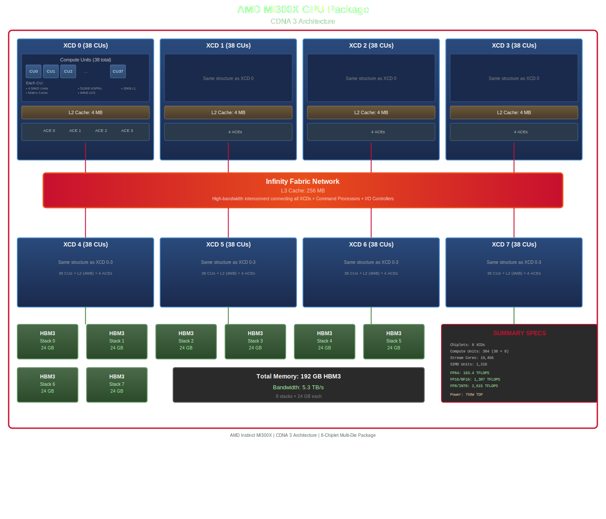
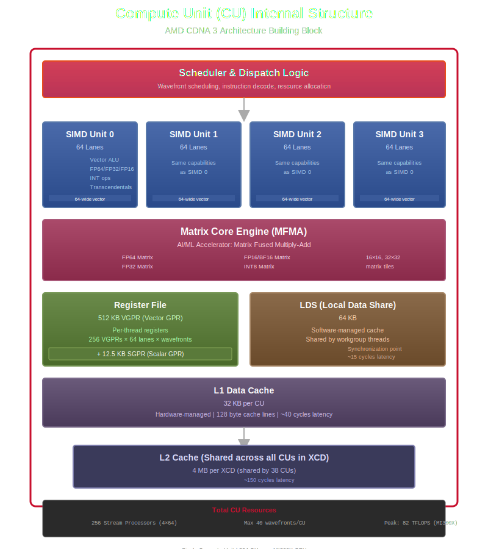
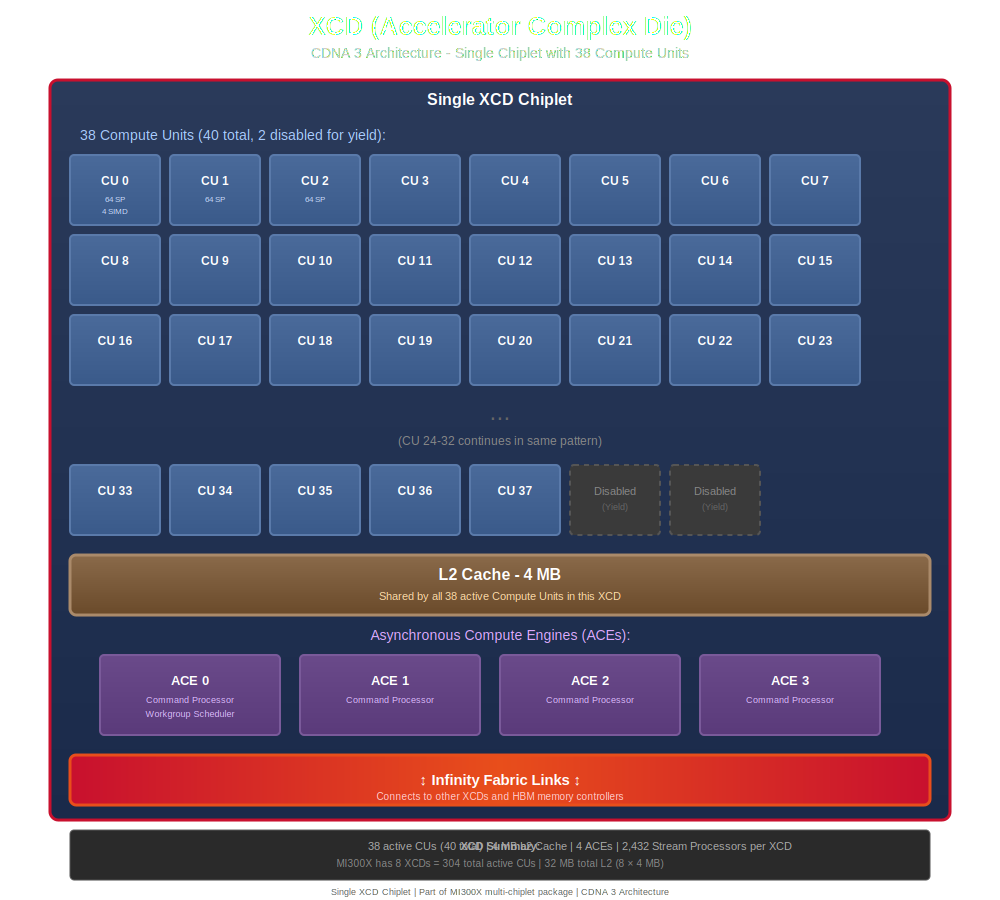
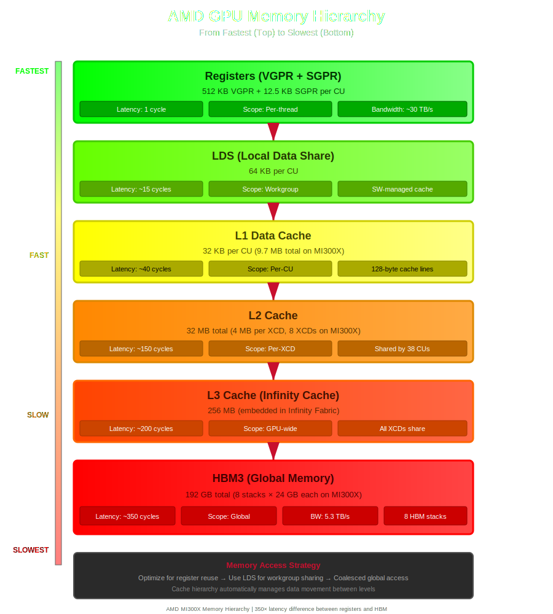
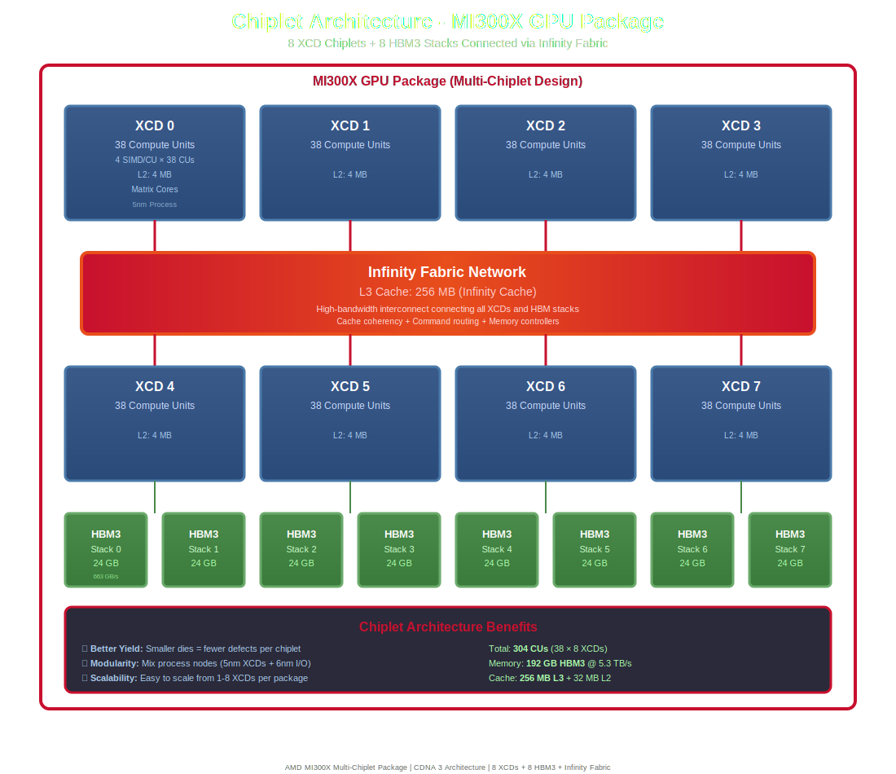

# Device Hardware

Physical components and architecture of AMD GPUs.

## Complete AMD GPU Architecture (MI300X)

The AMD Instinct MI300X represents the pinnacle of AMD's CDNA 3 architecture, featuring a revolutionary multi-chiplet design with 8 Accelerator Complex Dies (XCDs) integrated into a single package.

### Architecture Overview



<details>
<summary>View ASCII diagram</summary>

```
┌─────────────────────────────────────────────────────────────────────────────────────────────────────┐
│                                    AMD MI300X GPU Package                                            │
│                                   (CDNA 3 Architecture)                                              │
├─────────────────────────────────────────────────────────────────────────────────────────────────────┤
│                                                                                                       │
│  ┌───────────────────────┐  ┌───────────────────────┐  ┌───────────────────────┐  ┌───────────────┐│
│  │   XCD 0 (38 CUs)      │  │   XCD 1 (38 CUs)      │  │   XCD 2 (38 CUs)      │  │  XCD 3 (38 CUs││
│  ├───────────────────────┤  ├───────────────────────┤  ├───────────────────────┤  ├───────────────┤│
│  │ ┌─────────────────┐   │  │ ┌─────────────────┐   │  │ ┌─────────────────┐   │  │ ┌─────────────┤│
│  │ │  Compute Units  │   │  │ │  Compute Units  │   │  │ │  Compute Units  │   │  │ │  Compute Un││
│  │ │  ┌───┬───┬───┐  │   │  │ │  ┌───┬───┬───┐  │   │  │ │  ┌───┬───┬───┐  │   │  │ │  ┌───┬───┬─││
│  │ │  │CU0│CU1│CU2│  │   │  │ │  │CU │CU │CU │  │   │  │ │  │CU │CU │CU │  │   │  │ │  │CU │CU │C││
│  │ │  ├───┼───┼───┤  │   │  │ │  ├───┼───┼───┤  │   │  │ │  ├───┼───┼───┤  │   │  │ │  ├───┼───┼─││
│  │ │  │CU3│CU4│CU5│  │   │  │ │  │CU │CU │CU │  │   │  │ │  │CU │CU │CU │  │   │  │ │  │CU │CU │C││
│  │ │  ├───┴───┴───┤  │   │  │ │  ├───┴───┴───┤  │   │  │ │  ├───┴───┴───┤  │   │  │ │  ├───┴───┴─││
│  │ │  │  ... 38   │  │   │  │ │  │  ... 38   │  │   │  │ │  │  ... 38   │  │   │  │ │  │  ... 38 ││
│  │ │  │   total   │  │   │  │ │  │   total   │  │   │  │ │  │   total   │  │   │  │ │  │   total ││
│  │ │  └───────────┘  │   │  │ │  └───────────┘  │   │  │ │  └───────────┘  │   │  │ │  └─────────││
│  │ │                 │   │  │ │                 │   │  │ │                 │   │  │ │             ││
│  │ │ Each CU has:    │   │  │ │                 │   │  │ │                 │   │  │ │             ││
│  │ │ • 4 SIMD Units  │   │  │ │                 │   │  │ │                 │   │  │ │             ││
│  │ │ • Matrix Cores  │   │  │ │                 │   │  │ │                 │   │  │ │             ││
│  │ │ • 512KB VGPRs   │   │  │ │                 │   │  │ │                 │   │  │ │             ││
│  │ │ • 64KB LDS      │   │  │ │                 │   │  │ │                 │   │  │ │             ││
│  │ │ • 32KB L1 Cache │   │  │ │                 │   │  │ │                 │   │  │ │             ││
│  │ └─────────────────┘   │  │ └─────────────────┘   │  │ └─────────────────┘   │  │ └─────────────││
│  │                       │  │                       │  │                       │  │               ││
│  │  L2 Cache: 4 MB       │  │  L2 Cache: 4 MB       │  │  L2 Cache: 4 MB       │  │  L2 Cache: 4 M││
│  │                       │  │                       │  │                       │  │               ││
│  │  ┌──────────────┐     │  │  ┌──────────────┐     │  │  ┌──────────────┐     │  │  ┌──────────┐││
│  │  │ ACE 0│ACE 1  │     │  │  │ ACE 0│ACE 1  │     │  │  │ ACE 0│ACE 1  │     │  │  │ ACE 0│ACE││
│  │  │ ACE 2│ACE 3  │     │  │  │ ACE 2│ACE 3  │     │  │  │ ACE 2│ACE 3  │     │  │  │ ACE 2│ACE││
│  │  └──────────────┘     │  │  └──────────────┘     │  │  └──────────────┘     │  │  └──────────┘││
│  └───────────┬───────────┘  └───────────┬───────────┘  └───────────┬───────────┘  └───────┬───────││
│              │                          │                          │                      │       ││
│              └──────────────────────────┼──────────────────────────┼──────────────────────┘       ││
│                                         │                          │                              ││
│  ┌──────────────────────────────────────┴──────────────────────────┴─────────────────────────────┐│
│  │                         Infinity Fabric Network (L3 Cache: 256 MB)                            ││
│  │                     High-bandwidth interconnect connecting all XCDs                           ││
│  │                        + Command Processors + I/O Controllers                                 ││
│  └──────────────────────────────────────┬──────────────────────────┬─────────────────────────────┘│
│              ┌──────────────────────────┼──────────────────────────┼──────────────────────┐       ││
│              │                          │                          │                      │       ││
│  ┌───────────▼───────────┐  ┌───────────▼───────────┐  ┌───────────▼───────────┐  ┌─────▼─────────││
│  │   XCD 4 (38 CUs)      │  │   XCD 5 (38 CUs)      │  │   XCD 6 (38 CUs)      │  │  XCD 7 (38 CUs││
│  ├───────────────────────┤  ├───────────────────────┤  ├───────────────────────┤  ├───────────────┤│
│  │ Same structure as     │  │ Same structure as     │  │ Same structure as     │  │ Same structure││
│  │ XCD 0-3 above         │  │ XCD 0-3 above         │  │ XCD 0-3 above         │  │ XCD 0-3 above ││
│  │ 38 CUs + L2 + ACEs    │  │ 38 CUs + L2 + ACEs    │  │ 38 CUs + L2 + ACEs    │  │ 38 CUs + L2 + ││
│  └───────────┬───────────┘  └───────────┬───────────┘  └───────────┬───────────┘  └───────┬───────││
│              │                          │                          │                      │       ││
│  ────────────▼──────────────────────────▼──────────────────────────▼──────────────────────▼────── ││
│                                                                                                     ││
│  ┌─────────────┐  ┌─────────────┐  ┌─────────────┐  ┌─────────────┐  ┌─────────────┐  ┌─────────┐│
│  │  HBM3       │  │  HBM3       │  │  HBM3       │  │  HBM3       │  │  HBM3       │  │  HBM3   ││
│  │  Stack 0    │  │  Stack 1    │  │  Stack 2    │  │  Stack 3    │  │  Stack 4    │  │  Stack 5││
│  │  24 GB      │  │  24 GB      │  │  24 GB      │  │  24 GB      │  │  24 GB      │  │  24 GB  ││
│  └─────────────┘  └─────────────┘  └─────────────┘  └─────────────┘  └─────────────┘  └─────────┘│
│  ┌─────────────┐  ┌─────────────┐                                                                 ││
│  │  HBM3       │  │  HBM3       │                                                                 ││
│  │  Stack 6    │  │  Stack 7    │         Total Memory: 192 GB HBM3                               ││
│  │  24 GB      │  │  24 GB      │         Bandwidth: 5.3 TB/s                                     ││
│  └─────────────┘  └─────────────┘                                                                 ││
│                                                                                                     ││
├─────────────────────────────────────────────────────────────────────────────────────────────────────┤
│                                  SUMMARY SPECIFICATIONS                                             │
├─────────────────────────────────────────────────────────────────────────────────────────────────────┤
│  Chiplets:        8 XCDs (Accelerator Complex Dies)                                                │
│  Compute Units:   304 total (38 per XCD)                                                           │
│  Stream Cores:    19,456 (64 per CU)                                                               │
│  SIMD Units:      1,216 (4 per CU × 304 CUs)                                                       │
│                                                                                                     │
│  Memory Hierarchy:                                                                                 │
│    Registers:     512 KB VGPR + 12.5 KB SGPR (per CU)                                              │
│    LDS:           64 KB per CU                                                                     │
│    L1 Cache:      32 KB per CU (9.7 MB total)                                                      │
│    L2 Cache:      32 MB total (4 MB per XCD)                                                       │
│    L3 Cache:      256 MB (Infinity Cache)                                                          │
│    HBM3:          192 GB @ 5.3 TB/s                                                                │
│                                                                                                     │
│  Compute Performance:                                                                              │
│    FP64:          163.4 TFLOPS                                                                     │
│    FP32:          163.4 TFLOPS                                                                     │
│    FP16/BF16:     1,307.4 TFLOPS                                                                   │
│    FP8/INT8:      2,614.9 TFLOPS                                                                   │
│                                                                                                     │
│  Interconnect:    7 Infinity Fabric links per GPU (full-mesh 8-GPU topology)                       │
│  Power:           750W TDP                                                                         │
│  Process:         5nm (XCDs) + 6nm (I/O dies)                                                      │
└─────────────────────────────────────────────────────────────────────────────────────────────────────┘
```

</details>

### Key Features

**Multi-Chiplet Design:**
- 8 XCDs connected via Infinity Fabric
- Each XCD contains 38 Compute Units
- Total of 304 CUs across the entire package
- Enables massive parallel processing capability

**Memory System:**
- 192 GB HBM3 memory (8 stacks × 24 GB)
- 5.3 TB/s memory bandwidth
- 256 MB L3 Infinity Cache for bandwidth amplification
- 32 MB L2 cache distributed across XCDs
- Massive 155 MB of register file space

**Compute Capabilities:**
- 19,456 stream processors (64 per CU)
- Matrix cores in every CU for AI/ML acceleration
- Mixed precision support: FP64, FP32, TF32, FP16, BF16, FP8, INT8
- Peak AI performance: 2.6 PFLOPS (FP8)

**Infinity Fabric:**
- Connects all 8 XCDs within package
- Enables GPU-to-GPU communication in multi-GPU systems
- 7 links per GPU for full-mesh 8-GPU topology
- Critical for distributed training workloads

**Target Applications:**
- Large Language Models (LLMs)
- Deep Learning Training
- High Performance Computing (HPC)
- Scientific Simulations
- AI Inference at Scale

**Comparison to CDNA 2 (MI250X):**
- 38% more compute units (304 vs 220)
- 50% more memory (192 GB vs 128 GB)
- 66% faster memory bandwidth (5.3 TB/s vs 3.2 TB/s)
- 16x larger L3 cache (256 MB vs 16 MB)
- Enhanced AI performance with FP8 support

This architecture represents AMD's most powerful GPU for AI and HPC workloads, competing directly with NVIDIA's H100 and offering superior memory capacity and bandwidth.

## Compute Unit (CU)

The fundamental building block of AMD GPU architecture. A Compute Unit contains SIMD units, vector and scalar ALUs, local data share (LDS) memory, L1 cache, and scheduling hardware. Analogous to NVIDIA's Streaming Multiprocessor (SM).



<details>
<summary>View ASCII diagram</summary>

```
┌─────────────────────────────────────────────┐
│         Compute Unit (CU)                   │
├─────────────────────────────────────────────┤
│  ┌──────────────┐  ┌──────────────┐        │
│  │ SIMD Unit 0  │  │ SIMD Unit 1  │        │
│  │ (64 lanes)   │  │ (64 lanes)   │        │
│  └──────────────┘  └──────────────┘        │
│  ┌──────────────┐  ┌──────────────┐        │
│  │ SIMD Unit 2  │  │ SIMD Unit 3  │        │
│  └──────────────┘  └──────────────┘        │
│                                             │
│  ┌─────────────────────────────────┐       │
│  │   Matrix Core Engine (CDNA)     │       │
│  │   FP64/FP32/FP16/BF16/FP8       │       │
│  └─────────────────────────────────┘       │
│                                             │
│  ┌──────────────────────────────────────┐  │
│  │ Register File (VGPRs + SGPRs)        │  │
│  │ CDNA 3: 512 KB VGPR + 12.5 KB SGPR   │  │
│  └──────────────────────────────────────┘  │
│                                             │
│  ┌──────────────────────────────────────┐  │
│  │ LDS (Local Data Share) - 64 KB       │  │
│  └──────────────────────────────────────┘  │
│                                             │
│  ┌──────────────────────────────────────┐  │
│  │ L1 Cache - 32 KB (CDNA 3)            │  │
│  └──────────────────────────────────────┘  │
│                                             │
│  ┌──────────────────────────────────────┐  │
│  │ Scheduler & Dispatch Logic           │  │
│  └──────────────────────────────────────┘  │
└─────────────────────────────────────────────┘
```

</details>

**Key characteristics:**
- Executes wavefronts (64 work-items each)
- Has dedicated LDS (Local Data Share) memory (64 KB)
- Includes scalar and vector execution units
- Contains register files (VGPRs and SGPRs)
- L1 vector cache (32 KB in CDNA 3, 16 KB in CDNA 2/1)
- Multiple CUs per GPU (e.g., MI300X has 304 CUs)

**Architecture details:**
- CDNA 3: 40 CUs per XCD (38 active)
- CDNA 2: 110 CUs per GCD (MI250X), 104 CUs (MI210)
- CDNA 1: 120 CUs (MI100)

**Related:** [Wavefront](#wavefront), [Workgroup](#workgroup), [LDS](#lds-local-data-share), [SIMD Unit](#simd-unit)

## SIMD Unit

Single Instruction, Multiple Data execution units within a Compute Unit that execute wavefront instructions.

**Key characteristics:**
- Executes vector operations across a wavefront
- Multiple SIMD units per CU
- Processes 64 work-items in a wavefront simultaneously
- Supports FP32, FP64, FP16, INT operations
- Works in lockstep - all lanes execute the same instruction

**Function:**
- Vector ALU operations
- Memory load/store operations
- Arithmetic and logic operations
- Transcendental functions

**Related:** [Compute Unit](#compute-unit-cu), [Wavefront](#wavefront), [Work-Item](#work-item)

## Matrix Core Engine

Specialized hardware accelerators for matrix multiplication operations, crucial for AI and deep learning workloads. Introduced in CDNA architecture.

**Evolution across generations:**

**CDNA 3 (MI300X):**
- FP8/INT8: 2,614.9 TFLOPS (16x faster than FP32)
- FP16/BF16: 1,307.4 TFLOPS (3x improvement over CDNA 2)
- TF32: 4x faster than FP32
- FP32: 163.4 TFLOPS
- FP64: 163.4 TFLOPS
- 4096 FLOPS per clock per CU

**CDNA 2 (MI250X):**
- FP16/BF16: 383 TFLOPS
- INT8: 383 TOPS
- AccVGPR (Accumulation Vector Registers) for matrix operations

**CDNA 1 (MI100):**
- FP16: 184.6 TFLOPS
- INT8: 184.6 TOPS
- First CDNA with matrix acceleration

**Supported data types:**
- FP64 (double precision)
- FP32 (single precision)
- TF32 (TensorFloat-32) - CDNA 3 only
- FP16 (half precision)
- BF16 (Brain Float 16)
- FP8 (8-bit float) - CDNA 3 only
- INT8 (8-bit integer)

**Related:** [rocBLAS](#rocblas), [MIOpen](#miopen), [AccVGPR](#accvgpr-accumulation-vector-registers)

## XCD (Accelerator Complex Die)

The compute chiplet design used in CDNA 3 architecture (MI300 series). Each XCD contains compute units, cache, and command processors.



<details>
<summary>View ASCII diagram</summary>

```
┌─────────────────────────────────────────────────┐
│              XCD (Accelerator Complex Die)      │
├─────────────────────────────────────────────────┤
│                                                 │
│  ┌──────┐ ┌──────┐ ┌──────┐ ┌──────┐ ┌──────┐ │
│  │ CU 0 │ │ CU 1 │ │ CU 2 │ │ CU 3 │ │ CU 4 │ │
│  └──────┘ └──────┘ └──────┘ └──────┘ └──────┘ │
│  ┌──────┐ ┌──────┐ ┌──────┐ ┌──────┐ ┌──────┐ │
│  │ CU 5 │ │ CU 6 │ │ CU 7 │ │ CU 8 │ │ CU 9 │ │
│  └──────┘ └──────┘ └──────┘ └──────┘ └──────┘ │
│                  ... (38 total CUs)             │
│  ┌──────┐ ┌──────┐ ┌──────┐ ┌──────┐ ┌──────┐ │
│  │ CU33 │ │ CU34 │ │ CU35 │ │ CU36 │ │ CU37 │ │
│  └──────┘ └──────┘ └──────┘ └──────┘ └──────┘ │
│                                                 │
│  ┌───────────────────────────────────────────┐ │
│  │      L2 Cache - 4 MB                      │ │
│  └───────────────────────────────────────────┘ │
│                                                 │
│  ┌────────┐ ┌────────┐ ┌────────┐ ┌────────┐  │
│  │ ACE 0  │ │ ACE 1  │ │ ACE 2  │ │ ACE 3  │  │
│  │(Async  │ │(Async  │ │(Async  │ │(Async  │  │
│  │Compute)│ │Compute)│ │Compute)│ │Compute)│  │
│  └────────┘ └────────┘ └────────┘ └────────┘  │
│                                                 │
│         ↕ Infinity Fabric Links ↕              │
└─────────────────────────────────────────────────┘
```

</details>

**Key characteristics:**
- Contains 40 Compute Units (38 active, 2 disabled for yield management)
- 4 MB shared L2 cache per XCD
- Four Asynchronous Compute Engines (ACEs) for workload distribution
- 32 KB L1 cache per CU
- MI300X has 8 XCDs (304 total active CUs)
- MI300A has 6 XCDs (228 total active CUs)

**Related:** [Compute Unit](#compute-unit-cu), [Chiplet Architecture](#chiplet-architecture), [GCD](#graphics-compute-die-gcd)

## Graphics Compute Die (GCD)

A chiplet in CDNA 2 multi-die GPU designs (MI250 series). The predecessor to XCD in CDNA 3.

**Key characteristics:**
- Contains Compute Units, memory controllers, and cache
- Multiple GCDs can be connected for higher performance
- MI250X has 2 GCDs (110 CUs each)
- MI210 has 1 GCD (104 CUs)
- Enables modular GPU design

**Related:** [Infinity Fabric](#infinity-fabric), [Chiplet Architecture](#chiplet-architecture), [XCD](#xcd-accelerator-complex-die)

## Infinity Fabric

AMD's high-bandwidth, low-latency interconnect technology that connects different components within and between GPUs.

**Key characteristics:**
- Connects chiplets within a single package
- Enables GPU-to-GPU communication
- Supports coherent memory access
- Critical for multi-GPU scaling
- Connects XCDs, I/O dies, and HBM stacks

**Bandwidth and topology:**
- **MI300X**: 7 high-bandwidth links per GPU for inter-GPU communication
  - 8-GPU nodes use full-mesh topology
  - All GPUs can communicate directly
- **MI250X**: Up to 200 GB/s per link between GCDs
- **On-package**: Connects XCDs to I/O dies and HBM memory

```
8-GPU MI300X Node - Full Mesh Topology
(Each GPU has 7 Infinity Fabric links)

        GPU0 ←─────→ GPU1
        ╱ ╲         ╱ ╲
       ╱   ╲       ╱   ╲
      ╱     ╲     ╱     ╲
   GPU7 ←───→ GPU2
     ╲       ╱ ╲       ╱
      ╲     ╱   ╲     ╱
       ╲   ╱     ╲   ╱
      GPU6 ←─────→ GPU3
        ╲         ╱
         ╲       ╱
          ╲     ╱
          GPU5 ←─────→ GPU4

All-to-all connectivity:
• Any GPU can directly communicate with any other
• No need for intermediate hops
• Optimal for collective operations (All-Reduce, etc.)
• Critical for multi-GPU training performance
```

**Use cases:**
- Multi-die GPU coordination
- Multi-GPU training and inference
- Unified memory access across chiplets
- High-speed peer-to-peer transfers

**Related:** [XCD](#xcd-accelerator-complex-die), [GCD](#graphics-compute-die-gcd), [Multi-GPU](#multi-gpu-scaling), [RCCL](#rccl-rocm-communication-collectives-library)

## HBM (High Bandwidth Memory)

Stacked memory technology providing extremely high bandwidth for GPU operations. AMD Instinct GPUs use HBM2, HBM2e, or HBM3.

**Generations:**
- **HBM2**: MI100 (1.2 TB/s), MI50/MI60 (1 TB/s)
- **HBM2e**: MI210 (1.6 TB/s), MI250/MI250X (3.2 TB/s)
- **HBM3**: MI300X (5.3 TB/s), MI300A (5.3 TB/s)

**Key characteristics:**
- Stacked directly on GPU package
- Multiple stacks per GPU
- Much higher bandwidth than GDDR memory
- Lower power consumption per GB transferred

**Related:** [Memory Bandwidth](#memory-bandwidth), [Memory Coalescing](#memory-coalescing)

## LDS (Local Data Share)

Fast, low-latency memory shared among all work-items (threads) within a workgroup. Similar to CUDA's "shared memory."

**Key characteristics:**
- 64 KB per Compute Unit (typical)
- Programmer-managed scratch pad memory
- Much faster than global memory (HBM)
- Used for inter-thread communication within a workgroup
- Critical for performance optimization

**Usage:**
```cpp
// HIP example
__shared__ float sharedData[256];
```

**Related:** [Compute Unit](#compute-unit-cu), [Workgroup](#workgroup), [Memory Hierarchy](#memory-hierarchy)

## L1 Cache

First-level cache within each Compute Unit, providing fast access to frequently used data.

**Key characteristics:**
- CDNA 3: 32 KB vector cache per CU
- CDNA 2/1: 16 KB per CU (typical)
- Lowest latency memory after registers and LDS
- Automatically managed by hardware
- Separate from or combined with LDS depending on architecture

**Related:** [L2 Cache](#l2-cache), [L3 Cache](#l3-cache), [Compute Unit](#compute-unit-cu)

## L2 Cache

Second-level cache shared among Compute Units, typically per XCD or GCD.

**Key characteristics:**
- MI300X: 32 MB total (4 MB per XCD × 8 XCDs)
- MI300A: 24 MB total (4 MB per XCD × 6 XCDs)
- MI250X: 16 MB total (8 MB per GCD × 2 GCDs)
- MI210: 8 MB (single GCD)
- MI100: 16 MB
- Coalesces memory traffic before L3/HBM access

**Related:** [L1 Cache](#l1-cache), [L3 Cache](#l3-cache), [Memory Hierarchy](#memory-hierarchy)

## L3 Cache

Third-level cache providing high-capacity, high-bandwidth shared cache across the GPU.

**Key characteristics:**
- MI300X/MI300A: 256 MB (shared across all XCDs)
- MI250X: 16 MB (8 MB per GCD)
- MI210: 8 MB
- MI100: 8 MB
- MI60/MI50: 4 MB
- Reduces HBM traffic and improves bandwidth efficiency
- Shared across entire GPU package

**Related:** [L2 Cache](#l2-cache), [HBM](#hbm-high-bandwidth-memory), [Memory Hierarchy](#memory-hierarchy)

## Register File

Fast storage for thread-local variables. Each work-item (thread) has its own register allocation.

**Key characteristics:**
- Fastest memory in the hierarchy
- Limited quantity per thread
- Allocated statically per kernel
- Register pressure affects occupancy

**Related:** [Occupancy](#occupancy), [Wave Occupancy](#wave-occupancy)

## VGPR (Vector General Purpose Register)

Vector registers used for per-thread computation in AMD GPUs.

**Key characteristics:**
- Each work-item has exclusive access to its VGPRs
- CDNA 2: Up to 512 VGPRs per work-item
- Used for arithmetic operations
- High VGPR usage can limit occupancy

**Related:** [SGPR](#sgpr-scalar-general-purpose-register), [Register File](#register-file)

## SGPR (Scalar General Purpose Register)

Scalar registers shared across all lanes in a wavefront, used for uniform values.

**Key characteristics:**
- Shared by entire wavefront
- Used for addresses, loop counters, constants
- More efficient than VGPRs for uniform data
- CDNA 3: 12.5 KB per CU
- CDNA 2: 102 SGPRs available per wavefront

**Related:** [VGPR](#vgpr-vector-general-purpose-register), [AccVGPR](#accvgpr-accumulation-vector-registers), [Wavefront](#wavefront)

## AccVGPR (Accumulation Vector Registers)

Specialized vector registers for accumulating results in matrix operations, introduced in CDNA architecture.

**Key characteristics:**
- CDNA 2: 512 KB per CU (in addition to 512 KB VGPR)
- CDNA 1: 256 KB per CU (in addition to 256 KB VGPR)
- CDNA 3: Integrated into unified register file
- Used by Matrix Core Engines
- Optimized for FP16/BF16/INT8 accumulation
- Enables higher throughput for GEMM operations

**Purpose:**
- Accumulate intermediate matrix multiply results
- Reduces register pressure for matrix operations
- Enables higher occupancy for matrix-heavy kernels

**Related:** [VGPR](#vgpr-vector-general-purpose-register), [Matrix Core Engine](#matrix-core-engine)

## Memory Hierarchy

The multi-level structure of memory in AMD GPUs, from fastest/smallest to slowest/largest:



<details>
<summary>View ASCII diagram</summary>

```
                    Speed        Size         Scope
                    ─────────────────────────────────
┌──────────────┐    Fastest      Smallest     Per-thread
│  Registers   │    < 1 cycle    512 KB/CU    (VGPRs/SGPRs)
│  (VGPR/SGPR) │
└──────┬───────┘
       │
┌──────▼───────┐
│     LDS      │    ~25 cycles   64 KB/CU     Per-workgroup
│ (Shared Mem) │
└──────┬───────┘
       │
┌──────▼───────┐
│  L1 Cache    │    ~50 cycles   32 KB/CU     Per-CU
│              │                 (CDNA 3)
└──────┬───────┘
       │
┌──────▼───────┐
│  L2 Cache    │    ~150 cycles  4 MB/XCD     Per-XCD
│              │                 32 MB total
└──────┬───────┘
       │
┌──────▼───────┐
│  L3 Cache    │    ~200 cycles  256 MB       Entire GPU
│ (Infinity    │                 (MI300X)
│  Cache)      │
└──────┬───────┘
       │
┌──────▼───────┐
│     HBM      │    ~400 cycles  192 GB       Global
│   (HBM3)     │                 @ 5.3 TB/s
└──────────────┘    Slowest      Largest      All devices
```

</details>

1. **Registers** (VGPRs/SGPRs) - Sub-nanosecond latency
   - CDNA 3: 512 KB VGPR + 12.5 KB SGPR per CU
   - CDNA 2: 512 KB VGPR + AccVGPR per CU
   - CDNA 1: 256 KB VGPR + 256 KB AccVGPR per CU

2. **LDS (Local Data Share)** - ~25 cycles latency, 64 KB per CU

3. **L1 Cache** - ~50 cycles
   - CDNA 3: 32 KB vector cache per CU
   - CDNA 2/1: 16 KB per CU

4. **L2 Cache** - ~150 cycles
   - MI300X: 32 MB (4 MB per XCD)
   - MI250X: 16 MB

5. **L3 Cache** - ~200 cycles
   - MI300X/A: 256 MB
   - MI250X: 16 MB
   - MI100: 8 MB

6. **HBM (Global Memory)** - ~300-400 cycles
   - MI300X: 192 GB HBM3 (5.3 TB/s)
   - MI250X: 128 GB HBM2e (3.2 TB/s)

**Related:** [LDS](#lds-local-data-share), [HBM](#hbm-high-bandwidth-memory), [Registers](#register-file), [L3 Cache](#l3-cache)

## Chiplet Architecture

Modern AMD GPU design approach using multiple smaller dies (chiplets) connected together instead of one monolithic die.



<details>
<summary>View ASCII diagram</summary>

```
        MI300X GPU Package (8 XCDs)
┌─────────────────────────────────────────────┐
│  ┌───────┐  ┌───────┐  ┌───────┐  ┌───────┐│
│  │ XCD 0 │  │ XCD 1 │  │ XCD 2 │  │ XCD 3 ││
│  │38 CUs │  │38 CUs │  │38 CUs │  │38 CUs ││
│  └───┬───┘  └───┬───┘  └───┬───┘  └───┬───┘│
│      └──────────┼──────────┼──────────┘    │
│    ┌────────────┴──────────┴────────────┐  │
│    │     Infinity Fabric Network        │  │
│    │         (L3 Cache: 256 MB)         │  │
│    └────────────┬──────────┬────────────┘  │
│      ┌──────────┼──────────┼──────────┐    │
│  ┌───▼───┐  ┌───▼───┐  ┌───▼───┐  ┌───▼───┐│
│  │ XCD 4 │  │ XCD 5 │  │ XCD 6 │  │ XCD 7 ││
│  │38 CUs │  │38 CUs │  │38 CUs │  │38 CUs ││
│  └───┬───┘  └───┬───┘  └───┬───┘  └───┬───┘│
│      │          │          │          │    │
│  ┌───▼───┐  ┌───▼───┐  ┌───▼───┐  ┌───▼───┐│
│  │HBM3   │  │HBM3   │  │HBM3   │  │HBM3   ││
│  │Stack 0│  │Stack 1│  │Stack 2│  │Stack 3││
│  └───────┘  └───────┘  └───────┘  └───────┘│
│  ┌───────┐  ┌───────┐  ┌───────┐  ┌───────┐│
│  │HBM3   │  │HBM3   │  │HBM3   │  │HBM3   ││
│  │Stack 4│  │Stack 5│  │Stack 6│  │Stack 7││
│  └───────┘  └───────┘  └───────┘  └───────┘│
│                                             │
│  Total: 304 CUs, 192 GB HBM3, 256 MB L3    │
└─────────────────────────────────────────────┘
```

</details>

**Benefits:**
- Better manufacturing yield (smaller dies = fewer defects)
- Modularity and scalability
- Mix different process nodes (e.g., compute on 5nm, I/O on 6nm)
- 3D stacking for higher density
- Easier to scale performance

**CDNA 3 (MI300 series):**
- 8 XCDs (Accelerator Complex Dies) in MI300X
- 6 XCDs in MI300A
- 4 I/O dies with Infinity Fabric
- 8 HBM3 stacks (MI300X)
- Vertical 3D packaging
- 40 CUs per XCD (38 active)

**CDNA 2 (MI250 series):**
- 2 GCDs (Graphics Compute Dies) in MI250X/MI250
- 1 GCD in MI210
- 110 CUs per GCD (MI250X)

**Related:** [XCD](#xcd-accelerator-complex-die), [GCD](#graphics-compute-die-gcd), [Infinity Fabric](#infinity-fabric)

## Command Processor

Hardware unit responsible for reading command buffers and dispatching work to the GPU.

**Key functions:**
- Parses command buffers from CPU
- Manages kernel dispatch queues
- Coordinates work distribution to CUs
- Handles synchronization primitives

**Related:** [Kernel Dispatch](#kernel-dispatch), [HSA Queue](#hsa-queue)

## Async Compute Engines (ACE)

Independent command processors that enable concurrent execution of multiple kernels and graphics/compute overlap.

**Key characteristics:**
- CDNA 3: 4 ACEs per XCD (32 total in MI300X)
- CDNA 2/1: Multiple ACEs per GPU
- Distribute workgroups to Compute Units
- Enable kernel concurrency
- Support overlapping compute operations
- Each ACE has independent command queues

**Function:**
- Parse kernel dispatch packets
- Distribute work across available CUs
- Manage concurrent kernel execution
- Enable fine-grained workload balancing

**Related:** [Concurrent Kernels](#concurrent-kernel-execution), [Command Processor](#command-processor), [XCD](#xcd-accelerator-complex-die)
