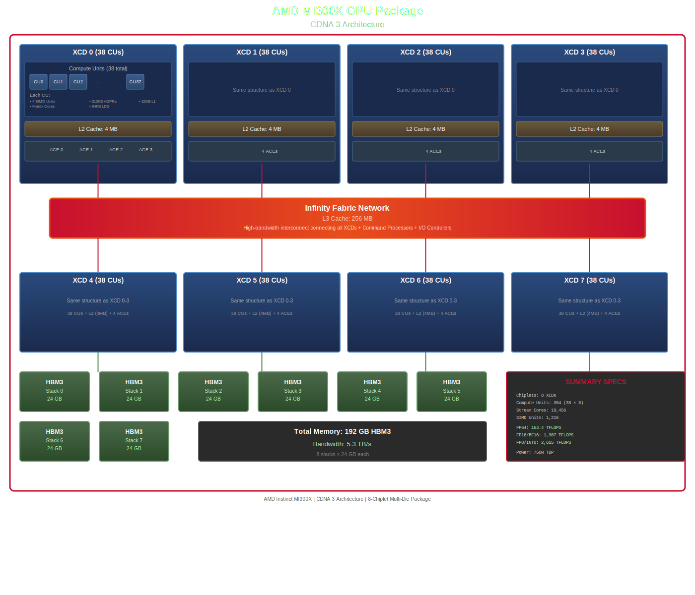
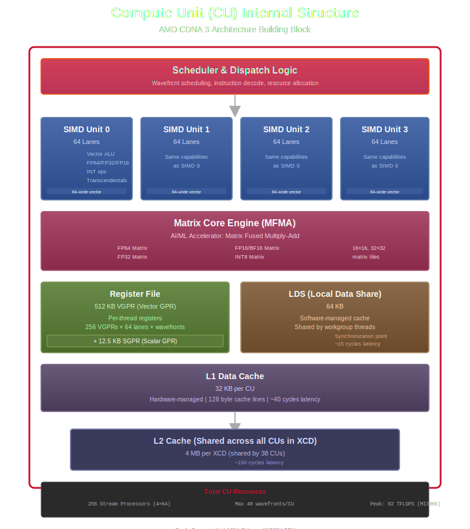
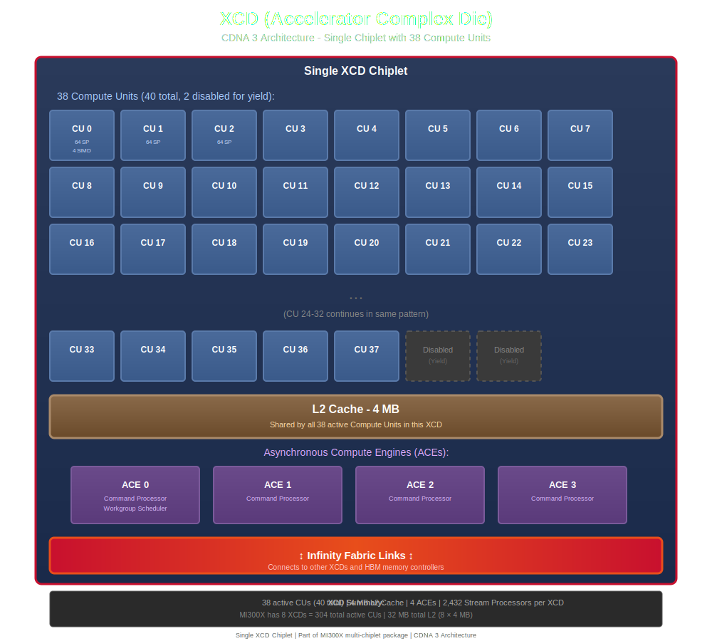
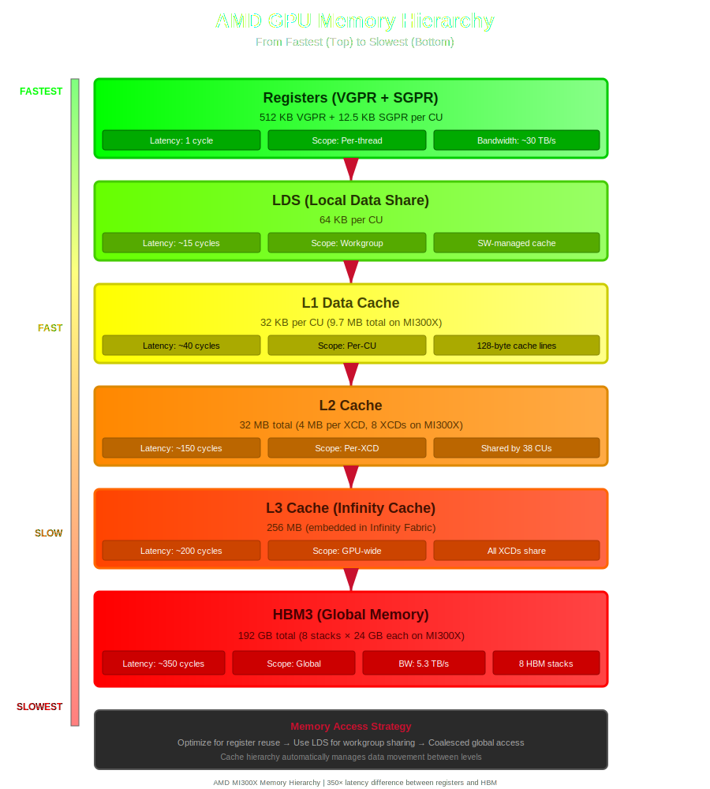
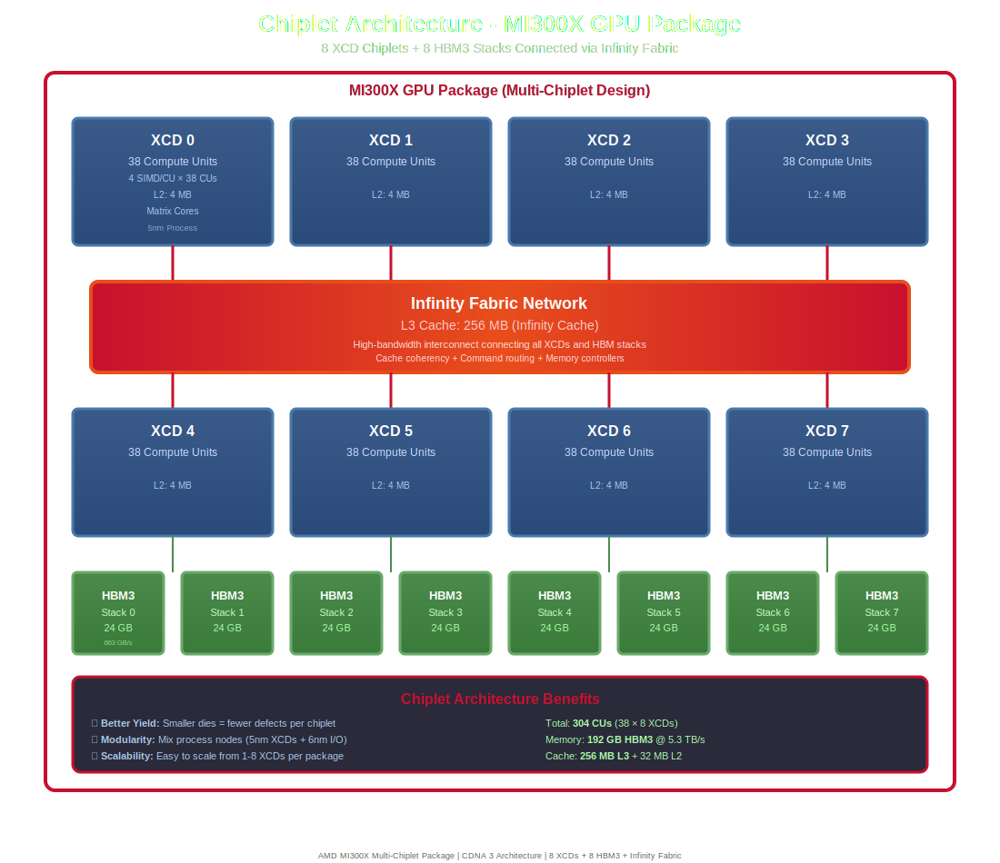

# Device Hardware

Physical components and architecture of AMD GPUs.

## Complete AMD GPU Architecture (MI300X)

The AMD Instinct MI300X represents the pinnacle of AMD's CDNA 3 architecture, featuring a revolutionary multi-chiplet design with 8 Accelerator Complex Dies (XCDs) integrated into a single package.

### Architecture Overview



<details>
<summary>View ASCII diagram</summary>

```
┌─────────────────────────────────────────────────────────────────────────────────────────────────────┐
│                                    AMD MI300X GPU Package                                            │
│                                   (CDNA 3 Architecture)                                              │
├─────────────────────────────────────────────────────────────────────────────────────────────────────┤
│                                                                                                       │
│  ┌───────────────────────┐  ┌───────────────────────┐  ┌───────────────────────┐  ┌───────────────┐│
│  │   XCD 0 (38 CUs)      │  │   XCD 1 (38 CUs)      │  │   XCD 2 (38 CUs)      │  │  XCD 3 (38 CUs││
│  ├───────────────────────┤  ├───────────────────────┤  ├───────────────────────┤  ├───────────────┤│
│  │ ┌─────────────────┐   │  │ ┌─────────────────┐   │  │ ┌─────────────────┐   │  │ ┌─────────────┤│
│  │ │  Compute Units  │   │  │ │  Compute Units  │   │  │ │  Compute Units  │   │  │ │  Compute Un││
│  │ │  ┌───┬───┬───┐  │   │  │ │  ┌───┬───┬───┐  │   │  │ │  ┌───┬───┬───┐  │   │  │ │  ┌───┬───┬─││
│  │ │  │CU0│CU1│CU2│  │   │  │ │  │CU │CU │CU │  │   │  │ │  │CU │CU │CU │  │   │  │ │  │CU │CU │C││
│  │ │  ├───┼───┼───┤  │   │  │ │  ├───┼───┼───┤  │   │  │ │  ├───┼───┼───┤  │   │  │ │  ├───┼───┼─││
│  │ │  │CU3│CU4│CU5│  │   │  │ │  │CU │CU │CU │  │   │  │ │  │CU │CU │CU │  │   │  │ │  │CU │CU │C││
│  │ │  ├───┴───┴───┤  │   │  │ │  ├───┴───┴───┤  │   │  │ │  ├───┴───┴───┤  │   │  │ │  ├───┴───┴─││
│  │ │  │  ... 38   │  │   │  │ │  │  ... 38   │  │   │  │ │  │  ... 38   │  │   │  │ │  │  ... 38 ││
│  │ │  │   total   │  │   │  │ │  │   total   │  │   │  │ │  │   total   │  │   │  │ │  │   total ││
│  │ │  └───────────┘  │   │  │ │  └───────────┘  │   │  │ │  └───────────┘  │   │  │ │  └─────────││
│  │ │                 │   │  │ │                 │   │  │ │                 │   │  │ │             ││
│  │ │ Each CU has:    │   │  │ │                 │   │  │ │                 │   │  │ │             ││
│  │ │ • 4 SIMD Units  │   │  │ │                 │   │  │ │                 │   │  │ │             ││
│  │ │ • Matrix Cores  │   │  │ │                 │   │  │ │                 │   │  │ │             ││
│  │ │ • 512KB VGPRs   │   │  │ │                 │   │  │ │                 │   │  │ │             ││
│  │ │ • 64KB LDS      │   │  │ │                 │   │  │ │                 │   │  │ │             ││
│  │ │ • 32KB L1 Cache │   │  │ │                 │   │  │ │                 │   │  │ │             ││
│  │ └─────────────────┘   │  │ └─────────────────┘   │  │ └─────────────────┘   │  │ └─────────────││
│  │                       │  │                       │  │                       │  │               ││
│  │  L2 Cache: 4 MB       │  │  L2 Cache: 4 MB       │  │  L2 Cache: 4 MB       │  │  L2 Cache: 4 M││
│  │                       │  │                       │  │                       │  │               ││
│  │  ┌──────────────┐     │  │  ┌──────────────┐     │  │  ┌──────────────┐     │  │  ┌──────────┐││
│  │  │ ACE 0│ACE 1  │     │  │  │ ACE 0│ACE 1  │     │  │  │ ACE 0│ACE 1  │     │  │  │ ACE 0│ACE││
│  │  │ ACE 2│ACE 3  │     │  │  │ ACE 2│ACE 3  │     │  │  │ ACE 2│ACE 3  │     │  │  │ ACE 2│ACE││
│  │  └──────────────┘     │  │  └──────────────┘     │  │  └──────────────┘     │  │  └──────────┘││
│  └───────────┬───────────┘  └───────────┬───────────┘  └───────────┬───────────┘  └───────┬───────││
│              │                          │                          │                      │       ││
│              └──────────────────────────┼──────────────────────────┼──────────────────────┘       ││
│                                         │                          │                              ││
│  ┌──────────────────────────────────────┴──────────────────────────┴─────────────────────────────┐│
│  │                         Infinity Fabric Network (L3 Cache: 256 MB)                            ││
│  │                     High-bandwidth interconnect connecting all XCDs                           ││
│  │                        + Command Processors + I/O Controllers                                 ││
│  └──────────────────────────────────────┬──────────────────────────┬─────────────────────────────┘│
│              ┌──────────────────────────┼──────────────────────────┼──────────────────────┐       ││
│              │                          │                          │                      │       ││
│  ┌───────────▼───────────┐  ┌───────────▼───────────┐  ┌───────────▼───────────┐  ┌─────▼─────────││
│  │   XCD 4 (38 CUs)      │  │   XCD 5 (38 CUs)      │  │   XCD 6 (38 CUs)      │  │  XCD 7 (38 CUs││
│  ├───────────────────────┤  ├───────────────────────┤  ├───────────────────────┤  ├───────────────┤│
│  │ Same structure as     │  │ Same structure as     │  │ Same structure as     │  │ Same structure││
│  │ XCD 0-3 above         │  │ XCD 0-3 above         │  │ XCD 0-3 above         │  │ XCD 0-3 above ││
│  │ 38 CUs + L2 + ACEs    │  │ 38 CUs + L2 + ACEs    │  │ 38 CUs + L2 + ACEs    │  │ 38 CUs + L2 + ││
│  └───────────┬───────────┘  └───────────┬───────────┘  └───────────┬───────────┘  └───────┬───────││
│              │                          │                          │                      │       ││
│  ────────────▼──────────────────────────▼──────────────────────────▼──────────────────────▼────── ││
│                                                                                                     ││
│  ┌─────────────┐  ┌─────────────┐  ┌─────────────┐  ┌─────────────┐  ┌─────────────┐  ┌─────────┐│
│  │  HBM3       │  │  HBM3       │  │  HBM3       │  │  HBM3       │  │  HBM3       │  │  HBM3   ││
│  │  Stack 0    │  │  Stack 1    │  │  Stack 2    │  │  Stack 3    │  │  Stack 4    │  │  Stack 5││
│  │  24 GB      │  │  24 GB      │  │  24 GB      │  │  24 GB      │  │  24 GB      │  │  24 GB  ││
│  └─────────────┘  └─────────────┘  └─────────────┘  └─────────────┘  └─────────────┘  └─────────┘│
│  ┌─────────────┐  ┌─────────────┐                                                                 ││
│  │  HBM3       │  │  HBM3       │                                                                 ││
│  │  Stack 6    │  │  Stack 7    │         Total Memory: 192 GB HBM3                               ││
│  │  24 GB      │  │  24 GB      │         Bandwidth: 5.3 TB/s                                     ││
│  └─────────────┘  └─────────────┘                                                                 ││
│                                                                                                     ││
├─────────────────────────────────────────────────────────────────────────────────────────────────────┤
│                                  SUMMARY SPECIFICATIONS                                             │
├─────────────────────────────────────────────────────────────────────────────────────────────────────┤
│  Chiplets:        8 XCDs (Accelerator Complex Dies)                                                │
│  Compute Units:   304 total (38 per XCD)                                                           │
│  Stream Cores:    19,456 (64 per CU)                                                               │
│  SIMD Units:      1,216 (4 per CU × 304 CUs)                                                       │
│                                                                                                     │
│  Memory Hierarchy:                                                                                 │
│    Registers:     512 KB VGPR + 12.5 KB SGPR (per CU)                                              │
│    LDS:           64 KB per CU                                                                     │
│    L1 Cache:      32 KB per CU (9.7 MB total)                                                      │
│    L2 Cache:      32 MB total (4 MB per XCD)                                                       │
│    L3 Cache:      256 MB (Infinity Cache)                                                          │
│    HBM3:          192 GB @ 5.3 TB/s                                                                │
│                                                                                                     │
│  Compute Performance:                                                                              │
│    FP64:          163.4 TFLOPS                                                                     │
│    FP32:          163.4 TFLOPS                                                                     │
│    FP16/BF16:     1,307.4 TFLOPS                                                                   │
│    FP8/INT8:      2,614.9 TFLOPS                                                                   │
│                                                                                                     │
│  Interconnect:    7 Infinity Fabric links per GPU (full-mesh 8-GPU topology)                       │
│  Power:           750W TDP                                                                         │
│  Process:         5nm (XCDs) + 6nm (I/O dies)                                                      │
└─────────────────────────────────────────────────────────────────────────────────────────────────────┘
```

</details>

### Key Features

**Multi-Chiplet Design:**
- 8 XCDs connected via Infinity Fabric
- Each XCD contains 38 Compute Units
- Total of 304 CUs across the entire package
- Enables massive parallel processing capability

**Memory System:**
- 192 GB HBM3 memory (8 stacks × 24 GB)
- 5.3 TB/s memory bandwidth
- 256 MB L3 Infinity Cache for bandwidth amplification
- 32 MB L2 cache distributed across XCDs
- Massive 155 MB of register file space

**Compute Capabilities:**
- 19,456 stream processors (64 per CU)
- Matrix cores in every CU for AI/ML acceleration
- Mixed precision support: FP64, FP32, TF32, FP16, BF16, FP8, INT8
- Peak AI performance: 2.6 PFLOPS (FP8)

**Infinity Fabric:**
- Connects all 8 XCDs within package
- Enables GPU-to-GPU communication in multi-GPU systems
- 7 links per GPU for full-mesh 8-GPU topology
- Critical for distributed training workloads

**Target Applications:**
- Large Language Models (LLMs)
- Deep Learning Training
- High Performance Computing (HPC)
- Scientific Simulations
- AI Inference at Scale

**Comparison to CDNA 2 (MI250X):**
- 38% more compute units (304 vs 220)
- 50% more memory (192 GB vs 128 GB)
- 66% faster memory bandwidth (5.3 TB/s vs 3.2 TB/s)
- 16x larger L3 cache (256 MB vs 16 MB)
- Enhanced AI performance with FP8 support

This architecture represents AMD's most powerful GPU for AI and HPC workloads, competing directly with NVIDIA's H100 and offering superior memory capacity and bandwidth.

## Compute Unit (CU)

The fundamental building block of AMD GPU architecture. A Compute Unit contains SIMD units, vector and scalar ALUs, local data share (LDS) memory, L1 cache, and scheduling hardware. Analogous to NVIDIA's Streaming Multiprocessor (SM).



<details>
<summary>View ASCII diagram</summary>

```
┌─────────────────────────────────────────────┐
│         Compute Unit (CU)                   │
├─────────────────────────────────────────────┤
│  ┌──────────────┐  ┌──────────────┐        │
│  │ SIMD Unit 0  │  │ SIMD Unit 1  │        │
│  │ (64 lanes)   │  │ (64 lanes)   │        │
│  └──────────────┘  └──────────────┘        │
│  ┌──────────────┐  ┌──────────────┐        │
│  │ SIMD Unit 2  │  │ SIMD Unit 3  │        │
│  └──────────────┘  └──────────────┘        │
│                                             │
│  ┌─────────────────────────────────┐       │
│  │   Matrix Core Engine (CDNA)     │       │
│  │   FP64/FP32/FP16/BF16/FP8       │       │
│  └─────────────────────────────────┘       │
│                                             │
│  ┌──────────────────────────────────────┐  │
│  │ Register File (VGPRs + SGPRs)        │  │
│  │ CDNA 3: 512 KB VGPR + 12.5 KB SGPR   │  │
│  └──────────────────────────────────────┘  │
│                                             │
│  ┌──────────────────────────────────────┐  │
│  │ LDS (Local Data Share) - 64 KB       │  │
│  └──────────────────────────────────────┘  │
│                                             │
│  ┌──────────────────────────────────────┐  │
│  │ L1 Cache - 32 KB (CDNA 3)            │  │
│  └──────────────────────────────────────┘  │
│                                             │
│  ┌──────────────────────────────────────┐  │
│  │ Scheduler & Dispatch Logic           │  │
│  └──────────────────────────────────────┘  │
└─────────────────────────────────────────────┘
```

</details>

**Key characteristics:**
- Executes wavefronts (64 work-items each)
- Has dedicated LDS (Local Data Share) memory (64 KB)
- Includes scalar and vector execution units
- Contains register files (VGPRs and SGPRs)
- L1 vector cache (32 KB in CDNA 3, 16 KB in CDNA 2/1)
- Multiple CUs per GPU (e.g., MI300X has 304 CUs)

**Architecture details:**
- CDNA 3: 40 CUs per XCD (38 active)
- CDNA 2: 110 CUs per GCD (MI250X), 104 CUs (MI210)
- CDNA 1: 120 CUs (MI100)

**Related:** [Wavefront](#wavefront), [Workgroup](#workgroup), [LDS](#lds-local-data-share), [SIMD Unit](#simd-unit)

## SIMD Unit

Single Instruction, Multiple Data execution units within a Compute Unit that execute wavefront instructions.

**Key characteristics:**
- Executes vector operations across a wavefront
- Multiple SIMD units per CU
- Processes 64 work-items in a wavefront simultaneously
- Supports FP32, FP64, FP16, INT operations
- Works in lockstep - all lanes execute the same instruction

**Function:**
- Vector ALU operations
- Memory load/store operations
- Arithmetic and logic operations
- Transcendental functions

**Related:** [Compute Unit](#compute-unit-cu), [Wavefront](#wavefront), [Work-Item](#work-item)

## Matrix Core Engine

Specialized hardware accelerators for matrix multiplication operations, crucial for AI and deep learning workloads. Introduced in CDNA architecture.

**Evolution across generations:**

**CDNA 3 (MI300X):**
- FP8/INT8: 2,614.9 TFLOPS (16x faster than FP32)
- FP16/BF16: 1,307.4 TFLOPS (3x improvement over CDNA 2)
- TF32: 4x faster than FP32
- FP32: 163.4 TFLOPS
- FP64: 163.4 TFLOPS
- 4096 FLOPS per clock per CU

**CDNA 2 (MI250X):**
- FP16/BF16: 383 TFLOPS
- INT8: 383 TOPS
- AccVGPR (Accumulation Vector Registers) for matrix operations

**CDNA 1 (MI100):**
- FP16: 184.6 TFLOPS
- INT8: 184.6 TOPS
- First CDNA with matrix acceleration

**Supported data types:**
- FP64 (double precision)
- FP32 (single precision)
- TF32 (TensorFloat-32) - CDNA 3 only
- FP16 (half precision)
- BF16 (Brain Float 16)
- FP8 (8-bit float) - CDNA 3 only
- INT8 (8-bit integer)

**Related:** [rocBLAS](#rocblas), [MIOpen](#miopen), [AccVGPR](#accvgpr-accumulation-vector-registers)

## XCD (Accelerator Complex Die)

The compute chiplet design used in CDNA 3 architecture (MI300 series). Each XCD contains compute units, cache, and command processors.



<details>
<summary>View ASCII diagram</summary>

```
┌─────────────────────────────────────────────────┐
│              XCD (Accelerator Complex Die)      │
├─────────────────────────────────────────────────┤
│                                                 │
│  ┌──────┐ ┌──────┐ ┌──────┐ ┌──────┐ ┌──────┐ │
│  │ CU 0 │ │ CU 1 │ │ CU 2 │ │ CU 3 │ │ CU 4 │ │
│  └──────┘ └──────┘ └──────┘ └──────┘ └──────┘ │
│  ┌──────┐ ┌──────┐ ┌──────┐ ┌──────┐ ┌──────┐ │
│  │ CU 5 │ │ CU 6 │ │ CU 7 │ │ CU 8 │ │ CU 9 │ │
│  └──────┘ └──────┘ └──────┘ └──────┘ └──────┘ │
│                  ... (38 total CUs)             │
│  ┌──────┐ ┌──────┐ ┌──────┐ ┌──────┐ ┌──────┐ │
│  │ CU33 │ │ CU34 │ │ CU35 │ │ CU36 │ │ CU37 │ │
│  └──────┘ └──────┘ └──────┘ └──────┘ └──────┘ │
│                                                 │
│  ┌───────────────────────────────────────────┐ │
│  │      L2 Cache - 4 MB                      │ │
│  └───────────────────────────────────────────┘ │
│                                                 │
│  ┌────────┐ ┌────────┐ ┌────────┐ ┌────────┐  │
│  │ ACE 0  │ │ ACE 1  │ │ ACE 2  │ │ ACE 3  │  │
│  │(Async  │ │(Async  │ │(Async  │ │(Async  │  │
│  │Compute)│ │Compute)│ │Compute)│ │Compute)│  │
│  └────────┘ └────────┘ └────────┘ └────────┘  │
│                                                 │
│         ↕ Infinity Fabric Links ↕              │
└─────────────────────────────────────────────────┘
```

</details>

**Key characteristics:**
- Contains 40 Compute Units (38 active, 2 disabled for yield management)
- 4 MB shared L2 cache per XCD
- Four Asynchronous Compute Engines (ACEs) for workload distribution
- 32 KB L1 cache per CU
- MI300X has 8 XCDs (304 total active CUs)
- MI300A has 6 XCDs (228 total active CUs)

**Related:** [Compute Unit](#compute-unit-cu), [Chiplet Architecture](#chiplet-architecture), [GCD](#graphics-compute-die-gcd)

## Graphics Compute Die (GCD)

A chiplet in CDNA 2 multi-die GPU designs (MI250 series). The predecessor to XCD in CDNA 3.

**Key characteristics:**
- Contains Compute Units, memory controllers, and cache
- Multiple GCDs can be connected for higher performance
- MI250X has 2 GCDs (110 CUs each)
- MI210 has 1 GCD (104 CUs)
- Enables modular GPU design

**Related:** [Infinity Fabric](#infinity-fabric), [Chiplet Architecture](#chiplet-architecture), [XCD](#xcd-accelerator-complex-die)

## Infinity Fabric

AMD's high-bandwidth, low-latency interconnect technology that connects different components within and between GPUs.

**Key characteristics:**
- Connects chiplets within a single package
- Enables GPU-to-GPU communication
- Supports coherent memory access
- Critical for multi-GPU scaling
- Connects XCDs, I/O dies, and HBM stacks

**Bandwidth and topology:**
- **MI300X**: 7 high-bandwidth links per GPU for inter-GPU communication
  - 8-GPU nodes use full-mesh topology
  - All GPUs can communicate directly
- **MI250X**: Up to 200 GB/s per link between GCDs
- **On-package**: Connects XCDs to I/O dies and HBM memory

```
8-GPU MI300X Node - Full Mesh Topology
(Each GPU has 7 Infinity Fabric links)

        GPU0 ←─────→ GPU1
        ╱ ╲         ╱ ╲
       ╱   ╲       ╱   ╲
      ╱     ╲     ╱     ╲
   GPU7 ←───→ GPU2
     ╲       ╱ ╲       ╱
      ╲     ╱   ╲     ╱
       ╲   ╱     ╲   ╱
      GPU6 ←─────→ GPU3
        ╲         ╱
         ╲       ╱
          ╲     ╱
          GPU5 ←─────→ GPU4

All-to-all connectivity:
• Any GPU can directly communicate with any other
• No need for intermediate hops
• Optimal for collective operations (All-Reduce, etc.)
• Critical for multi-GPU training performance
```

**Use cases:**
- Multi-die GPU coordination
- Multi-GPU training and inference
- Unified memory access across chiplets
- High-speed peer-to-peer transfers

**Related:** [XCD](#xcd-accelerator-complex-die), [GCD](#graphics-compute-die-gcd), [Multi-GPU](#multi-gpu-scaling), [RCCL](#rccl-rocm-communication-collectives-library)

## HBM (High Bandwidth Memory)

Stacked memory technology providing extremely high bandwidth for GPU operations. AMD Instinct GPUs use HBM2, HBM2e, or HBM3.

**Generations:**
- **HBM2**: MI100 (1.2 TB/s), MI50/MI60 (1 TB/s)
- **HBM2e**: MI210 (1.6 TB/s), MI250/MI250X (3.2 TB/s)
- **HBM3**: MI300X (5.3 TB/s), MI300A (5.3 TB/s)

**Key characteristics:**
- Stacked directly on GPU package
- Multiple stacks per GPU
- Much higher bandwidth than GDDR memory
- Lower power consumption per GB transferred

**Related:** [Memory Bandwidth](#memory-bandwidth), [Memory Coalescing](#memory-coalescing)

## LDS (Local Data Share)

Fast, low-latency memory shared among all work-items (threads) within a workgroup. Similar to CUDA's "shared memory."

### Overview

LDS is a programmer-managed on-chip memory resource that resides within each Compute Unit. It provides the fastest form of shared memory accessible to all work-items in a workgroup, making it essential for high-performance GPU programming when threads need to cooperate and exchange data.

### Technical Specifications

**Capacity:**
- CDNA 3 (MI300X): 64 KB per CU
- CDNA 2 (MI250X, MI210): 64 KB per CU
- CDNA 1 (MI100): 64 KB per CU
- RDNA 3: 64-128 KB per CU (configurable)

**Latency:**
- Access time: ~25 cycles
- Much faster than L1 cache (~50 cycles)
- Significantly faster than HBM (~300-400 cycles)

**Bandwidth:**
- Theoretical: ~10 TB/s per CU (architecture dependent)
- Typically 32 banks × 4 bytes per cycle at GPU clock speed
- Shared among all active workgroups on the CU

### Memory Organization

**Banking Structure:**
```
LDS Memory Banks (32 banks typical)
┌────────────────────────────────────────────────────┐
│ Bank 0 │ Bank 1 │ Bank 2 │ ... │ Bank 30 │ Bank 31│
├────────┼────────┼────────┼─────┼─────────┼────────┤
│ 0x00   │ 0x04   │ 0x08   │ ... │ 0x78    │ 0x7C   │
│ 0x80   │ 0x84   │ 0x88   │ ... │ 0xF8    │ 0xFC   │
│ 0x100  │ 0x104  │ 0x108  │ ... │ 0x178   │ 0x17C  │
│  ...   │  ...   │  ...   │ ... │  ...    │  ...   │
└────────┴────────┴────────┴─────┴─────────┴────────┘

Address to Bank Mapping:
Bank = (Address / 4) % 32
```

**Bank Conflicts:**
- Occur when multiple work-items in a wavefront access different addresses within the same bank
- Result in serialized access, reducing effective bandwidth
- N-way conflict → N sequential accesses instead of 1 parallel access

### Allocation and Scope

**Static Allocation:**
```cpp
// HIP kernel with static LDS allocation
__global__ void myKernel() {
    __shared__ float staticData[256];  // 1 KB allocated at compile time
    __shared__ int sharedCounter;      // 4 bytes

    // All work-items in the workgroup see the same memory
}
```

**Dynamic Allocation:**
```cpp
// Kernel declaration with dynamic shared memory
__global__ void myKernel(float* output) {
    extern __shared__ float dynamicData[];  // Size specified at launch

    int tid = threadIdx.x;
    dynamicData[tid] = tid * 2.0f;
}

// Launch with dynamic LDS size (3rd parameter)
myKernel<<<gridDim, blockDim, 2048>>>(output);  // 2048 bytes LDS
```

**Total LDS Usage:**
```
Total LDS per Workgroup = Static LDS + Dynamic LDS + Compiler Padding
```

### Impact on Occupancy

LDS usage directly affects how many workgroups can be active on a CU simultaneously:

```
Max Workgroups per CU = min(
    Hardware_Max_Workgroups,
    64KB / LDS_per_Workgroup,
    Other_Resource_Limits
)
```

**Example:**
- CU has 64 KB LDS
- Each workgroup uses 16 KB LDS
- Maximum concurrent workgroups = 64 KB / 16 KB = 4 workgroups
- If workgroup needs 32 KB → only 2 workgroups can be active
- If workgroup needs 65 KB → kernel cannot launch!

### Common Use Cases

**1. Cooperative Data Loading (Tiling):**
```cpp
__global__ void matrixMul(float* C, float* A, float* B, int N) {
    __shared__ float tileA[TILE_SIZE][TILE_SIZE];
    __shared__ float tileB[TILE_SIZE][TILE_SIZE];

    int tx = threadIdx.x, ty = threadIdx.y;

    // Collaboratively load tiles into LDS
    for (int t = 0; t < N/TILE_SIZE; t++) {
        tileA[ty][tx] = A[...];  // Load from global memory
        tileB[ty][tx] = B[...];
        __syncthreads();  // Ensure all threads finished loading

        // Compute using fast LDS data
        for (int k = 0; k < TILE_SIZE; k++) {
            sum += tileA[ty][k] * tileB[k][tx];
        }
        __syncthreads();  // Ensure all threads finished computing
    }
}
```

**2. Reduction Operations:**
```cpp
__global__ void reduce(float* input, float* output, int n) {
    __shared__ float sdata[256];

    int tid = threadIdx.x;
    int i = blockIdx.x * blockDim.x + tid;

    // Load data into LDS
    sdata[tid] = (i < n) ? input[i] : 0.0f;
    __syncthreads();

    // Parallel reduction in LDS
    for (int s = blockDim.x/2; s > 0; s >>= 1) {
        if (tid < s) {
            sdata[tid] += sdata[tid + s];
        }
        __syncthreads();
    }

    if (tid == 0) output[blockIdx.x] = sdata[0];
}
```

**3. Inter-Thread Communication:**
```cpp
__global__ void neighborExchange() {
    __shared__ float buffer[256];
    int tid = threadIdx.x;

    buffer[tid] = computeValue();
    __syncthreads();  // Ensure all writes complete

    // Access neighbor's data
    float left  = buffer[tid > 0 ? tid-1 : tid];
    float right = buffer[tid < 255 ? tid+1 : tid];

    float result = (left + buffer[tid] + right) / 3.0f;
}
```

**4. Atomic Operations Within Workgroup:**
```cpp
__global__ void histogram() {
    __shared__ int bins[256];

    // Initialize bins
    if (threadIdx.x < 256) bins[threadIdx.x] = 0;
    __syncthreads();

    // Accumulate using LDS atomics (faster than global atomics)
    int value = data[globalIdx];
    atomicAdd(&bins[value], 1);
    __syncthreads();

    // Write results back to global memory
    if (threadIdx.x < 256) {
        atomicAdd(&globalBins[threadIdx.x], bins[threadIdx.x]);
    }
}
```

### Performance Considerations

**Best Practices:**

1. **Avoid Bank Conflicts:**
```cpp
// BAD: Stride access causes conflicts
__shared__ float data[32][32];
float value = data[threadIdx.x][0];  // All threads hit same bank!

// GOOD: Sequential access, different banks
float value = data[0][threadIdx.x];  // Each thread hits different bank
```

2. **Minimize LDS Usage:**
- Use only what you need to maximize occupancy
- Consider trade-off between LDS usage and occupancy
- Profile to find optimal LDS allocation

3. **Proper Synchronization:**
```cpp
// Always sync after LDS writes before reads
buffer[tid] = value;
__syncthreads();  // CRITICAL: Ensures all writes visible
float x = buffer[other_tid];  // Safe to read
```

4. **Pad to Avoid Conflicts:**
```cpp
// BAD: 32-wide array causes bank conflicts
__shared__ float data[64][32];

// GOOD: Add padding to offset banks
__shared__ float data[64][33];  // Extra column prevents conflicts
```

### Debugging LDS Issues

**Common Problems:**

1. **Insufficient LDS:**
```bash
Error: Workgroup requires 96 KB LDS, but only 64 KB available
Solution: Reduce LDS usage or split workgroup
```

2. **Bank Conflicts:**
```bash
# Check LDS bank conflicts with rocprofv3
rocprofv3 --pmc SQ_LDS_BANK_CONFLICT -- ./myapp

# Look for LDSBankConflict percentage
# 0% = optimal, >10% = investigate access patterns
```

3. **Race Conditions:**
- Missing `__syncthreads()` between LDS write and read
- Uninitialized LDS data
- Incorrect barrier placement

### Hardware Details

**Architecture Implementation:**
- Physically located within each Compute Unit
- Separate from L1 cache (though some architectures can share the space)
- Managed entirely by programmer (no automatic caching)
- Persists only for the lifetime of a workgroup

**Memory Consistency:**
- LDS writes are not immediately visible to all threads
- `__syncthreads()` enforces memory fence + execution barrier
- Atomics provide immediate consistency for specific addresses

**Related:** [Compute Unit](#compute-unit-cu), [Workgroup](#workgroup), [Memory Hierarchy](#memory-hierarchy), [Barrier Synchronization](#barrier--synchronization)

## L1 Cache

First-level cache within each Compute Unit, providing fast access to frequently used data.

### Overview

L1 cache is the first level in the GPU's cache hierarchy, residing within each Compute Unit. It automatically caches data fetched from global memory (HBM) to reduce access latency for frequently accessed data. Unlike LDS which is programmer-managed, L1 cache is managed entirely by hardware.

### Technical Specifications

**Capacity by Architecture:**
- **CDNA 3 (MI300X/MI300A):** 32 KB vector cache per CU
  - Total: 9.7 MB across 304 CUs (MI300X)
- **CDNA 2 (MI250X):** 16 KB per CU
  - Total: 3.52 MB across 220 CUs
- **CDNA 1 (MI100):** 16 KB per CU
  - Total: 1.92 MB across 120 CUs
- **RDNA 3:** 16-32 KB per CU (varies by model)

**Performance:**
- Latency: ~50 cycles for hit
- Bandwidth: Shared among all wavefronts on the CU
- Hit rate: Highly dependent on access patterns (typically 60-95% for well-optimized kernels)

### Cache Architecture

**Structure:**
```
L1 Cache Organization (per CU)
┌───────────────────────────────────────────┐
│         L1 Vector Cache (32 KB)           │
├───────────────────────────────────────────┤
│  Cache Line Size: 64 bytes (typical)      │
│  Associativity: 4-way or 8-way set       │
│  Number of Sets: 128-256                 │
│                                           │
│  ┌─────────┬─────────┬─────────┬───┐     │
│  │ Set 0   │ Set 1   │ Set 2   │...│     │
│  ├─────────┼─────────┼─────────┼───┤     │
│  │ Way 0   │ Way 0   │ Way 0   │   │     │
│  │ Way 1   │ Way 1   │ Way 1   │   │     │
│  │ Way 2   │ Way 2   │ Way 2   │   │     │
│  │ Way 3   │ Way 3   │ Way 3   │   │     │
│  └─────────┴─────────┴─────────┴───┘     │
└───────────────────────────────────────────┘
```

**Cache Line:**
- Size: 64 bytes (16 × 4-byte words)
- Aligned to 64-byte boundaries
- Spatial locality: Fetching one element brings 15 neighbors into cache

### Cache Behavior

**Read Operations:**
```
Read Flow:
1. Thread requests data at address X
2. Check L1 cache for cache line containing X
   ├─ HIT  → Return data (~50 cycles)
   └─ MISS → Forward to L2 cache
             ├─ L2 HIT  → Fill L1, return data (~150 cycles)
             └─ L2 MISS → Forward to L3/HBM (~200-400 cycles)
```

**Write Operations:**
```
Write Policy (typical):
- Write-through or write-evict
- Writes bypass L1 and go directly to L2
- Some architectures: write-back for compute operations
- Maintains cache coherence across CUs
```

### L1 and LDS Relationship

**Memory Space Configuration:**

Some AMD GPU architectures allow flexible partitioning between L1 cache and LDS:

```
Configuration Options (architecture dependent):
┌─────────────────────────────────────────┐
│ Option 1: 32 KB L1 + 32 KB LDS         │
│ Option 2: 16 KB L1 + 48 KB LDS         │
│ Option 3: 48 KB L1 + 16 KB LDS         │
└─────────────────────────────────────────┘

CDNA 3: Fixed 32 KB L1 + 64 KB LDS (separate)
RDNA 2/3: Configurable shared space
```

### Access Patterns and Performance

**Coalesced Access (Good for L1):**
```cpp
// Threads in wavefront access consecutive addresses
__global__ void coalescedRead(float* data) {
    int idx = blockIdx.x * blockDim.x + threadIdx.x;
    float value = data[idx];  // Each thread reads sequential element

    // Result: 1 cache line fetch serves 16 threads (64 bytes / 4 bytes)
    //         L1 hit rate: ~93% after first access
}
```

**Strided Access (Moderate L1 Performance):**
```cpp
// Threads access with stride
__global__ void stridedRead(float* data, int stride) {
    int idx = (blockIdx.x * blockDim.x + threadIdx.x) * stride;
    float value = data[idx];

    // Stride = 16: Uses all 16 words in cache line
    // Stride = 32: Wastes half of each cache line
    // Stride = 64: No benefit from spatial locality
}
```

**Random Access (Poor L1 Performance):**
```cpp
// Random/scattered access pattern
__global__ void randomRead(float* data, int* indices) {
    int idx = indices[blockIdx.x * blockDim.x + threadIdx.x];
    float value = data[idx];

    // Result: Low cache line reuse
    //         L1 hit rate: 10-30% (mostly L2/HBM access)
}
```

### Cache Line Utilization

**Maximizing Cache Efficiency:**

```cpp
// BAD: Only uses 4 bytes from 64-byte cache line
__global__ void wastefulAccess(float* data) {
    int idx = threadIdx.x * 16;  // Big stride
    float value = data[idx];     // Uses 4 bytes, wastes 60 bytes
}

// GOOD: All 64 bytes used by threads in wavefront
__global__ void efficientAccess(float* data) {
    int idx = threadIdx.x;       // Sequential access
    float value = data[idx];     // 16 threads use 1 cache line fully
}
```

### Performance Optimization Tips

**1. Optimize for Spatial Locality:**
- Access consecutive memory addresses
- Structure data for sequential access within wavefronts
- Align data structures to cache line boundaries

**2. Temporal Locality:**
```cpp
// Reuse data from L1 cache
__global__ void reuseData(float* A, float* B, float* C) {
    int idx = threadIdx.x;

    // First access: L1 miss, fetch from L2/HBM
    float a = A[idx];

    // Immediate reuse: L1 hit
    float result1 = a * 2.0f;
    float result2 = a * 3.0f;  // Still in L1
    float result3 = a * 4.0f;  // Still in L1

    C[idx] = result1 + result2 + result3;
}
```

**3. Avoid Cache Thrashing:**
```cpp
// BAD: Large working set evicts cache lines
__global__ void thrashing(float* data) {
    for (int i = 0; i < 10000; i++) {
        float value = data[i * 1024];  // Each access different cache line
    }                                   // Working set >> 32 KB cache
}

// GOOD: Working set fits in cache
__global__ void cacheFriendly(float* data) {
    for (int i = 0; i < 512; i++) {    // 2 KB working set
        float value = data[i];          // Stays in L1
    }
}
```

### Profiling L1 Cache

**Using rocprofv3:**

```bash
# Check L1 cache hit rate
rocprofv3 --pmc TCP_PERF_SEL_TOTAL_CACHE_ACCESSES,TCP_PERF_SEL_CACHE_HITS -- ./myapp

# Monitor L1 stalls
rocprofv3 --pmc TCP_TCP_TA_DATA_STALL_CYCLES -- ./myapp

# Comprehensive L1 analysis
rocprofv3 --pmc \
  TCP_PERF_SEL_TOTAL_CACHE_ACCESSES,\
  TCP_PERF_SEL_CACHE_HITS,\
  TCP_PERF_SEL_CACHE_MISSES,\
  TCP_TCP_TA_DATA_STALL_CYCLES -- ./myapp
```

**Interpreting Results:**
```
L1 Hit Rate = Cache Hits / Total Accesses

Target hit rates:
- >90%: Excellent spatial/temporal locality
- 70-90%: Good, room for optimization
- <70%: Poor, investigate access patterns
```

### Hardware Implementation

**Per-CU Resource:**
- Each CU has its own private L1 cache
- Not shared between CUs
- Managed entirely by hardware (no programmer control)

**Coherence:**
- L1 caches are not coherent across CUs
- Writes from one CU not visible in another CU's L1
- L2 maintains coherence for multi-CU access

**Replacement Policy:**
- Typically LRU (Least Recently Used) or pseudo-LRU
- Hardware-managed, not configurable by software

### When L1 Cache Helps Most

**Good Use Cases:**
1. **Matrix operations with tile reuse**
2. **Stencil computations** (neighbors accessed multiple times)
3. **Iterative algorithms** reusing same data
4. **Texture sampling** with spatial locality

**Limited Benefit:**
1. **Streaming operations** (data used once)
2. **Random memory access** patterns
3. **Very large working sets** (>32 KB per CU)

**Related:** [L2 Cache](#l2-cache), [L3 Cache](#l3-cache), [Compute Unit](#compute-unit-cu), [Memory Coalescing](#memory-coalescing)

## L2 Cache

Second-level cache shared among multiple Compute Units within an XCD (CDNA 3) or GCD (CDNA 2), providing larger capacity and bandwidth amplification.

### Overview

L2 cache acts as an intermediary between the distributed L1 caches in individual CUs and the larger, slower L3 cache or HBM memory. It significantly reduces memory bandwidth pressure by caching frequently accessed data across multiple CUs.

### Technical Specifications by Architecture

**CDNA 3 (MI300 Series):**
- **MI300X:** 32 MB total (4 MB per XCD × 8 XCDs)
- **MI300A:** 24 MB total (4 MB per XCD × 6 XCDs)
- Shared among 38 active CUs per XCD
- ~105 KB per CU effective capacity

**CDNA 2 (MI250 Series):**
- **MI250X:** 16 MB total (8 MB per GCD × 2 GCDs)
- **MI210:** 8 MB (single GCD)
- Shared among 104-110 CUs per GCD
- ~73-77 KB per CU effective capacity

**CDNA 1 (MI100):**
- **MI100:** 16 MB total
- Shared among 120 CUs
- ~133 KB per CU

**Performance:**
- Latency: ~150 cycles for hit
- Bandwidth: Much higher than L1 (aggregate of all L1→L2 paths)
- Acts as bandwidth filter before L3/HBM

### L2 Cache Architecture

**Structure:**
```
L2 Cache Organization (per XCD in CDNA 3)
┌─────────────────────────────────────────────────┐
│              4 MB L2 Cache                      │
├─────────────────────────────────────────────────┤
│  Cache Line: 128 bytes (larger than L1)        │
│  Associativity: 16-way set associative         │
│  Number of Sets: 2048                          │
│                                                 │
│  Serves 38 Compute Units                       │
│                                                 │
│  ┌─────┐  ┌─────┐  ┌─────┐                    │
│  │ CU0 │  │ CU1 │  │ CU2 │  ...  (38 CUs)     │
│  └──┬──┘  └──┬──┘  └──┬──┘                    │
│     │        │        │                         │
│     └────────┼────────┘                         │
│              │                                  │
│         All L1 misses                          │
│              ▼                                  │
│  ┌────────────────────────────┐                │
│  │      L2 Cache Tags          │                │
│  │      L2 Cache Data          │                │
│  └────────────────────────────┘                │
│              │                                  │
│              ▼                                  │
│    L2 Miss → L3/Infinity Fabric/HBM           │
└─────────────────────────────────────────────────┘
```

### Cache Coherence

**Multi-CU Coherence:**
- L2 maintains coherence across all CUs it serves
- Ensures consistency when multiple CUs access same address
- Write-through or write-back policy (architecture dependent)

**Inter-XCD Communication:**
```
XCD 0 L2          XCD 1 L2
┌────────┐        ┌────────┐
│ 4 MB   │◄───────►│ 4 MB   │
└────┬───┘  Infinity  └───┬────┘
     │      Fabric        │
     └──────────┬──────────┘
                ▼
           L3 Cache (256 MB)
                ▼
           HBM Memory
```

### Cache Line Size and Impact

**L2 Cache Lines:**
- **Size:** 128 bytes (32 × 4-byte floats)
- **Larger than L1:** 128B vs 64B
- **Benefit:** More spatial locality captured
- **Cost:** Higher penalty for uncoalesced access

**Example:**
```cpp
// Good: Wavefront (64 threads) reading floats
__global__ void sequentialAccess(float* data) {
    int idx = blockIdx.x * blockDim.x + threadIdx.x;
    float value = data[idx];

    // Wavefront of 64 threads:
    // - Reads 256 bytes (64 × 4 bytes)
    // - Fetches 2 L2 cache lines (2 × 128 bytes)
    // - L2 cache line utilization: 100%
}

// Bad: Strided access wastes cache lines
__global__ void stridedAccess(float* data) {
    int idx = (blockIdx.x * blockDim.x + threadIdx.x) * 32;
    float value = data[idx];

    // Each thread needs separate cache line
    // - 64 threads fetch 64 × 128B = 8192 bytes
    // - Actually use only 64 × 4B = 256 bytes
    // - Efficiency: 3.1% (very wasteful!)
}
```

### L2 Bandwidth and Throughput

**Bandwidth Characteristics:**
- Aggregate bandwidth from all L1→L2 paths
- Significantly higher than any single CU's L1 bandwidth
- Shared resource: Contention possible under heavy load

**Example Calculation (MI300X XCD):**
```
Per XCD:
- 38 CUs, each with L1 cache
- All CUs share 4 MB L2
- Peak L2 bandwidth: ~1-2 TB/s per XCD (estimated)
- Total MI300X: 8-16 TB/s L2 bandwidth across 8 XCDs
```

### L2 Cache Hit Rate Impact

**Performance Difference:**
```
L2 Hit:  ~150 cycles latency
L2 Miss: ~400 cycles (L3) or ~400+ cycles (HBM)

Example for 1000 memory accesses:
- 90% L2 hit rate: 90×150 + 10×400 = 17,500 cycles
- 50% L2 hit rate: 50×150 + 50×400 = 27,500 cycles
                    → 57% slower!
```

### Optimizing for L2 Cache

**1. Data Reuse Across CUs:**
```cpp
// Multiple CUs accessing same data benefits from L2
__global__ void sharedDataAccess(float* coefficients, float* input, float* output) {
    int idx = blockIdx.x * blockDim.x + threadIdx.x;

    // 'coefficients' array accessed by all CUs
    // Stays hot in L2 cache after first access
    float coeff = coefficients[threadIdx.x % 128];

    output[idx] = input[idx] * coeff;
}
```

**2. Locality Across Workgroups:**
```cpp
// Workgroups accessing nearby memory
__global__ void spatialLocality(float* data) {
    int blockStart = blockIdx.x * blockDim.x * sizeof(float);
    int idx = blockIdx.x * blockDim.x + threadIdx.x;

    // Adjacent workgroups access adjacent data
    // L2 can cache and serve to multiple CUs
    float value = data[idx];
}
```

**3. Avoid Thrashing:**
```cpp
// BAD: Working set too large for L2
__global__ void l2Thrashing(float* data) {
    for (int i = 0; i < 100000; i++) {
        float value = data[i * blockIdx.x];  // Huge stride, evicts cache lines
    }
}

// GOOD: Working set fits in L2
__global__ void l2Friendly(float* data, int workingSetSize) {
    // workingSetSize chosen to fit in L2 (< 4 MB per XCD)
    for (int i = 0; i < workingSetSize; i++) {
        float value = data[blockIdx.x * workingSetSize + i];
    }
}
```

### Profiling L2 Cache

**Using rocprofv3:**

```bash
# L2 cache hit rate (TCC = L2 on AMD GPUs)
rocprofv3 --pmc TCC_HIT,TCC_MISS -- ./myapp

# Calculate hit rate
# Hit Rate = TCC_HIT / (TCC_HIT + TCC_MISS) × 100%

# L2 read/write requests
rocprofv3 --pmc TCC_EA_RDREQ,TCC_EA_WRREQ -- ./myapp

# L2 stalls
rocprofv3 --pmc TCC_EA_WRREQ_STALL,TCC_WRREQ_STALL_max -- ./myapp
```

**Interpreting L2 Metrics:**
```
Good L2 hit rate: >80%
Moderate:         50-80%
Poor:             <50% (check access patterns)
```

### L2 as Bandwidth Amplifier

**Effective Bandwidth Amplification:**
```
Effective HBM Bandwidth = Physical HBM BW × (1 - L2_Hit_Rate) + L2 BW × L2_Hit_Rate

Example:
- HBM: 5.3 TB/s
- L2 effective BW: 10 TB/s (faster access)
- L2 hit rate: 80%

Effective BW ≈ 5.3 TB/s × 0.2 + 10 TB/s × 0.8
             ≈ 1.06 + 8.0 = 9.06 TB/s
             → 71% bandwidth amplification!
```

### Multi-Level Cache Interaction

**L1 + L2 Combined Behavior:**
```
Memory Access Flow:
1. Thread requests data
2. Check L1 (per CU)
   ├─ Hit  → ~50 cycles
   └─ Miss → Check L2 (shared)
             ├─ Hit  → ~150 cycles, fill L1
             └─ Miss → Check L3 or HBM (~400+ cycles)
```

**Inclusive vs. Exclusive:**
- **Inclusive:** Data in L1 also in L2 (AMD typical)
- **Benefit:** Simpler coherence protocol
- **Cost:** Some capacity redundancy

**Related:** [L1 Cache](#l1-cache), [L3 Cache](#l3-cache), [Memory Hierarchy](#memory-hierarchy), [XCD](#xcd-accelerator-complex-die)

## L3 Cache

Third-level cache providing high-capacity, high-bandwidth shared cache across the entire GPU package, also known as "Infinity Cache" in AMD terminology.

### Overview

L3 cache is the largest and final cache level before accessing HBM (High Bandwidth Memory). In AMD's CDNA 3 architecture, it's massively expanded to 256 MB, providing substantial bandwidth amplification and reducing the frequency of expensive HBM accesses. The L3 cache is shared across all XCDs via the Infinity Fabric interconnect.

### Technical Specifications by Architecture

**CDNA 3 (MI300 Series):**
- **MI300X:** 256 MB (Infinity Cache)
  - Shared across 8 XCDs (304 active CUs)
  - ~843 KB per CU effective capacity
  - 16× larger than CDNA 2
  - Integrated with Infinity Fabric
- **MI300A:** 256 MB (same as MI300X)
  - Shared across 6 XCDs (228 active CUs)

**CDNA 2 (MI250 Series):**
- **MI250X:** 16 MB total
  - 8 MB per GCD × 2 GCDs
  - ~73 KB per CU (220 CUs)
- **MI210:** 8 MB
  - Single GCD, 104 CUs
  - ~77 KB per CU

**CDNA 1 (MI100):**
- **MI100:** 8 MB
  - 120 CUs
  - ~67 KB per CU

**Earlier Generations:**
- **MI60/MI50:** 4 MB

**Performance:**
- Latency: ~200 cycles for hit
- Bandwidth: Significantly higher than L2 aggregate
- Critical for bandwidth amplification

### L3 Cache Architecture (CDNA 3)

**Integration with Infinity Fabric:**
```
MI300X L3 Cache Architecture
┌──────────────────────────────────────────────────────┐
│              256 MB Infinity Cache (L3)               │
│          Distributed across Infinity Fabric           │
├──────────────────────────────────────────────────────┤
│                                                        │
│  XCD 0   XCD 1   XCD 2   XCD 3   XCD 4   XCD 5  ...  │
│  ┌────┐  ┌────┐  ┌────┐  ┌────┐  ┌────┐  ┌────┐     │
│  │ L2 │  │ L2 │  │ L2 │  │ L2 │  │ L2 │  │ L2 │     │
│  │ 4MB│  │ 4MB│  │ 4MB│  │ 4MB│  │ 4MB│  │ 4MB│     │
│  └─┬──┘  └─┬──┘  └─┬──┘  └─┬──┘  └─┬──┘  └─┬──┘     │
│    │       │       │       │       │       │         │
│    └───────┼───────┼───────┼───────┼───────┘         │
│            ▼       ▼       ▼       ▼                  │
│   ┌────────────────────────────────────────────┐     │
│   │    Infinity Fabric Network + L3 Cache      │     │
│   │    • All-to-all connectivity               │     │
│   │    • 256 MB distributed cache              │     │
│   │    • Coherent across all XCDs              │     │
│   └──────────────┬─────────────────────────────┘     │
│                  ▼                                    │
│            L3 Miss → HBM3                            │
│            8 stacks × 24 GB = 192 GB                 │
│            Bandwidth: 5.3 TB/s                       │
└──────────────────────────────────────────────────────┘
```

### Cache Capacity Impact

**Massive Improvement in CDNA 3:**

| Architecture | L3 Size | CUs  | L3 per CU |
|-------------|---------|------|-----------|
| MI50        | 4 MB    | 60   | 68 KB     |
| MI100       | 8 MB    | 120  | 68 KB     |
| MI250X      | 16 MB   | 220  | 74 KB     |
| **MI300X**  | **256 MB** | **304** | **863 KB** |

**Key Insight:** MI300X has 11.7× more L3 per CU than MI250X

### L3 as Bandwidth Amplifier

**Reducing HBM Traffic:**

The primary role of L3 is to filter memory requests before they reach HBM, which has limited bandwidth (5.3 TB/s for MI300X).

```
Without L3 Cache:
- Application needs 10 TB/s bandwidth
- HBM only provides 5.3 TB/s
- Performance severely limited (memory bound)

With 256 MB L3 at 80% hit rate:
- 80% of requests served from L3 (~50-100 TB/s effective)
- Only 20% reach HBM (2 TB/s needed)
- Well within HBM bandwidth
- Application achieves much higher effective bandwidth
```

**Bandwidth Amplification Formula:**
```
Effective Bandwidth = HBM_BW / (1 - L3_Hit_Rate)

Example with 80% L3 hit rate:
Effective BW = 5.3 TB/s / (1 - 0.80)
             = 5.3 TB/s / 0.20
             = 26.5 TB/s effective!
```

### Access Latency Comparison

**Memory Access Timing:**
```
Latency (cycles) to serve memory request:

L1 Hit:  ~50 cycles
L2 Hit:  ~150 cycles
L3 Hit:  ~200 cycles    ◄─── L3 saves ~200 cycles vs HBM
HBM:     ~400 cycles
```

**Impact on Performance:**
For 1 million memory accesses:

| L3 Hit Rate | Avg Latency | Cycles      | Performance |
|-------------|-------------|-------------|-------------|
| 0% (no L3)  | 400         | 400M        | 1.0×        |
| 50% L3 hits | 300         | 300M        | 1.33×       |
| 80% L3 hits | 240         | 240M        | 1.67×       |
| 90% L3 hits | 220         | 220M        | 1.82×       |

### L3 Cache Hit Rate Factors

**What Improves L3 Hit Rate:**

1. **Data Reuse Across XCDs:**
```cpp
// Common data accessed by all XCDs
__global__ void crossXCDReuse(float* sharedWeights, float* input, float* output) {
    int idx = blockIdx.x * blockDim.x + threadIdx.x;

    // 'sharedWeights' is small and accessed by all XCDs
    // Stays hot in L3 cache
    float weight = sharedWeights[threadIdx.x % 1024];

    output[idx] = input[idx] * weight;
}
```

2. **Working Set Size:**
- Small datasets (< 256 MB) can fully fit in L3
- Medium datasets benefit from partial caching
- Very large datasets (> several GB) have low hit rates

3. **Temporal Locality:**
```cpp
// Repeated access to same data across kernel launches
for (int iter = 0; iter < 100; iter++) {
    kernel<<<grid, block>>>(same_data);  // L3 warms up after first iter
}
```

**What Hurts L3 Hit Rate:**

1. **Streaming workloads** (use-once data)
2. **Random access patterns** (poor spatial locality)
3. **Working sets >> 256 MB** (cache thrashing)
4. **Concurrent kernels** competing for L3 space

### Multi-GPU Coherence

**L3 and Infinity Fabric:**

In multi-GPU systems, L3 plays a role in GPU-to-GPU communication:

```
GPU 0                    GPU 1
┌─────────────┐          ┌─────────────┐
│ L3: 256 MB  │◄────────►│ L3: 256 MB  │
│             │ Infinity │             │
│             │  Fabric  │             │
└─────────────┘  Links   └─────────────┘

Remote GPU access flow:
1. CU on GPU 0 requests data owned by GPU 1
2. Check local L3 (miss)
3. Request sent via Infinity Fabric to GPU 1
4. GPU 1 L3 checked (potential hit)
5. Data returned to GPU 0
6. Cached in GPU 0's L3 for future access
```

### Optimizing for L3 Cache

**1. Kernel Fusion for L3 Reuse:**
```cpp
// BAD: Separate kernels, data evicted from L3 between launches
kernel1<<<grid, block>>>(input, temp);  // temp written to HBM
hipDeviceSynchronize();
kernel2<<<grid, block>>>(temp, output); // temp read from HBM

// GOOD: Fused kernel, data stays in L3
fusedKernel<<<grid, block>>>(input, output);  // temp never leaves L3
```

**2. Blocking for L3 Capacity:**
```cpp
// Process data in chunks that fit in L3
const int CHUNK_SIZE = 64 * 1024 * 1024;  // 64 MB chunks (< 256 MB L3)

for (int chunk = 0; chunk < totalSize; chunk += CHUNK_SIZE) {
    processChunk<<<grid, block>>>(data + chunk, CHUNK_SIZE);
    // Each chunk fits in L3, high hit rate
}
```

**3. Data Layout for Spatial Locality:**
```cpp
// BAD: Struct of Arrays with poor locality
struct {
    float* x;  // Separate allocation
    float* y;  // Separate allocation
    float* z;  // Separate allocation
} data;

// GOOD: Array of Structs, better L3 locality
struct Point {
    float x, y, z;
};
Point* data;  // Contiguous allocation

__global__ void process(Point* data) {
    Point p = data[idx];  // All fields in same cache line
    // Better chance all accesses hit same L3 cache line
}
```

### Profiling L3 Cache

**Using rocprofv3:**

```bash
# L3 is implemented as "Infinity Cache" / part of memory system
# Check memory subsystem metrics

# Memory bandwidth utilization
rocprofv3 --pmc \
  TCC_EA_RDREQ,TCC_EA_WRREQ,\
  TCC_HIT,TCC_MISS -- ./myapp

# L2→L3 traffic (TCC counters show L2-level traffic)
rocprofv3 --pmc \
  TCC_EA_RDREQ_sum,\
  TCC_EA_WRREQ_sum,\
  TCC_HIT_sum,\
  TCC_MISS_sum -- ./myapp
```

**Analyzing L3 Impact:**

```bash
# Use rocprofiler-compute for high-level analysis
rocprof-compute profile -d results -- ./myapp
rocprof-compute analyze -d results

# Check "Memory Chart Analysis" panel
# Look for:
# - L2 hit rate (proxy for L3 effectiveness)
# - HBM bandwidth utilization
# - Memory bottlenecks
```

### L3 Cache in Context

**When L3 Provides Maximum Benefit:**

1. **Multi-kernel workloads** reusing data
2. **Iterative algorithms** (optimization, solvers)
3. **Neural network training** (weight reuse across batches)
4. **Moderate working sets** (10-200 MB sweet spot)
5. **Multi-CU/XCD sharing** of common data

**When L3 Has Limited Impact:**

1. **Streaming computations** (single-pass through data)
2. **Extremely large datasets** (>> 256 MB)
3. **Compute-bound kernels** (little memory access)
4. **Perfectly coalesced sequential access** (cache-less streaming)

### Historical Context

**Evolution of AMD GPU L3:**

```
MI50 (2018):    4 MB  → Baseline
MI100 (2020):   8 MB  → 2× improvement
MI250X (2021): 16 MB  → 2× improvement
MI300X (2023): 256 MB → 16× improvement! (Revolutionary)
```

The 256 MB L3 in MI300X is a game-changer for memory-intensive workloads, particularly large language models and HPC applications.

**Related:** [L2 Cache](#l2-cache), [HBM](#hbm-high-bandwidth-memory), [Memory Hierarchy](#memory-hierarchy), [Infinity Fabric](#infinity-fabric), [XCD](#xcd-accelerator-complex-die)

## Register File

Fast storage for thread-local variables. Each work-item (thread) has its own register allocation.

**Key characteristics:**
- Fastest memory in the hierarchy
- Limited quantity per thread
- Allocated statically per kernel
- Register pressure affects occupancy

**Related:** [Occupancy](#occupancy), [Wave Occupancy](#wave-occupancy)

## VGPR (Vector General Purpose Register)

Vector registers used for per-thread computation in AMD GPUs.

**Key characteristics:**
- Each work-item has exclusive access to its VGPRs
- CDNA 2: Up to 512 VGPRs per work-item
- Used for arithmetic operations
- High VGPR usage can limit occupancy

**Related:** [SGPR](#sgpr-scalar-general-purpose-register), [Register File](#register-file)

## SGPR (Scalar General Purpose Register)

Scalar registers shared across all lanes in a wavefront, used for uniform values.

**Key characteristics:**
- Shared by entire wavefront
- Used for addresses, loop counters, constants
- More efficient than VGPRs for uniform data
- CDNA 3: 12.5 KB per CU
- CDNA 2: 102 SGPRs available per wavefront

**Related:** [VGPR](#vgpr-vector-general-purpose-register), [AccVGPR](#accvgpr-accumulation-vector-registers), [Wavefront](#wavefront)

## AccVGPR (Accumulation Vector Registers)

Specialized vector registers for accumulating results in matrix operations, introduced in CDNA architecture.

**Key characteristics:**
- CDNA 2: 512 KB per CU (in addition to 512 KB VGPR)
- CDNA 1: 256 KB per CU (in addition to 256 KB VGPR)
- CDNA 3: Integrated into unified register file
- Used by Matrix Core Engines
- Optimized for FP16/BF16/INT8 accumulation
- Enables higher throughput for GEMM operations

**Purpose:**
- Accumulate intermediate matrix multiply results
- Reduces register pressure for matrix operations
- Enables higher occupancy for matrix-heavy kernels

**Related:** [VGPR](#vgpr-vector-general-purpose-register), [Matrix Core Engine](#matrix-core-engine)

## Memory Hierarchy

The multi-level structure of memory in AMD GPUs, from fastest/smallest to slowest/largest:



<details>
<summary>View ASCII diagram</summary>

```
                    Speed        Size         Scope
                    ─────────────────────────────────
┌──────────────┐    Fastest      Smallest     Per-thread
│  Registers   │    < 1 cycle    512 KB/CU    (VGPRs/SGPRs)
│  (VGPR/SGPR) │
└──────┬───────┘
       │
┌──────▼───────┐
│     LDS      │    ~25 cycles   64 KB/CU     Per-workgroup
│ (Shared Mem) │
└──────┬───────┘
       │
┌──────▼───────┐
│  L1 Cache    │    ~50 cycles   32 KB/CU     Per-CU
│              │                 (CDNA 3)
└──────┬───────┘
       │
┌──────▼───────┐
│  L2 Cache    │    ~150 cycles  4 MB/XCD     Per-XCD
│              │                 32 MB total
└──────┬───────┘
       │
┌──────▼───────┐
│  L3 Cache    │    ~200 cycles  256 MB       Entire GPU
│ (Infinity    │                 (MI300X)
│  Cache)      │
└──────┬───────┘
       │
┌──────▼───────┐
│     HBM      │    ~400 cycles  192 GB       Global
│   (HBM3)     │                 @ 5.3 TB/s
└──────────────┘    Slowest      Largest      All devices
```

</details>

1. **Registers** (VGPRs/SGPRs) - Sub-nanosecond latency
   - CDNA 3: 512 KB VGPR + 12.5 KB SGPR per CU
   - CDNA 2: 512 KB VGPR + AccVGPR per CU
   - CDNA 1: 256 KB VGPR + 256 KB AccVGPR per CU

2. **LDS (Local Data Share)** - ~25 cycles latency, 64 KB per CU

3. **L1 Cache** - ~50 cycles
   - CDNA 3: 32 KB vector cache per CU
   - CDNA 2/1: 16 KB per CU

4. **L2 Cache** - ~150 cycles
   - MI300X: 32 MB (4 MB per XCD)
   - MI250X: 16 MB

5. **L3 Cache** - ~200 cycles
   - MI300X/A: 256 MB
   - MI250X: 16 MB
   - MI100: 8 MB

6. **HBM (Global Memory)** - ~300-400 cycles
   - MI300X: 192 GB HBM3 (5.3 TB/s)
   - MI250X: 128 GB HBM2e (3.2 TB/s)

**Related:** [LDS](#lds-local-data-share), [HBM](#hbm-high-bandwidth-memory), [Registers](#register-file), [L3 Cache](#l3-cache)

## Chiplet Architecture

Modern AMD GPU design approach using multiple smaller dies (chiplets) connected together instead of one monolithic die.



<details>
<summary>View ASCII diagram</summary>

```
        MI300X GPU Package (8 XCDs)
┌─────────────────────────────────────────────┐
│  ┌───────┐  ┌───────┐  ┌───────┐  ┌───────┐│
│  │ XCD 0 │  │ XCD 1 │  │ XCD 2 │  │ XCD 3 ││
│  │38 CUs │  │38 CUs │  │38 CUs │  │38 CUs ││
│  └───┬───┘  └───┬───┘  └───┬───┘  └───┬───┘│
│      └──────────┼──────────┼──────────┘    │
│    ┌────────────┴──────────┴────────────┐  │
│    │     Infinity Fabric Network        │  │
│    │         (L3 Cache: 256 MB)         │  │
│    └────────────┬──────────┬────────────┘  │
│      ┌──────────┼──────────┼──────────┐    │
│  ┌───▼───┐  ┌───▼───┐  ┌───▼───┐  ┌───▼───┐│
│  │ XCD 4 │  │ XCD 5 │  │ XCD 6 │  │ XCD 7 ││
│  │38 CUs │  │38 CUs │  │38 CUs │  │38 CUs ││
│  └───┬───┘  └───┬───┘  └───┬───┘  └───┬───┘│
│      │          │          │          │    │
│  ┌───▼───┐  ┌───▼───┐  ┌───▼───┐  ┌───▼───┐│
│  │HBM3   │  │HBM3   │  │HBM3   │  │HBM3   ││
│  │Stack 0│  │Stack 1│  │Stack 2│  │Stack 3││
│  └───────┘  └───────┘  └───────┘  └───────┘│
│  ┌───────┐  ┌───────┐  ┌───────┐  ┌───────┐│
│  │HBM3   │  │HBM3   │  │HBM3   │  │HBM3   ││
│  │Stack 4│  │Stack 5│  │Stack 6│  │Stack 7││
│  └───────┘  └───────┘  └───────┘  └───────┘│
│                                             │
│  Total: 304 CUs, 192 GB HBM3, 256 MB L3    │
└─────────────────────────────────────────────┘
```

</details>

**Benefits:**
- Better manufacturing yield (smaller dies = fewer defects)
- Modularity and scalability
- Mix different process nodes (e.g., compute on 5nm, I/O on 6nm)
- 3D stacking for higher density
- Easier to scale performance

**CDNA 3 (MI300 series):**
- 8 XCDs (Accelerator Complex Dies) in MI300X
- 6 XCDs in MI300A
- 4 I/O dies with Infinity Fabric
- 8 HBM3 stacks (MI300X)
- Vertical 3D packaging
- 40 CUs per XCD (38 active)

**CDNA 2 (MI250 series):**
- 2 GCDs (Graphics Compute Dies) in MI250X/MI250
- 1 GCD in MI210
- 110 CUs per GCD (MI250X)

**Related:** [XCD](#xcd-accelerator-complex-die), [GCD](#graphics-compute-die-gcd), [Infinity Fabric](#infinity-fabric)

## Command Processor

Hardware unit responsible for reading command buffers and dispatching work to the GPU.

**Key functions:**
- Parses command buffers from CPU
- Manages kernel dispatch queues
- Coordinates work distribution to CUs
- Handles synchronization primitives

**Related:** [Kernel Dispatch](#kernel-dispatch), [HSA Queue](#hsa-queue)

## Async Compute Engines (ACE)

Independent command processors that enable concurrent execution of multiple kernels and graphics/compute overlap.

**Key characteristics:**
- CDNA 3: 4 ACEs per XCD (32 total in MI300X)
- CDNA 2/1: Multiple ACEs per GPU
- Distribute workgroups to Compute Units
- Enable kernel concurrency
- Support overlapping compute operations
- Each ACE has independent command queues

**Function:**
- Parse kernel dispatch packets
- Distribute work across available CUs
- Manage concurrent kernel execution
- Enable fine-grained workload balancing

**Related:** [Concurrent Kernels](#concurrent-kernel-execution), [Command Processor](#command-processor), [XCD](#xcd-accelerator-complex-die)
