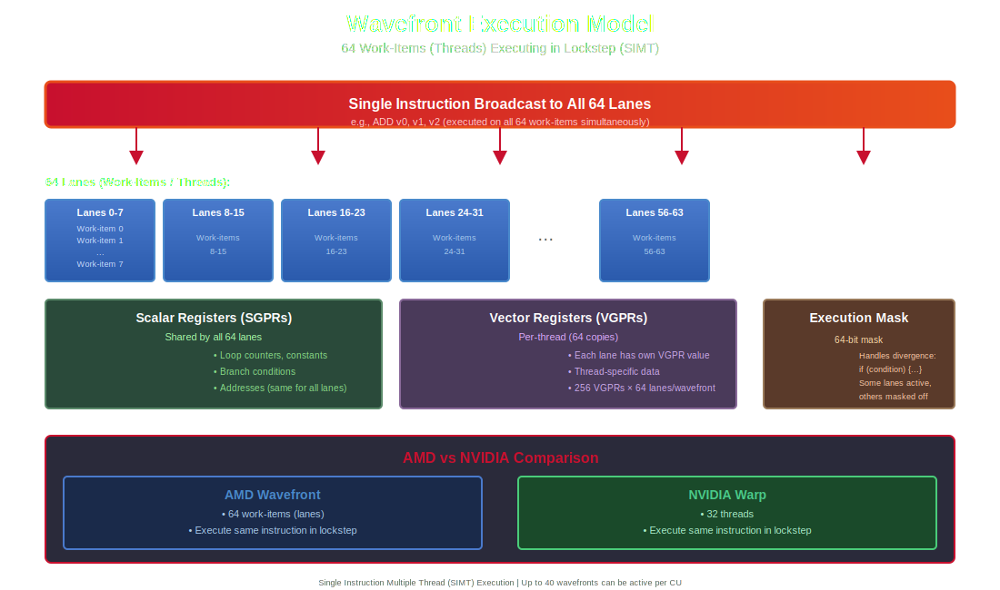
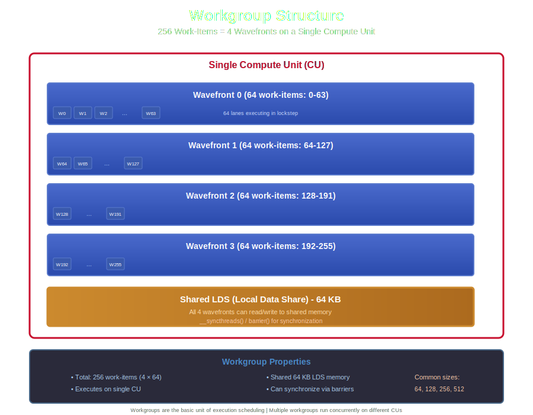
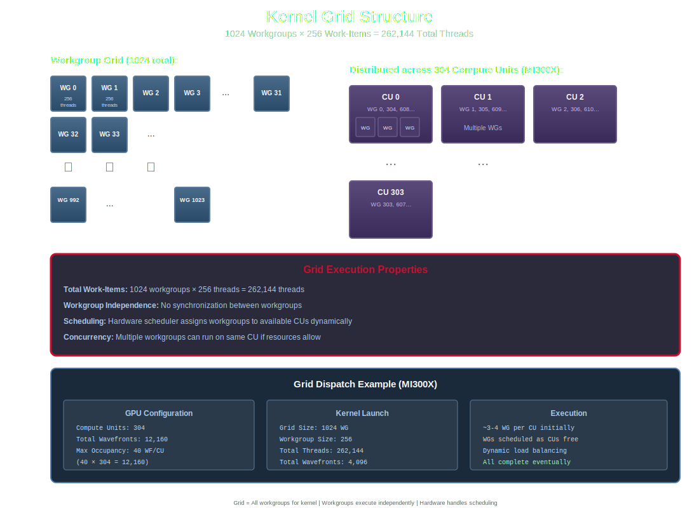

# Device Software

Programming models, execution concepts, and on-device software abstractions for AMD GPUs.

## HIP (Heterogeneous-compute Interface for Portability)

AMD's C++ programming language for GPU computing. HIP provides a CUDA-like API that can compile to both AMD and NVIDIA GPUs.

**Key characteristics:**
- Very similar syntax to CUDA
- Single source code for AMD and NVIDIA GPUs
- hipcc compiler supports both backends
- Extensive CUDA compatibility layer

**Example:**
```cpp
__global__ void vectorAdd(float* a, float* b, float* c, int n) {
    int idx = blockIdx.x * blockDim.x + threadIdx.x;
    if (idx < n) c[idx] = a[idx] + b[idx];
}
```

**Related:** [ROCm](#rocm), [hipcc](#hipcc), [Kernel](#kernel)

## Kernel

A function that runs on the GPU, executed by many parallel threads simultaneously.

**Key characteristics:**
- Declared with `__global__` in HIP
- Launched from host (CPU) code
- Executes across multiple Compute Units
- Each thread runs the same code on different data (SPMD)

**Launch syntax:**
```cpp
kernel<<<gridDim, blockDim, sharedMem, stream>>>(args);
```

**Related:** [Work-Item](#work-item), [Workgroup](#workgroup), [Grid](#grid)

## Wavefront

A group of 64 work-items (threads) that execute in SIMT (Single Instruction, Multiple Thread) fashion on AMD GPUs. Analogous to NVIDIA's "warp" (32 threads).



<details>
<summary>View ASCII diagram</summary>

```
Wavefront (64 work-items executing in lockstep)
┌────────────────────────────────────────────────────┐
│  Lane: 0   1   2   3   4  ...  60  61  62  63     │
│       ┌───┬───┬───┬───┬───┬───┬───┬───┬───┬───┐   │
│       │ T │ T │ T │ T │ T │...│ T │ T │ T │ T │   │
│       └───┴───┴───┴───┴───┴───┴───┴───┴───┴───┘   │
│         ↓   ↓   ↓   ↓   ↓       ↓   ↓   ↓   ↓     │
│       ┌─────────────────────────────────────────┐  │
│       │  Same Instruction (e.g., ADD v0, v1)    │  │
│       └─────────────────────────────────────────┘  │
│                                                     │
│  Each lane (T) has its own:                        │
│    • VGPRs (Vector Registers)                      │
│    • Program Counter (PC)                          │
│    • Data values                                   │
│                                                     │
│  Shared across wavefront:                          │
│    • SGPRs (Scalar Registers)                      │
│    • Instruction stream                            │
│    • Execution mask (for divergence)               │
└────────────────────────────────────────────────────┘

AMD Wavefront = 64 threads  (vs. NVIDIA Warp = 32)
```

</details>

**Key characteristics:**
- Always 64 threads on CDNA/RDNA architectures
- All threads in wavefront execute same instruction
- Fundamental scheduling unit
- Divergence causes serialization

**Related:** [Work-Item](#work-item), [Wave Divergence](#wave-divergence), [Compute Unit](#compute-unit-cu)

## Work-Item

A single thread of execution in the AMD programming model. Equivalent to CUDA's "thread."

**Key characteristics:**
- Identified by `get_global_id()` or `threadIdx`/`blockIdx` in HIP
- Executes independently (logically)
- 64 work-items form a wavefront
- Has private registers and can access LDS

**Related:** [Wavefront](#wavefront), [Workgroup](#workgroup)

## Workgroup

A collection of work-items that can cooperate via LDS memory and synchronization. Equivalent to CUDA's "thread block."



<details>
<summary>View ASCII diagram</summary>

```
Workgroup (e.g., 256 threads = 4 wavefronts)
┌────────────────────────────────────────────────┐
│         Executing on Single Compute Unit       │
├────────────────────────────────────────────────┤
│  Wavefront 0: [T0  T1  T2  ... T62 T63]       │
│  Wavefront 1: [T64 T65 T66 ... T126 T127]     │
│  Wavefront 2: [T128 T129 T130 ... T190 T191]  │
│  Wavefront 3: [T192 T193 T194 ... T254 T255]  │
│                                                 │
│  ┌──────────────────────────────────────────┐  │
│  │  Shared LDS Memory (64 KB)               │  │
│  │  All threads can read/write              │  │
│  │  __shared__ float data[256];             │  │
│  └──────────────────────────────────────────┘  │
│                                                 │
│  Synchronization:                               │
│  __syncthreads() ← All wavefronts wait here    │
└────────────────────────────────────────────────┘

Workgroup size: typically 64, 128, 256, or 512
(Must be multiple of 64 for optimal performance)
```

</details>

**Key characteristics:**
- Execute on the same Compute Unit
- Share LDS (Local Data Share) memory
- Can synchronize with barriers
- Size is programmer-defined (typically 64, 128, 256 threads)

**HIP usage:**
```cpp
// blockDim = workgroup size
// blockIdx = workgroup ID
int localId = threadIdx.x;
int groupId = blockIdx.x;
```

**Related:** [Work-Item](#work-item), [LDS](#lds-local-data-share), [Compute Unit](#compute-unit-cu)

## Grid

The complete collection of workgroups launched for a kernel execution.



<details>
<summary>View ASCII diagram</summary>

```
Grid (All workgroups for a kernel launch)
kernel<<<gridDim, blockDim>>>(args);
e.g., <<<(1024, 1, 1), (256, 1, 1)>>>

┌─────────────────────────────────────────────────┐
│  Grid: 1024 workgroups × 256 threads each       │
│       = 262,144 total threads                   │
├─────────────────────────────────────────────────┤
│                                                  │
│  WG 0    WG 1    WG 2    WG 3    ...   WG 1023  │
│  ┌───┐  ┌───┐  ┌───┐  ┌───┐         ┌───┐     │
│  │256│  │256│  │256│  │256│   ...   │256│     │
│  │ T │  │ T │  │ T │  │ T │         │ T │     │
│  └─┬─┘  └─┬─┘  └─┬─┘  └─┬─┘         └─┬─┘     │
│    │      │      │      │               │       │
│    ▼      ▼      ▼      ▼               ▼       │
│  ┌────────────────────────────────────────┐     │
│  │    Distributed across Compute Units    │     │
│  │  CU0   CU1   CU2  ... CU303 (MI300X)  │     │
│  └────────────────────────────────────────┘     │
│                                                  │
│  Note: Workgroups execute independently         │
│        (no synchronization between WGs)         │
└─────────────────────────────────────────────────┘
```

</details>

**Key characteristics:**
- Can be 1D, 2D, or 3D
- Total threads = gridDim × blockDim
- Workgroups execute independently
- No direct synchronization between workgroups

**Related:** [Workgroup](#workgroup), [Kernel](#kernel)

## Work-Item Dimensions

The 3D indexing scheme (x, y, z) used to identify individual work-items within workgroups and grids.

**HIP syntax:**
```cpp
int globalX = blockIdx.x * blockDim.x + threadIdx.x;
int globalY = blockIdx.y * blockDim.y + threadIdx.y;
int globalZ = blockIdx.z * blockDim.z + threadIdx.z;
```

**Related:** [Work-Item](#work-item), [Grid](#grid)

## GCN ISA (Graphics Core Next Instruction Set Architecture)

The assembly-level instruction set for AMD GPUs from GCN generation (now evolved into RDNA for gaming, CDNA for compute).

**Key characteristics:**
- Low-level GPU assembly language
- VALU (Vector ALU) and SALU (Scalar ALU) instructions
- Vector and Scalar instruction streams
- Exposed through `llvm-objdump` or ROCm tools

**Related:** [AMDGPU LLVM](#amdgpu-llvm), [Code Object](#code-object)

## CDNA ISA

The instruction set architecture for AMD's Compute DNA (CDNA) datacenter GPUs (MI100, MI200, MI300 series).

**Key features:**
- Optimized for FP64 and matrix operations
- Enhanced FP64 performance vs. RDNA
- Matrix Core instructions
- HIP compiles to CDNA ISA for Instinct GPUs

**Related:** [GCN ISA](#gcn-isa-graphics-core-next-instruction-set-architecture), [Matrix Core Engine](#matrix-core-engine)

## Code Object

The compiled binary containing GPU kernels and metadata, ready for loading and execution.

**Key characteristics:**
- ELF format binary
- Contains ISA code for specific GPU architecture
- Includes kernel metadata (register usage, LDS size, etc.)
- Generated by hipcc/ROCm compiler

**Related:** [Kernel](#kernel), [hipcc](#hipcc)

## HSA (Heterogeneous System Architecture)

An open standard that AMD GPUs implement for unified CPU-GPU programming and memory management.

**Key features:**
- Shared virtual memory between CPU and GPU
- User-mode queue submission (no kernel driver calls)
- Coherent memory access
- Standardized runtime and queue model

**Related:** [ROCm](#rocm), [HSA Queue](#hsa-queue)

## HSA Queue

A command queue for submitting work to the GPU in the HSA programming model.

**Key characteristics:**
- User-space queue (no syscalls needed)
- Ring buffer structure
- Supports multiple concurrent queues
- Low-latency kernel dispatch

**Related:** [HSA](#hsa-heterogeneous-system-architecture), [Kernel Dispatch](#kernel-dispatch)

## Kernel Dispatch

The process of launching a kernel for execution on the GPU.

**Execution Flow from CPU to GPU:**

```
┌─────────────────────────────────────────────────────────────────────────────┐
│                           CPU SIDE (HOST)                                   │
└─────────────────────────────────────────────────────────────────────────────┘

  ┌──────────────────────────────────────────────────────────────────────┐
  │  1. Application Code                                                 │
  │     hipLaunchKernelGGL(myKernel, gridDim, blockDim, 0, 0, args...)  │
  └────────────────────────────────┬─────────────────────────────────────┘
                                   │
                                   ▼
  ┌──────────────────────────────────────────────────────────────────────┐
  │  2. HIP Runtime (hipLaunchKernel)                                    │
  │     • Validate launch parameters                                     │
  │     • Prepare kernel arguments                                       │
  │     • Allocate argument buffer if needed                             │
  └────────────────────────────────┬─────────────────────────────────────┘
                                   │
                                   ▼
  ┌──────────────────────────────────────────────────────────────────────┐
  │  3. HSA Runtime (hsa_signal_create, hsa_queue_store_write_index)    │
  │     • Create dispatch packet (AQL packet)                            │
  │     • Copy kernel arguments to GPU memory                            │
  │     • Setup grid/workgroup dimensions                                │
  │     • Setup kernel object handle                                     │
  │     • Write packet to HSA queue (ring buffer)                        │
  │     • Ring doorbell (notify GPU)                                     │
  └────────────────────────────────┬─────────────────────────────────────┘
                                   │
                                   │ PCIe / Memory Bus
                                   │
┌──────────────────────────────────▼──────────────────────────────────────────┐
│                           GPU SIDE (DEVICE)                                 │
└─────────────────────────────────────────────────────────────────────────────┘

  ┌──────────────────────────────────────────────────────────────────────┐
  │  4. Command Processor (CP)                                           │
  │     • Read dispatch packet from HSA queue                            │
  │     • Parse packet header and kernel descriptor                      │
  │     • Decode grid dimensions (gridDim, blockDim)                     │
  │     • Calculate total number of workgroups                           │
  └────────────────────────────────┬─────────────────────────────────────┘
                                   │
                                   ▼
  ┌──────────────────────────────────────────────────────────────────────┐
  │  5. Workgroup Assignment                                             │
  │     • CP assigns workgroups to available Compute Units (CUs)         │
  │     • Check CU resource availability:                                │
  │       - VGPR/SGPR availability                                       │
  │       - LDS availability                                             │
  │       - Wavefront slots                                              │
  │     • Workgroups distributed across Shader Engines and CUs           │
  └────────────────────────────────┬─────────────────────────────────────┘
                                   │
                   ┌───────────────┼───────────────┐
                   │               │               │
                   ▼               ▼               ▼
  ┌──────────────────┐  ┌──────────────────┐  ┌──────────────────┐
  │   CU 0           │  │   CU 1           │  │   CU N           │
  │                  │  │                  │  │                  │
  │  6. Wavefront    │  │  6. Wavefront    │  │  6. Wavefront    │
  │     Creation     │  │     Creation     │  │     Creation     │
  │     • Split      │  │     • Split      │  │     • Split      │
  │       workgroup  │  │       workgroup  │  │       workgroup  │
  │       into       │  │       into       │  │       into       │
  │       wavefronts │  │       wavefronts │  │       wavefronts │
  │       (64 lanes) │  │       (64 lanes) │  │       (64 lanes) │
  │                  │  │                  │  │                  │
  │  7. Allocate     │  │  7. Allocate     │  │  7. Allocate     │
  │     Resources    │  │     Resources    │  │     Resources    │
  │     • VGPRs      │  │     • VGPRs      │  │     • VGPRs      │
  │     • SGPRs      │  │     • SGPRs      │  │     • SGPRs      │
  │     • LDS        │  │     • LDS        │  │     • LDS        │
  │                  │  │                  │  │                  │
  │  8. Schedule to  │  │  8. Schedule to  │  │  8. Schedule to  │
  │     SIMD Units   │  │     SIMD Units   │  │     SIMD Units   │
  │                  │  │                  │  │                  │
  │  ┌─────┐┌─────┐ │  │  ┌─────┐┌─────┐ │  │  ┌─────┐┌─────┐ │
  │  │SIMD0││SIMD1│ │  │  │SIMD0││SIMD1│ │  │  │SIMD0││SIMD1│ │
  │  └─────┘└─────┘ │  │  └─────┘└─────┘ │  │  └─────┘└─────┘ │
  │  ┌─────┐┌─────┐ │  │  ┌─────┐┌─────┐ │  │  ┌─────┐┌─────┐ │
  │  │SIMD2││SIMD3│ │  │  │SIMD2││SIMD3│ │  │  │SIMD2││SIMD3│ │
  │  └─────┘└─────┘ │  │  └─────┘└─────┘ │  │  └─────┘└─────┘ │
  │                  │  │                  │  │                  │
  │  9. Execute      │  │  9. Execute      │  │  9. Execute      │
  │     Instructions │  │     Instructions │  │     Instructions │
  │     • Fetch inst │  │     • Fetch inst │  │     • Fetch inst │
  │     • Decode     │  │     • Decode     │  │     • Decode     │
  │     • Execute    │  │     • Execute    │  │     • Execute    │
  │     • Writeback  │  │     • Writeback  │  │     • Writeback  │
  └──────────────────┘  └──────────────────┘  └──────────────────┘

                              ▼ ▼ ▼

  ┌──────────────────────────────────────────────────────────────────────┐
  │ 10. Memory Operations (throughout execution)                         │
  │     • Register File: VGPRs, SGPRs (< 1 cycle)                        │
  │     • LDS: Workgroup shared memory (~25 cycles)                      │
  │     • L1 Cache: Vector cache (~50 cycles)                            │
  │     • L2 Cache: Shared across CUs (~150 cycles)                      │
  │     • L3 Cache: Infinity Cache (~200 cycles)                         │
  │     • HBM3: Global memory (~300-400 cycles)                          │
  └──────────────────────────────────────────────────────────────────────┘

                              ▼ ▼ ▼

  ┌──────────────────────────────────────────────────────────────────────┐
  │ 11. Completion                                                       │
  │     • All wavefronts complete execution                              │
  │     • Resources deallocated (VGPRs, SGPRs, LDS)                      │
  │     • Signal completion event to HSA queue                           │
  │     • CPU notified (if synchronous) or continues (if async)          │
  └──────────────────────────────────────────────────────────────────────┘
```

**Key Steps Explained:**

1. **Application Code**: HIP API call launches kernel with grid/block dimensions
2. **HIP Runtime**: Validates parameters and prepares for launch
3. **HSA Runtime**: Creates AQL (Architected Queuing Language) packet and submits to queue
4. **Command Processor**: Hardware unit that reads queue and decodes dispatch
5. **Workgroup Assignment**: Distributes work to Compute Units based on resource availability
6. **Wavefront Creation**: Workgroups split into wavefronts (64 work-items each)
7. **Resource Allocation**: VGPRs, SGPRs, and LDS allocated per wavefront
8. **SIMD Scheduling**: Wavefronts scheduled to SIMD units within CUs
9. **Execution**: Instructions execute across all lanes in SIMD lockstep
10. **Memory Operations**: Access memory hierarchy as needed
11. **Completion**: Signal completion and free resources

**Related:** [Kernel](#kernel), [HSA Queue](#hsa-queue), [Command Processor](#command-processor), [Wavefront](#wavefront), [Compute Unit](#compute-unit)

## Barrier / Synchronization

Mechanisms to coordinate execution between work-items within a workgroup.

**Types:**
- `__syncthreads()` in HIP - Workgroup barrier
- Memory fences (`__threadfence()`)
- Atomic operations

**Key characteristics:**
- Only works within a workgroup
- All work-items must reach barrier
- Ensures memory visibility

**Important:** No built-in synchronization between different workgroups.

**Related:** [Workgroup](#workgroup), [Atomic Operations](#atomic-operations)

## Wave Divergence

When work-items within the same wavefront take different execution paths (e.g., different branches of an if-statement).

**Impact:**
- Both branches execute serially
- Some lanes masked off during each branch
- Reduces effective parallelism
- Can significantly hurt performance

**Example of divergence:**
```cpp
if (threadIdx.x < 32) {
    // Only half of wavefront active
    doSomething();
} else {
    // Other half active
    doSomethingElse();
}
```

**Related:** [Wavefront](#wavefront), [Performance Optimization](#performance-optimization)

## Occupancy

The ratio of active wavefronts to the maximum possible wavefronts on a Compute Unit.

**Factors limiting occupancy:**
- VGPR usage per work-item
- SGPR usage per wavefront
- LDS usage per workgroup
- Workgroup size

**Why it matters:**
- Higher occupancy can hide memory latency
- More wavefronts available to schedule
- Balance with resource usage

**Related:** [Wavefront](#wavefront), [Compute Unit](#compute-unit-cu), [VGPR](#vgpr-vector-general-purpose-register)

## Atomic Operations

Memory operations that execute atomically, ensuring thread-safe updates to shared memory.

**Common operations:**
```cpp
atomicAdd(address, value);
atomicCAS(address, compare, value); // Compare-and-swap
atomicExch(address, value);
atomicMin/Max(address, value);
```

**Key characteristics:**
- Serialized execution (slow if contended)
- Work across workgroups (global memory)
- Available in LDS for intra-workgroup atomics

**Related:** [LDS](#lds-local-data-share), [Synchronization](#barrier--synchronization)

## Memory Coalescing

When consecutive work-items in a wavefront access consecutive memory addresses, allowing the hardware to combine multiple accesses into fewer transactions.

**Best case (coalesced):**
```cpp
// Each thread loads consecutive 4-byte element
float value = array[threadIdx.x];
```

**Worst case (uncoalesced):**
```cpp
// Random or strided access pattern
float value = array[randomIndex[threadIdx.x]];
```

**Related:** [Wavefront](#wavefront), [HBM](#hbm-high-bandwidth-memory), [Memory Bandwidth](#memory-bandwidth)

## Unified Memory / Managed Memory

Memory that can be accessed from both CPU and GPU with automatic migration.

**Key characteristics:**
- Single pointer valid on both CPU and GPU
- Runtime handles data migration
- Simplified programming model
- May have performance overhead vs. explicit copying

**HIP usage:**
```cpp
hipMallocManaged(&ptr, size);
// Use ptr on both CPU and GPU
```

**Related:** [HSA](#hsa-heterogeneous-system-architecture), [Memory Management](#memory-management)

## Constant Memory

Read-only memory optimized for broadcast reads (all threads read same address).

**Key characteristics:**
- Cached efficiently when all threads read same value
- Declared with `__constant__` qualifier
- Limited size (64 KB typical)
- Poor performance for divergent reads

**Related:** [Memory Hierarchy](#memory-hierarchy), [Kernel](#kernel)
