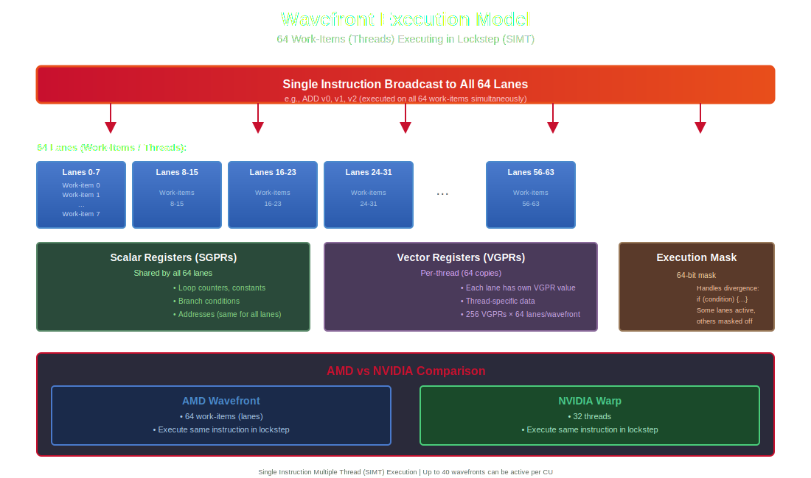
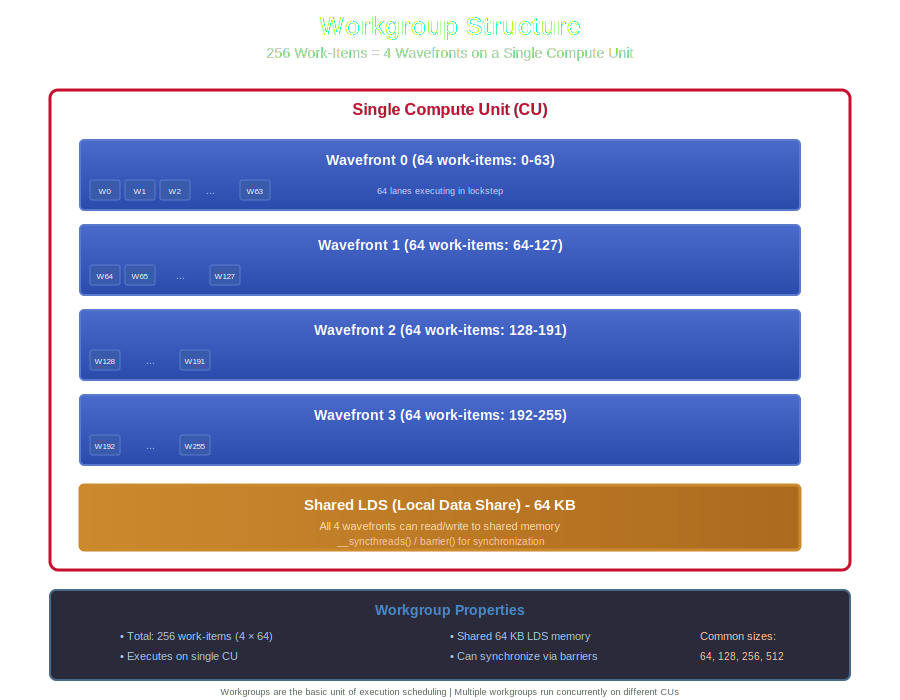
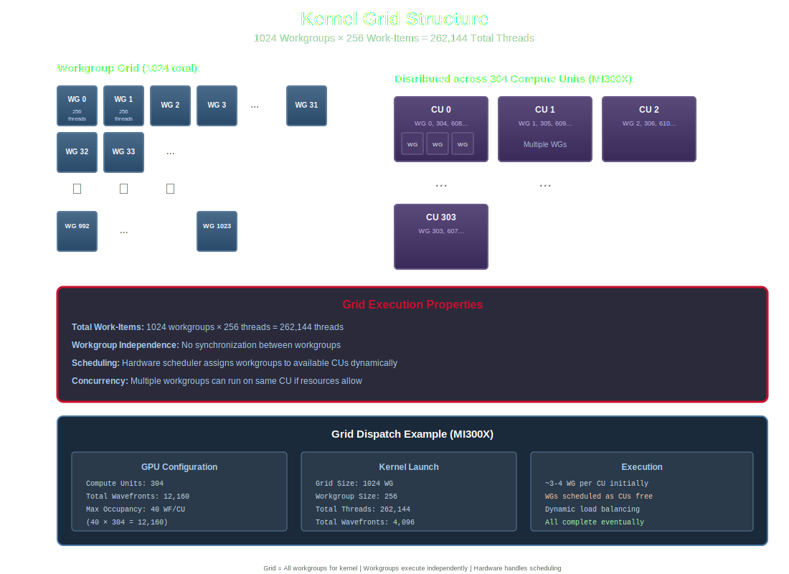

# Device Software

Programming models, execution concepts, and on-device software abstractions for AMD GPUs.

## HIP (Heterogeneous-compute Interface for Portability)

AMD's C++ programming language for GPU computing. HIP provides a CUDA-like API that can compile to both AMD and NVIDIA GPUs, enabling portable GPU code across vendors.

**Key characteristics:**
- Near-identical syntax to CUDA (often just renaming `cuda*` to `hip*`)
- Single source code targets both AMD (via ROCm) and NVIDIA (via CUDA) backends
- hipcc compiler automatically selects appropriate backend
- Extensive CUDA compatibility layer (hipify tools convert CUDA to HIP)
- Direct access to AMD-specific features (wavefront intrinsics, LDS control)

**Programming model:**
- Host code (CPU) allocates memory, launches kernels, manages execution
- Device code (GPU) runs massively parallel computations
- Asynchronous execution with streams for overlapping operations
- Memory spaces: global (HBM), shared/LDS (on-chip), registers (per-thread)

**Example:**
```cpp
__global__ void vectorAdd(float* a, float* b, float* c, int n) {
    int idx = blockIdx.x * blockDim.x + threadIdx.x;
    if (idx < n) c[idx] = a[idx] + b[idx];
}

// Host launches kernel: <<<grid_size, block_size>>>
vectorAdd<<<1024, 256>>>(d_a, d_b, d_c, n);
```

**When to use HIP:**
- Need portability between AMD and NVIDIA GPUs
- Migrating existing CUDA code to AMD
- Want CUDA-like productivity on ROCm platform
- Building vendor-neutral GPU libraries

**Related:** [ROCm](#rocm), [hipcc](#hipcc), [Kernel](#kernel)

## Kernel

A function that runs on the GPU, executed by many parallel threads (work-items) simultaneously in a Single Program, Multiple Data (SPMD) fashion.

### Overview

A GPU kernel is a special function compiled to run on the GPU rather than the CPU. When launched, a single kernel invocation creates thousands to millions of threads that all execute the same code but operate on different data elements. This massive parallelism is the fundamental paradigm that makes GPUs effective for data-parallel computations.

### Kernel Declaration and Attributes

**Basic Kernel Declaration:**
```cpp
// HIP kernel declaration
__global__ void myKernel(float* input, float* output, int n) {
    int idx = blockIdx.x * blockDim.x + threadIdx.x;

    if (idx < n) {
        output[idx] = input[idx] * 2.0f;
    }
}
```

**Key Attributes:**

- **`__global__`:** Marks function as GPU kernel
  - Called from host (CPU)
  - Executed on device (GPU)
  - Must return `void`

- **`__device__`:** GPU-only function
  - Called from GPU kernels or other device functions
  - Cannot be called from host

- **`__host__`:** CPU function (default)
  - Runs on CPU only

- **`__host__ __device__`:** Dual compilation
  - Compiled for both CPU and GPU
  - Useful for shared utility functions

**Launch Qualifiers:**
```cpp
// Standard kernel
__global__ void kernel1() { }

// Kernel with launch bounds (optimization hint)
__global__
__launch_bounds__(256, 4)  // Max 256 threads/block, 4 blocks/CU target
void kernel2() { }
```

### Kernel Launch Syntax

**Full Launch Configuration:**
```cpp
kernel<<<gridDim, blockDim, sharedMemBytes, stream>>>(arg1, arg2, ...);
       ───┬────  ───┬────  ──────┬──────  ──┬──  ────┬────
          │         │            │           │        │
          │         │            │           │        └─ Kernel arguments
          │         │            │           └────────── HIP stream (queue)
          │         │            └────────────────────── Dynamic LDS size (bytes)
          │         └─────────────────────────────────── Workgroup size (threads)
          └───────────────────────────────────────────── Grid size (workgroups)
```

**Dimension Specifications:**
```cpp
// 1D launch: 1024 workgroups × 256 threads = 262,144 total threads
kernel<<<1024, 256>>>(args);

// 2D launch: (32×32) workgroups × (16×16) threads
dim3 grid(32, 32);       // 1024 workgroups in 2D layout
dim3 block(16, 16);      // 256 threads per workgroup
kernel<<<grid, block>>>(args);

// 3D launch: (10×10×10) workgroups × (8×8×8) threads
dim3 grid(10, 10, 10);   // 1000 workgroups
dim3 block(8, 8, 8);     // 512 threads per workgroup
kernel<<<grid, block>>>(args);

// With dynamic LDS and stream
kernel<<<grid, block, 4096, stream>>>(args);  // 4KB dynamic LDS
```

### Thread Indexing

**Built-in Variables:**

```cpp
__global__ void indexExample() {
    // Workgroup/Block IDs (which workgroup am I in?)
    int blockIdX = blockIdx.x;  // 0 to gridDim.x-1
    int blockIdY = blockIdx.y;  // 0 to gridDim.y-1
    int blockIdZ = blockIdx.z;  // 0 to gridDim.z-1

    // Thread IDs within workgroup (which thread am I in my workgroup?)
    int threadIdX = threadIdx.x;  // 0 to blockDim.x-1
    int threadIdY = threadIdx.y;  // 0 to blockDim.y-1
    int threadIdZ = threadIdx.z;  // 0 to blockDim.z-1

    // Grid dimensions (total number of workgroups)
    int numBlocksX = gridDim.x;
    int numBlocksY = gridDim.y;
    int numBlocksZ = gridDim.z;

    // Block dimensions (threads per workgroup)
    int threadsPerBlockX = blockDim.x;
    int threadsPerBlockY = blockDim.y;
    int threadsPerBlockZ = blockDim.z;
}
```

**Computing Global Thread Index:**

```cpp
// 1D global index
__global__ void index1D(float* data) {
    int globalIdx = blockIdx.x * blockDim.x + threadIdx.x;
    data[globalIdx] = ...;
}

// 2D global index
__global__ void index2D(float* data, int width) {
    int globalX = blockIdx.x * blockDim.x + threadIdx.x;
    int globalY = blockIdx.y * blockDim.y + threadIdx.y;
    int globalIdx = globalY * width + globalX;
    data[globalIdx] = ...;
}

// 3D global index
__global__ void index3D(float* data, int width, int height) {
    int globalX = blockIdx.x * blockDim.x + threadIdx.x;
    int globalY = blockIdx.y * blockDim.y + threadIdx.y;
    int globalZ = blockIdx.z * blockDim.z + threadIdx.z;
    int globalIdx = globalZ * (width * height) + globalY * width + globalX;
    data[globalIdx] = ...;
}
```

### SPMD Execution Model

**Single Program, Multiple Data:**

All threads execute the same kernel code, but operate on different data:

```cpp
__global__ void spmdExample(float* input, float* output, int n) {
    // Every thread executes this SAME code
    int idx = blockIdx.x * blockDim.x + threadIdx.x;

    // But each thread has DIFFERENT idx value
    // Thread 0:    idx = 0
    // Thread 1:    idx = 1
    // Thread 1000: idx = 1000
    // etc.

    if (idx < n) {
        output[idx] = input[idx] * 2.0f;  // Each thread processes different element
    }
}

// Launch with 1M threads
spmdExample<<<1000, 1024>>>(input, output, 1000000);
```

### Kernel Execution Flow

**From Launch to Completion:**

```
1. CPU calls kernel<<<grid, block>>>(args)
   └─ HIP runtime prepares launch
      └─ Arguments copied to GPU memory
         └─ Dispatch packet created

2. Dispatch packet submitted to HSA queue
   └─ GPU Command Processor reads packet
      └─ Workgroups distributed to Compute Units
         └─ Each CU creates wavefronts (64 threads each)

3. Wavefronts execute on SIMD units
   └─ Instructions fetched and executed
      └─ Memory operations access L1→L2→L3→HBM
         └─ Registers hold per-thread state

4. All wavefronts complete
   └─ Resources freed (VGPRs, SGPRs, LDS)
      └─ Completion signal sent to host
         └─ Next kernel can launch
```

### Workgroup Size Selection

**Guidelines:**

```cpp
// RULE 1: Multiple of 64 (wavefront size)
__launch_bounds__(256)  // Good: 256 = 4 wavefronts
__launch_bounds__(255)  // Bad:  255 = 3.98 wavefronts, wastes resources

// RULE 2: Balance occupancy and resources
__launch_bounds__(128)  // Lower occupancy, less resource pressure
__launch_bounds__(512)  // Higher occupancy, more resource pressure

// RULE 3: Consider problem size
// For small problems (< 10K elements):
kernel<<<100, 128>>>(args);  // 12,800 threads

// For large problems (> 1M elements):
kernel<<<8192, 256>>>(args); // 2,097,152 threads
```

**Finding Optimal Block Size:**

```cpp
// Occupancy calculator approach
int minGridSize, blockSize;
hipOccupancyMaxPotentialBlockSize(&minGridSize, &blockSize, myKernel, 0, 0);

// Launch with recommended size
int gridSize = (dataSize + blockSize - 1) / blockSize;
myKernel<<<gridSize, blockSize>>>(args);
```

### Memory Access from Kernels

**Global Memory:**
```cpp
__global__ void globalMemAccess(float* input, float* output) {
    int idx = blockIdx.x * blockDim.x + threadIdx.x;

    // Read from global memory (HBM)
    float value = input[idx];  // ~400 cycles latency

    // Compute
    value = value * 2.0f;

    // Write to global memory
    output[idx] = value;       // Write-through to HBM
}
```

**Shared Memory (LDS):**
```cpp
__global__ void sharedMemAccess(float* input, float* output) {
    __shared__ float temp[256];  // Allocated in LDS

    int tid = threadIdx.x;
    int idx = blockIdx.x * blockDim.x + tid;

    // Load from global to shared
    temp[tid] = input[idx];  // ~25 cycles latency
    __syncthreads();

    // Multiple accesses to shared memory (fast!)
    float result = temp[tid] * 2.0f;
    if (tid > 0) result += temp[tid - 1];
    if (tid < 255) result += temp[tid + 1];

    output[idx] = result;
}
```

**Constant Memory:**
```cpp
__constant__ float coefficients[256];  // Read-only, cached

__global__ void constantMemAccess(float* input, float* output) {
    int idx = blockIdx.x * blockDim.x + threadIdx.x;

    // Efficient broadcast read (all threads read same value)
    float coeff = coefficients[idx % 256];

    output[idx] = input[idx] * coeff;
}
```

### Control Flow in Kernels

**Divergence Awareness:**

```cpp
__global__ void divergentKernel(int* data, int* output) {
    int idx = blockIdx.x * blockDim.x + threadIdx.x;

    // DIVERGENT: Threads take different paths
    if (data[idx] > 100) {
        output[idx] = expensiveFunction(data[idx]);  // Some threads execute this
    } else {
        output[idx] = cheapFunction(data[idx]);      // Other threads execute this
    }
    // Both branches execute sequentially within wavefront! → 2× slower
}

// BETTER: Minimize divergence
__global__ void lessDivergentKernel(int* data, int* output) {
    int idx = blockIdx.x * blockDim.x + threadIdx.x;

    // Use arithmetic instead of branching when possible
    int value = data[idx];
    int mask = (value > 100);  // 0 or 1
    output[idx] = mask * expensiveFunction(value) +
                  (1 - mask) * cheapFunction(value);
    // Both still evaluated, but no divergence penalty
}
```

### Kernel Resource Usage

**Resources Per Thread:**
- **VGPRs (Vector General Purpose Registers):** 32-256 typical
- **SGPRs (Scalar GPRs):** Shared across wavefront
- **LDS:** Shared across workgroup
- **Stack:** Minimal (avoid recursion, large arrays)

**Checking Resource Usage:**
```bash
# Compile and view resource requirements
hipcc -c mykernel.cu --offload-arch=gfx90a
llvm-objdump -d mykernel.o

# Look for lines like:
# .vgpr_count: 64
# .sgpr_count: 32
# .lds_size: 4096
```

**Impact on Occupancy:**
```
High VGPR usage (>128) → Fewer concurrent wavefronts → Lower occupancy
High LDS usage (>32KB)  → Fewer concurrent workgroups → Lower occupancy
```

### Kernel Launch Performance

**Asynchronous Execution:**
```cpp
// Kernel launches are asynchronous by default
kernel1<<<grid, block>>>(args1);  // Returns immediately
kernel2<<<grid, block>>>(args2);  // Returns immediately
                                   // Both kernels may execute concurrently!

// Explicit synchronization
hipDeviceSynchronize();  // Wait for all kernels to complete
```

**Using Streams for Concurrency:**
```cpp
hipStream_t stream1, stream2;
hipStreamCreate(&stream1);
hipStreamCreate(&stream2);

// Launch kernels in different streams (can overlap)
kernel1<<<grid, block, 0, stream1>>>(args1);
kernel2<<<grid, block, 0, stream2>>>(args2);

// Wait for specific stream
hipStreamSynchronize(stream1);
```

### Common Kernel Patterns

**1. Element-wise Operations:**
```cpp
__global__ void vectorAdd(float* a, float* b, float* c, int n) {
    int idx = blockIdx.x * blockDim.x + threadIdx.x;
    if (idx < n) {
        c[idx] = a[idx] + b[idx];
    }
}
```

**2. Reduction:**
```cpp
__global__ void reduce(float* input, float* output, int n) {
    __shared__ float sdata[256];
    int tid = threadIdx.x;
    int idx = blockIdx.x * blockDim.x + tid;

    sdata[tid] = (idx < n) ? input[idx] : 0.0f;
    __syncthreads();

    for (int s = blockDim.x / 2; s > 0; s >>= 1) {
        if (tid < s) sdata[tid] += sdata[tid + s];
        __syncthreads();
    }

    if (tid == 0) output[blockIdx.x] = sdata[0];
}
```

**3. Matrix Multiplication (tiled):**
```cpp
__global__ void matmul(float* A, float* B, float* C, int N) {
    __shared__ float tileA[16][16];
    __shared__ float tileB[16][16];

    int tx = threadIdx.x, ty = threadIdx.y;
    int row = blockIdx.y * 16 + ty;
    int col = blockIdx.x * 16 + tx;

    float sum = 0.0f;
    for (int t = 0; t < N / 16; t++) {
        tileA[ty][tx] = A[row * N + t * 16 + tx];
        tileB[ty][tx] = B[(t * 16 + ty) * N + col];
        __syncthreads();

        for (int k = 0; k < 16; k++) {
            sum += tileA[ty][k] * tileB[k][tx];
        }
        __syncthreads();
    }

    C[row * N + col] = sum;
}
```

### Error Handling

**Checking Launch Success:**
```cpp
kernel<<<grid, block>>>(args);

// Check for launch errors
hipError_t err = hipGetLastError();
if (err != hipSuccess) {
    printf("Kernel launch failed: %s\n", hipGetErrorString(err));
}

// Wait and check for execution errors
hipDeviceSynchronize();
err = hipGetLastError();
if (err != hipSuccess) {
    printf("Kernel execution failed: %s\n", hipGetErrorString(err));
}
```

**Common Launch Errors:**
```
- Invalid configuration (blockDim too large, LDS too large)
- Out of memory
- Invalid arguments
- Too many registers requested
```

### Kernel Optimization Principles

**Key Strategies:**

1. **Maximize Occupancy** (balance resource usage)
2. **Coalesce Memory Access** (sequential access patterns)
3. **Minimize Divergence** (avoid if/else in wavefronts)
4. **Use LDS Effectively** (for data reuse)
5. **Overlap Computation and Memory** (hide latency)

**Related:** [Work-Item](#work-item), [Workgroup](#workgroup), [Grid](#grid), [Wavefront](#wavefront), [Kernel Dispatch](#kernel-dispatch), [Occupancy](#occupancy)

## Wavefront

A group of 64 work-items (threads) that execute in SIMT (Single Instruction, Multiple Thread) fashion on AMD GPUs. Analogous to NVIDIA's "warp" (32 threads).

### Overview

The wavefront is the fundamental unit of execution and scheduling on AMD GPUs. It represents 64 work-items (threads) that execute in perfect lockstep - all 64 threads execute the same instruction at the same time on the same SIMD unit. Understanding wavefronts is critical for writing efficient GPU code and reasoning about performance.



<details>
<summary>View ASCII diagram</summary>

```
Wavefront (64 work-items executing in lockstep)
┌────────────────────────────────────────────────────┐
│  Lane: 0   1   2   3   4  ...  60  61  62  63     │
│       ┌───┬───┬───┬───┬───┬───┬───┬───┬───┬───┐   │
│       │ T │ T │ T │ T │ T │...│ T │ T │ T │ T │   │
│       └───┴───┴───┴───┴───┴───┴───┴───┴───┴───┘   │
│         ↓   ↓   ↓   ↓   ↓       ↓   ↓   ↓   ↓     │
│       ┌─────────────────────────────────────────┐  │
│       │  Same Instruction (e.g., ADD v0, v1)    │  │
│       └─────────────────────────────────────────┘  │
│                                                     │
│  Each lane (T) has its own:                        │
│    • VGPRs (Vector Registers)                      │
│    • Program Counter (PC)                          │
│    • Data values                                   │
│                                                     │
│  Shared across wavefront:                          │
│    • SGPRs (Scalar Registers)                      │
│    • Instruction stream                            │
│    • Execution mask (for divergence)               │
└────────────────────────────────────────────────────┘

AMD Wavefront = 64 threads  (vs. NVIDIA Warp = 32)
```

</details>

### Technical Specifications

**Size:**
- **CDNA (MI100/MI200/MI300):** 64 threads per wavefront
- **RDNA 1/2/3:** 32 threads per wavefront (gaming GPUs)
- **GCN (older):** 64 threads per wavefront

**Key Difference from NVIDIA:**
- AMD wavefront = 64 threads
- NVIDIA warp = 32 threads
- AMD has 2× more threads per SIMT group

### SIMT Execution Model

**Single Instruction, Multiple Threads:**

All 64 threads in a wavefront execute the exact same instruction simultaneously, but on different data:

```
Cycle 1: All 64 threads execute: ADD v0, v1, v2
         Thread 0: v0[0] = v1[0] + v2[0]
         Thread 1: v0[1] = v1[1] + v2[1]
         ...
         Thread 63: v0[63] = v1[63] + v2[63]

Cycle 2: All 64 threads execute: MUL v3, v0, v4
         Thread 0: v3[0] = v0[0] * v4[0]
         Thread 1: v3[1] = v0[1] * v4[1]
         ...
```

**Lockstep Execution:**
```cpp
__global__ void wavefrontExample() {
    int tid = threadIdx.x;

    // All 64 threads execute ADD instruction simultaneously
    float a = data[tid] + 1.0f;

    // All 64 threads execute MUL instruction simultaneously
    float b = a * 2.0f;

    // All 64 threads execute memory store simultaneously
    output[tid] = b;
}

// Launched with 64+ threads:
// Threads 0-63:   Form wavefront 0
// Threads 64-127: Form wavefront 1
// Etc.
```

### Wavefront Formation

**From Workgroups to Wavefronts:**

```
Workgroup (256 threads)
│
├─ Wavefront 0: Threads [0-63]      ──► SIMD Unit 0
├─ Wavefront 1: Threads [64-127]    ──► SIMD Unit 1
├─ Wavefront 2: Threads [128-191]   ──► SIMD Unit 2
└─ Wavefront 3: Threads [192-255]   ──► SIMD Unit 3

Each wavefront scheduled independently
```

**Threading Model:**
```cpp
__global__ void threadToWavefront() {
    int threadId = threadIdx.x;
    int wavefrontId = threadId / 64;  // Which wavefront am I in?
    int laneId = threadId % 64;        // Which lane within wavefront?

    // Threads 0-63:   wavefrontId=0, laneId=0-63
    // Threads 64-127: wavefrontId=1, laneId=0-63
    // Threads 128-191: wavefrontId=2, laneId=0-63
}
```

### Register Allocation

**Per-Thread Registers (VGPRs):**

Each thread in the wavefront has its own set of Vector General Purpose Registers:

```
Wavefront Register File
┌─────────────────────────────────────────────────┐
│  VGPR Allocation (per thread)                   │
├─────────────────────────────────────────────────┤
│  Thread 0:  v0-v255 (256 VGPRs available)      │
│  Thread 1:  v0-v255                             │
│  Thread 2:  v0-v255                             │
│  ...                                            │
│  Thread 63: v0-v255                             │
├─────────────────────────────────────────────────┤
│  Total VGPR usage = NumVGPRs × 64 threads       │
│                                                  │
│  Example: Kernel uses 64 VGPRs/thread           │
│           Total = 64 × 64 = 4096 VGPRs          │
└─────────────────────────────────────────────────┘
```

**Shared Scalar Registers (SGPRs):**

All threads in a wavefront share the same SGPRs:

```
Scalar Register File (shared by all 64 threads)
┌─────────────────────────────────────────────────┐
│  SGPR s0-s101 (typical)                        │
│                                                 │
│  Used for:                                      │
│  • Loop counters (same for all threads)        │
│  • Base addresses                               │
│  • Uniform values                               │
│  • Control flow state                           │
└─────────────────────────────────────────────────┘
```

### Wavefront Scheduling

**CU Wavefront Slots:**

Each Compute Unit can hold multiple wavefronts concurrently:

```
Compute Unit (4 SIMD Units)
┌───────────────────────────────────────────────┐
│  Max: ~40 wavefronts total (architecture dep) │
│                                                │
│  SIMD 0: [W0] [W4] [W8]  [W12] ...            │
│  SIMD 1: [W1] [W5] [W9]  [W13] ...            │
│  SIMD 2: [W2] [W6] [W10] [W14] ...            │
│  SIMD 3: [W3] [W7] [W11] [W15] ...            │
│                                                │
│  Each SIMD can execute 1 wavefront at a time  │
│  But many wavefronts resident for switching   │
└───────────────────────────────────────────────┘

Hardware rapidly switches between wavefronts:
- Wavefront A executes 1 instruction
- Stalls on memory access
- Wavefront B executes 1 instruction
- Wavefront C executes 1 instruction
- Wavefront A ready again, executes next instruction
```

**Latency Hiding Through Wavefront Switching:**

```
Time ──────────────────────────────────────►

SIMD Unit executing wavefronts:

Cycle 1:  WF0 - ADD instruction
Cycle 2:  WF0 - Load from memory (starts, 400 cycle latency)
Cycle 3:  WF1 - ADD instruction (switch while WF0 waits)
Cycle 4:  WF2 - MUL instruction
Cycle 5:  WF3 - ADD instruction
...
Cycle 100: WF10 - Some instruction
...
Cycle 402: WF0 - Load completes, ready to execute next instruction

Result: Memory latency completely hidden by other wavefronts!
```

### Wave Divergence

**The Divergence Problem:**

When threads in a wavefront take different execution paths, both paths must execute serially:

```cpp
__global__ void divergentCode(int* data, int* output) {
    int idx = threadIdx.x;
    int value = data[idx];

    if (value > 100) {           // ◄── DIVERGENCE POINT
        output[idx] = value * 2; // Path A
    } else {
        output[idx] = value + 10; // Path B
    }
}

// Execution in wavefront with mixed values:
// Threads 0-31:  value <= 100
// Threads 32-63: value > 100

Actual execution:
1. Evaluate condition for all 64 threads
2. Mask: Enable threads 32-63, disable 0-31
3. Execute "output[idx] = value * 2" for threads 32-63
   (Threads 0-31 idle)
4. Mask: Enable threads 0-31, disable 32-63
5. Execute "output[idx] = value + 10" for threads 0-31
   (Threads 32-63 idle)

Result: 2× execution time compared to no divergence!
```

**Measuring Divergence Impact:**

```
No Divergence:      All threads take same path
                    Execution time: T

50% Divergence:     Half take each path
                    Execution time: ~2T

Worst Case:         Each thread different path
                    Execution time: up to 64T!
```

**Avoiding Divergence:**

```cpp
// BAD: Divergent within wavefront
__global__ void bad(int* data, int* output) {
    int idx = threadIdx.x;

    if (data[idx] > threshold) {
        expensiveOperation(idx);
    } else {
        cheapOperation(idx);
    }
}

// BETTER: Predication instead of branching
__global__ void better(int* data, int* output) {
    int idx = threadIdx.x;
    int value = data[idx];

    // Both operations execute, but result selected
    int result1 = expensiveOperation(idx);
    int result2 = cheapOperation(idx);

    // No divergence, but both branches computed
    output[idx] = (value > threshold) ? result1 : result2;
}

// BEST: Sort data so threads in same wavefront take same path
__global__ void best(int* sortedData, int* output) {
    int idx = threadIdx.x;

    // All threads 0-63 likely take same path (data is sorted)
    if (sortedData[idx] > threshold) {
        expensiveOperation(idx);  // All threads execute this
    } else {
        cheapOperation(idx);       // OR all threads execute this
    }
    // Minimal divergence!
}
```

### Wavefront Memory Access

**Coalesced Access:**

When threads in a wavefront access consecutive memory addresses:

```cpp
__global__ void coalescedAccess(float* data) {
    int idx = blockIdx.x * blockDim.x + threadIdx.x;

    // Thread 0:  data[0]
    // Thread 1:  data[1]
    // Thread 2:  data[2]
    // ...
    // Thread 63: data[63]

    float value = data[idx];  // ◄── COALESCED: 1-2 memory transactions
}
```

**Uncoalesced Access:**

```cpp
__global__ void uncoalescedAccess(float* data) {
    int idx = blockIdx.x * blockDim.x + threadIdx.x;

    // Thread 0:  data[0]
    // Thread 1:  data[1000]
    // Thread 2:  data[2000]
    // ...

    float value = data[idx * 1000];  // ◄── UNCOALESCED: up to 64 transactions!
}
```

### Wavefront-Level Operations

**Wavefront-Aware Primitives:**

```cpp
// Get lane ID within wavefront (0-63)
__device__ int getLaneId() {
    return __lane_id();  // Or threadIdx.x % 64
}

// Wavefront-level ballot (get bit mask of active threads)
__device__ uint64_t ballot(int predicate) {
    return __ballot(predicate);
    // Returns 64-bit mask: bit i set if thread i's predicate is true
}

// Wavefront shuffle: Read from another thread's register
__device__ float shuffle(float value, int srcLane) {
    return __shfl(value, srcLane);
    // Read thread srcLane's value
}

// Wavefront reduction
__device__ float wavefrontSum(float value) {
    // Sum across all 64 threads in wavefront
    for (int offset = 32; offset > 0; offset /= 2) {
        value += __shfl_down(value, offset);
    }
    return value;  // Thread 0 has sum
}
```

**Example Usage:**

```cpp
__global__ void wavefrontPrimitives(float* data, float* output) {
    int idx = blockIdx.x * blockDim.x + threadIdx.x;
    int lane = getLaneId();

    float value = data[idx];

    // Check if any thread in wavefront has value > 100
    uint64_t mask = __ballot(value > 100);
    if (mask != 0) {
        // At least one thread has value > 100
    }

    // Broadcast thread 0's value to all threads in wavefront
    float broadcastValue = __shfl(value, 0);

    // Compute wavefront-wide sum
    float sum = wavefrontSum(value);
    if (lane == 0) {
        output[blockIdx.x * (blockDim.x / 64) + lane / 64] = sum;
    }
}
```

### Wavefront Execution Masking

**EXEC Mask:**

Hardware uses an execution mask to control which threads are active:

```
64-bit EXEC mask (one bit per thread):
┌──┬──┬──┬──┬──┬───┬───┬───┬───┐
│1 │1 │0 │0 │1 │...│ 1 │ 1 │ 0 │
└──┴──┴──┴──┴──┴───┴───┴───┴───┘
 │  │  │  │  │       │   │   │
 T0 T1 T2 T3 T4     T61 T62 T63

1 = Thread active, instruction executes
0 = Thread inactive, instruction skipped

Used for:
• Divergent branches (mask off threads not taking branch)
• Early thread exit
• Bounds checking (e.g., if (idx < n))
```

**Example:**
```cpp
__global__ void earlyExit(int* data, int n) {
    int idx = blockIdx.x * blockDim.x + threadIdx.x;

    // Some threads may be out of bounds
    if (idx >= n) return;  // ◄── These threads become inactive

    // EXEC mask updated: only threads with idx < n are active
    // Inactive threads still in wavefront, just masked off

    data[idx] = idx * 2;  // Only active threads execute this
}
```

### Wavefront Synchronization

**Implicit Synchronization:**

Threads within a wavefront are inherently synchronized (lockstep execution):

```cpp
__device__ void wavefrontImplicitSync() {
    int lane = __lane_id();
    int value = computeSomething(lane);

    // NO __syncthreads() needed within wavefront!
    // All threads automatically at same instruction

    int neighbor = __shfl_down(value, 1);  // Safe: lockstep execution
}
```

**No Barrier Needed Within Wavefront:**

```cpp
// Within wavefront: No barrier needed
if (lane < 63) {
    int next = __shfl(value, lane + 1);  // Safe
}

// Across wavefronts: MUST use barrier
__shared__ float buffer[256];
buffer[threadIdx.x] = value;
__syncthreads();  // ◄── Required! Different wavefronts not synchronized
float other = buffer[(threadIdx.x + 64) % 256];
```

### Performance Implications

**Wavefront Utilization:**

```
Workgroup size should be multiple of 64:

Size 64:  1 full wavefront  (100% utilization)
Size 128: 2 full wavefronts (100% utilization)
Size 256: 4 full wavefronts (100% utilization)

Size 65:  2 wavefronts: 64 + 1 (only 1.5% of 2nd wavefront used!)
Size 100: 2 wavefronts: 64 + 36 (only 56% of 2nd wavefront used)
```

**Occupancy Impact:**

```
CU can hold ~40 wavefronts maximum

High VGPR usage limits concurrent wavefronts:
• 64 VGPRs/thread → 16 wavefronts per CU (40% occupancy)
• 128 VGPRs/thread → 8 wavefronts per CU (20% occupancy)
• 256 VGPRs/thread → 4 wavefronts per CU (10% occupancy)
```

### Debugging Wavefronts

**Profiling Wavefront Metrics:**

```bash
# Count wavefronts executed
rocprofv3 --pmc SQ_WAVES -- ./myapp

# Measure wavefront active cycles
rocprofv3 --pmc SQ_ACTIVE_INST_VALU -- ./myapp

# Check for divergence
rocprofv3 --pmc VALUUtilization -- ./myapp
# Low VALUUtilization (<80%) indicates divergence or partial wavefronts
```

**Related:** [Work-Item](#work-item), [Wave Divergence](#wave-divergence), [Compute Unit](#compute-unit-cu), [SIMD Unit](#simd-unit), [Occupancy](#occupancy)

## Work-Item

A single thread of execution in the AMD GPU programming model. Each work-item represents one instance of a kernel function executing with its own data. Equivalent to CUDA's "thread."

**Key characteristics:**
- Basic unit of parallelism (logically independent, but executes in groups)
- Identified by unique index: `get_global_id()` (OpenCL) or `threadIdx`/`blockIdx` (HIP)
- Grouped into wavefronts (64 work-items) for hardware execution
- Has private registers (VGPRs) and local variables
- Can access shared LDS memory within its workgroup
- Can access global HBM memory across all workgroups

**Indexing:**
```cpp
// Global ID across entire kernel launch
int gid = blockIdx.x * blockDim.x + threadIdx.x;

// Local ID within workgroup
int lid = threadIdx.x;

// Workgroup ID
int wgid = blockIdx.x;
```

**Execution model:**
- Logical independence: each work-item appears to execute independently
- Physical execution: groups of 64 execute together as wavefronts in SIMT fashion
- Hardware limitation: wavefront divergence when work-items take different paths

**Related:** [Wavefront](#wavefront), [Workgroup](#workgroup), [Work-Item Dimensions](#work-item-dimensions)

## Workgroup

A collection of work-items that can cooperate via LDS memory and synchronization. Equivalent to CUDA's "thread block."



<details>
<summary>View ASCII diagram</summary>

```
Workgroup (e.g., 256 threads = 4 wavefronts)
┌────────────────────────────────────────────────┐
│         Executing on Single Compute Unit       │
├────────────────────────────────────────────────┤
│  Wavefront 0: [T0  T1  T2  ... T62 T63]       │
│  Wavefront 1: [T64 T65 T66 ... T126 T127]     │
│  Wavefront 2: [T128 T129 T130 ... T190 T191]  │
│  Wavefront 3: [T192 T193 T194 ... T254 T255]  │
│                                                 │
│  ┌──────────────────────────────────────────┐  │
│  │  Shared LDS Memory (64 KB)               │  │
│  │  All threads can read/write              │  │
│  │  __shared__ float data[256];             │  │
│  └──────────────────────────────────────────┘  │
│                                                 │
│  Synchronization:                               │
│  __syncthreads() ← All wavefronts wait here    │
└────────────────────────────────────────────────┘

Workgroup size: typically 64, 128, 256, or 512
(Must be multiple of 64 for optimal performance)
```

</details>

**Key characteristics:**
- Execute on the same Compute Unit
- Share LDS (Local Data Share) memory
- Can synchronize with barriers
- Size is programmer-defined (typically 64, 128, 256 threads)

**HIP usage:**
```cpp
// blockDim = workgroup size
// blockIdx = workgroup ID
int localId = threadIdx.x;
int groupId = blockIdx.x;
```

**Related:** [Work-Item](#work-item), [LDS](#lds-local-data-share), [Compute Unit](#compute-unit-cu)

## Grid

The complete collection of workgroups launched for a kernel execution.



<details>
<summary>View ASCII diagram</summary>

```
Grid (All workgroups for a kernel launch)
kernel<<<gridDim, blockDim>>>(args);
e.g., <<<(1024, 1, 1), (256, 1, 1)>>>

┌─────────────────────────────────────────────────┐
│  Grid: 1024 workgroups × 256 threads each       │
│       = 262,144 total threads                   │
├─────────────────────────────────────────────────┤
│                                                  │
│  WG 0    WG 1    WG 2    WG 3    ...   WG 1023  │
│  ┌───┐  ┌───┐  ┌───┐  ┌───┐         ┌───┐     │
│  │256│  │256│  │256│  │256│   ...   │256│     │
│  │ T │  │ T │  │ T │  │ T │         │ T │     │
│  └─┬─┘  └─┬─┘  └─┬─┘  └─┬─┘         └─┬─┘     │
│    │      │      │      │               │       │
│    ▼      ▼      ▼      ▼               ▼       │
│  ┌────────────────────────────────────────┐     │
│  │    Distributed across Compute Units    │     │
│  │  CU0   CU1   CU2  ... CU303 (MI300X)  │     │
│  └────────────────────────────────────────┘     │
│                                                  │
│  Note: Workgroups execute independently         │
│        (no synchronization between WGs)         │
└─────────────────────────────────────────────────┘
```

</details>

**Key characteristics:**
- Can be 1D, 2D, or 3D
- Total threads = gridDim × blockDim
- Workgroups execute independently
- No direct synchronization between workgroups

**Related:** [Workgroup](#workgroup), [Kernel](#kernel)

## Work-Item Dimensions

The 3D indexing scheme (x, y, z) used to identify individual work-items within workgroups and grids. Allows mapping multi-dimensional data (images, volumes, matrices) naturally to GPU threads.

**Why 3D indexing:**
- Natural mapping to 2D/3D data structures (images, matrices, volumes)
- Improves code readability (x for width, y for height, z for depth)
- Hardware still executes linearly, but programmer thinks in problem space

**HIP syntax:**
```cpp
// Thread indices within workgroup (0 to blockDim-1)
int localX = threadIdx.x;
int localY = threadIdx.y;
int localZ = threadIdx.z;

// Workgroup indices within grid (0 to gridDim-1)
int wgX = blockIdx.x;
int wgY = blockIdx.y;
int wgZ = blockIdx.z;

// Global thread indices (most common)
int globalX = blockIdx.x * blockDim.x + threadIdx.x;
int globalY = blockIdx.y * blockDim.y + threadIdx.y;
int globalZ = blockIdx.z * blockDim.z + threadIdx.z;
```

**Common patterns:**
```cpp
// 1D: Vector operations
int i = blockIdx.x * blockDim.x + threadIdx.x;
output[i] = input[i] * 2;

// 2D: Image/matrix operations
int x = blockIdx.x * blockDim.x + threadIdx.x;
int y = blockIdx.y * blockDim.y + threadIdx.y;
int idx = y * width + x;  // Row-major indexing
output[idx] = input[idx];

// 3D: Volume operations
int x = blockIdx.x * blockDim.x + threadIdx.x;
int y = blockIdx.y * blockDim.y + threadIdx.y;
int z = blockIdx.z * blockDim.z + threadIdx.z;
int idx = z * width * height + y * width + x;
```

**Launch configuration:**
```cpp
// 1D launch: 1M elements, 256 threads/block
int threads = 256;
int blocks = (1000000 + threads - 1) / threads;
kernel<<<blocks, threads>>>(data);

// 2D launch: 1024x1024 image, 16x16 threads/block
dim3 threads(16, 16);
dim3 blocks((1024 + 15) / 16, (1024 + 15) / 16);
kernel<<<blocks, threads>>>(image);
```

**Related:** [Work-Item](#work-item), [Grid](#grid), [Workgroup](#workgroup)

## GCN ISA (Graphics Core Next Instruction Set Architecture)

The assembly-level instruction set for AMD GPUs from GCN generation (now evolved into RDNA for gaming, CDNA for compute).

**Key characteristics:**
- Low-level GPU assembly language
- VALU (Vector ALU) and SALU (Scalar ALU) instructions
- Vector and Scalar instruction streams
- Exposed through `llvm-objdump` or ROCm tools

**Related:** [AMDGPU LLVM](#amdgpu-llvm), [Code Object](#code-object)

## CDNA ISA

The instruction set architecture for AMD's Compute DNA (CDNA) datacenter GPUs (MI100, MI200, MI300 series).

**Key features:**
- Optimized for FP64 and matrix operations
- Enhanced FP64 performance vs. RDNA
- Matrix Core instructions
- HIP compiles to CDNA ISA for Instinct GPUs

**Related:** [GCN ISA](#gcn-isa-graphics-core-next-instruction-set-architecture), [Matrix Core Engine](#matrix-core-engine)

## Code Object

The compiled binary containing GPU kernels and metadata, ready for loading and execution on AMD GPUs. Code objects are the final output of the HIP/ROCm compilation pipeline.

**Key characteristics:**
- ELF format binary (standard Linux executable format)
- Contains machine code (ISA) for specific GPU architecture (gfx90a, gfx942, etc.)
- Includes kernel metadata: register usage, LDS requirements, workgroup size limits
- Generated by hipcc/ROCm compiler toolchain (LLVM-based)
- Architecture-specific: code for MI250X won't run on MI300X without recompilation

**Structure:**
```
Code Object (.co or embedded in executable)
├── ELF Header (identifies architecture: gfx90a, gfx942)
├── .text section (GPU machine code/ISA)
├── .rodata (constants, __constant__ memory)
├── Kernel metadata:
│   ├── Register usage (VGPRs, SGPRs)
│   ├── LDS size requirements
│   ├── Kernel arguments (types, alignment)
│   ├── Workgroup size limits
│   └── Code properties (uses dynamic LDS, barriers, etc.)
└── Symbol table (kernel names)
```

**Compilation flow:**
```
HIP Source (.hip, .cpp)
    ↓ hipcc
LLVM IR
    ↓ AMDGPU backend
GPU ISA assembly
    ↓ assembler/linker
Code Object (.co)
    ↓ embedded or loaded at runtime
GPU execution
```

**Inspection:**
```bash
# View code object metadata
rocm-objdump -d kernel.co

# Extract kernel information
rocm-readelf -s kernel.co
```

**Related:** [Kernel](#kernel), [hipcc](#hipcc), [GCN ISA](#gcn-isa-graphics-core-next-instruction-set-architecture)

## HSA (Heterogeneous System Architecture)

An open standard that AMD GPUs implement for unified CPU-GPU programming and memory management. HSA provides a foundation for tight CPU-GPU integration with minimal overhead.

**Key features:**
- **Shared virtual memory:** CPU and GPU see the same address space (no separate device pointers)
- **User-mode queue submission:** Direct hardware queue access without kernel driver syscalls
- **Coherent memory access:** CPU and GPU can access same data with automatic coherency
- **Standardized runtime:** Common programming model across HSA-compliant devices
- **Signals:** Low-latency synchronization primitives for CPU-GPU coordination

**Benefits:**
- Simplified programming: single pointer space, no explicit data transfers
- Lower latency: user-space submission eliminates driver overhead
- Fine-grained synchronization: signals enable efficient CPU-GPU interaction
- Platform for ROCm: ROCm runtime built on HSA foundation

**Architecture:**
```
Application
    ↓
HSA Runtime API
    ↓
User-space queues (ring buffers in CPU memory)
    ↓
GPU command processor reads queues directly
    ↓
Kernel execution on CUs
```

**Memory model:**
- Fine-grained system memory: coherent between CPU and GPU
- Coarse-grained system memory: faster but requires explicit synchronization
- GPU local memory (HBM): fastest, GPU-only access

**Why HSA matters:**
- Enables ROCm's low-overhead execution model
- Foundation for unified memory programming
- Critical for CPU-GPU heterogeneous workloads

**Related:** [ROCm](#rocm), [HSA Queue](#hsa-queue), [Unified Memory](#unified-memory--managed-memory)

## HSA Queue

A command queue for submitting work to the GPU in the HSA (Heterogeneous System Architecture) programming model, enabling low-latency, user-space work submission without kernel driver involvement.

### Overview

HSA Queues are the mechanism by which CPU applications submit work (kernel dispatches, memory operations, barriers) to AMD GPUs. Unlike traditional GPU programming models that require expensive kernel driver calls, HSA queues reside in user-space memory, allowing direct hardware interaction with minimal overhead. This architecture is fundamental to ROCm's low-latency execution model.

### Queue Structure

**Ring Buffer Architecture:**

```
HSA Queue (Ring Buffer in User-Space Memory)
┌────────────────────────────────────────────────────┐
│  Queue Capacity: 1024 packets (typical)            │
├────────────────────────────────────────────────────┤
│                                                     │
│  ┌──────────────────────────────────────────┐     │
│  │  Packet 0: Kernel Dispatch               │     │
│  ├──────────────────────────────────────────┤     │
│  │  Packet 1: Barrier                       │     │
│  ├──────────────────────────────────────────┤     │
│  │  Packet 2: Kernel Dispatch               │     │
│  ├──────────────────────────────────────────┤     │
│  │  ...                                     │     │
│  ├──────────────────────────────────────────┤     │
│  │  Packet 1023: (empty)                    │     │
│  └──────────────────────────────────────────┘     │
│                                                     │
│  Write Index ───►  Next packet written here        │
│  Read Index  ───►  Next packet GPU processes       │
│                                                     │
│  Doorbell Register: Signal GPU when new work added │
└────────────────────────────────────────────────────┘

Properties:
• Fixed size (power of 2, typically 256-4096 packets)
• Circular: Wraps around when reaching end
• Lock-free: Single producer, single consumer
• Memory-mapped: Accessible from user-space
```

### Packet Types

**AQL (Architected Queuing Language) Packets:**

Each queue entry is a 64-byte AQL packet specifying an operation:

**1. Kernel Dispatch Packet (Most Common):**
```
┌──────────────────────────────────────────┐
│  Header (16 bits)                        │  Type, barriers, completion signal
├──────────────────────────────────────────┤
│  Setup (16 bits)                         │  Dimensions (1D/2D/3D)
├──────────────────────────────────────────┤
│  Workgroup Size X, Y, Z (16 bits each)   │  Threads per workgroup
├──────────────────────────────────────────┤
│  Grid Size X, Y, Z (32 bits each)        │  Total workgroups
├──────────────────────────────────────────┤
│  Private Segment Size (32 bits)          │  Scratch memory per thread
├──────────────────────────────────────────┤
│  Group Segment Size (32 bits)            │  LDS size per workgroup
├──────────────────────────────────────────┤
│  Kernel Object Address (64 bits)         │  Pointer to compiled kernel
├──────────────────────────────────────────┤
│  Kernarg Address (64 bits)               │  Pointer to kernel arguments
├──────────────────────────────────────────┤
│  Completion Signal (64 bits)             │  Signal to update when complete
└──────────────────────────────────────────┘
Total: 64 bytes
```

**2. Barrier Packet:**
```
┌──────────────────────────────────────────┐
│  Header                                   │  Packet type = Barrier
├──────────────────────────────────────────┤
│  Dependent Signal Count                   │  Number of signals to wait for
├──────────────────────────────────────────┤
│  Dependent Signal Pointers (up to 5)      │  Array of signals to wait on
├──────────────────────────────────────────┤
│  Completion Signal                        │  Signal when barrier complete
└──────────────────────────────────────────┘
```

**3. Agent Dispatch Packet:**
- For specialized tasks (firmware, copy engines)
- Less commonly used by applications

### Queue Submission Flow

**User-Space Packet Submission:**

```
CPU Application Thread:

1. Allocate packet slot
   ├─ Read current write_index
   ├─ Increment write_index (atomic)
   └─ Compute slot = write_index % queue_size

2. Fill packet at slot
   ├─ Set grid dimensions
   ├─ Set workgroup size
   ├─ Set kernel object address
   ├─ Set kernel arguments address
   └─ Set completion signal

3. Memory fence
   └─ Ensure packet writes visible to GPU

4. Ring doorbell
   └─ Write to memory-mapped doorbell register
      └─ GPU hardware notified: "New work available!"

GPU Hardware (Command Processor):

5. Read doorbell signal
   └─ Wake up and check queue

6. Fetch packet from queue
   ├─ Read from read_index position
   └─ Increment read_index

7. Parse and execute packet
   └─ Dispatch kernel to compute units

8. Update completion signal
   └─ Notify CPU when kernel completes
```

**Code Example:**

```cpp
// Simplified HSA queue submission (actual HSA API is more complex)

// 1. Get queue write index
uint64_t write_idx = atomic_load(&queue->write_index);
uint64_t slot = write_idx % queue->size;

// 2. Fill packet
hsa_kernel_dispatch_packet_t* packet = &queue->packets[slot];
packet->setup = 1;  // 1D dispatch
packet->workgroup_size_x = 256;
packet->grid_size_x = 1024;
packet->kernel_object = my_kernel_handle;
packet->kernarg_address = (uint64_t)kernel_args;
packet->completion_signal = completion_signal;

// Set header last with release semantics (makes packet valid)
packet->header = (HSA_PACKET_TYPE_KERNEL_DISPATCH << 8) |
                 (HSA_FENCE_SCOPE_SYSTEM << 0);

// 3. Update write index
atomic_store_release(&queue->write_index, write_idx + 1);

// 4. Ring doorbell (notify GPU)
atomic_store_release(queue->doorbell, write_idx);

// 5. Wait for completion (optional)
hsa_signal_wait_acquire(completion_signal, HSA_SIGNAL_CONDITION_LT, 1);
```

### Queue Types

**1. AQL Queue (User-Mode):**
- Application directly writes packets
- No kernel driver involvement
- Ultra-low latency (~1-2 microseconds dispatch)
- Used by HIP, OpenCL, HSA applications

**2. Hardware Queue:**
- Directly connected to GPU Command Processor
- Multiple queues per GPU (typically 128-256)
- Scheduled by GPU hardware

**3. Soft Queue:**
- Software-managed queue in older models
- Kernel driver involvement
- Higher latency than AQL

### Multi-Queue Support

**Concurrent Queues:**

```
GPU with Multiple HSA Queues
┌──────────────────────────────────────────────┐
│  Application Thread 1                        │
│    └─► HSA Queue 0 ──┐                       │
│                       │                       │
│  Application Thread 2 │                       │
│    └─► HSA Queue 1 ──┼──► GPU Command        │
│                       │    Processor          │
│  Application Thread 3 │      │                │
│    └─► HSA Queue 2 ──┘      │                │
│                              ▼                │
│                       ┌──────────────┐        │
│                       │  CU 0   CU 1 │        │
│                       │  CU 2   CU 3 │        │
│                       │  ...   ...   │        │
│                       └──────────────┘        │
└──────────────────────────────────────────────┘

Benefits:
• Independent kernel streams
• Concurrent execution from different queues
• Per-queue priorities (hardware dependent)
• Isolation between workloads
```

**Use Cases:**
- Different threads submitting independent work
- Overlapping computation and data transfer
- Priority-based scheduling
- Multi-tenant GPU sharing

### Queue Synchronization

**Signals for Synchronization:**

HSA signals enable fine-grained synchronization between CPU and GPU, and across queues:

```cpp
// Create signal (initially 1)
hsa_signal_t signal;
hsa_signal_create(1, 0, NULL, &signal);

// Launch kernel with completion signal
packet->completion_signal = signal;
ringDoorbell(queue);

// CPU can wait for kernel completion
hsa_signal_wait_acquire(signal, HSA_SIGNAL_CONDITION_LT, 1, UINT64_MAX);
// When kernel completes, GPU decrements signal to 0, CPU wakes up

// Or poll without blocking
if (hsa_signal_load_acquire(signal) == 0) {
    // Kernel completed!
}
```

**Barrier Packets:**

```cpp
// Queue 0: Launch kernel A
launchKernelA(queue0, signalA);

// Queue 1: Launch kernel B
launchKernelB(queue1, signalB);

// Queue 2: Wait for A and B, then launch kernel C
barrierPacket(queue2, {signalA, signalB});  // Wait
launchKernelC(queue2, signalC);              // Executes after A and B complete
```

### Low-Latency Benefits

**Comparison to Traditional GPU APIs:**

```
Traditional GPU (CUDA/OpenCL without user queues):
┌─────────────────────────────────────────────┐
│ 1. Application calls kernel launch API      │ ~1-2 μs
│ 2. User→Kernel transition (syscall)         │ ~3-10 μs
│ 3. Kernel driver validates and queues work  │ ~2-5 μs
│ 4. Driver signals GPU via hardware          │ ~1 μs
│ 5. GPU processes work                        │
└─────────────────────────────────────────────┘
Total Latency: ~7-18 microseconds

HSA Queue (ROCm):
┌─────────────────────────────────────────────┐
│ 1. Application writes packet to user queue  │ ~0.1-0.5 μs
│ 2. Write doorbell register (memory write)   │ ~0.5-1 μs
│ 3. GPU processes work                        │
└─────────────────────────────────────────────┘
Total Latency: ~1-2 microseconds

Speedup: 5-10× faster dispatch!
```

**Impact on Small Kernels:**

For kernels that execute in microseconds, dispatch latency matters:
- HSA queue dispatch: 1-2 μs
- Traditional dispatch: 10-20 μs

For a kernel that runs in 10 μs:
- HSA: 1 μs dispatch + 10 μs execution = 11 μs (9% overhead)
- Traditional: 15 μs dispatch + 10 μs execution = 25 μs (60% overhead)

### Queue Management

**Queue Creation (HSA API):**

```cpp
// Create HSA queue
hsa_queue_t* queue;
hsa_status_t status = hsa_queue_create(
    agent,                    // GPU agent
    4096,                     // Queue size (power of 2)
    HSA_QUEUE_TYPE_SINGLE,    // Single producer/consumer
    NULL,                     // Callback (optional)
    NULL,                     // Callback data
    UINT32_MAX,               // Private segment size
    UINT32_MAX,               // Group segment size (LDS)
    &queue                    // Output queue handle
);

// Queue properties
uint32_t queue_size = queue->size;            // Number of packets
uint64_t queue_mask = queue->size - 1;        // For modulo: idx & mask
void* base_address = queue->base_address;     // Packet buffer
hsa_signal_t doorbell = queue->doorbell_signal;  // Ring this to notify GPU
```

**Queue Destruction:**

```cpp
// Destroy queue (waits for pending work)
hsa_queue_destroy(queue);
```

### Error Handling

**Queue Full Condition:**

```cpp
// Check if queue has space
uint64_t write_idx = atomic_load(&queue->write_index);
uint64_t read_idx = atomic_load(&queue->read_index);

if (write_idx - read_idx >= queue->size) {
    // Queue is full! Wait for GPU to consume packets
    while (write_idx - atomic_load(&queue->read_index) >= queue->size) {
        // Spin or sleep
    }
}
```

**Queue Errors:**

```cpp
// Register error callback
hsa_status_t error_callback(hsa_status_t status, hsa_queue_t* queue, void* data) {
    if (status != HSA_STATUS_SUCCESS) {
        printf("Queue error: %d\n", status);
        // Handle error (abort, retry, etc.)
    }
    return status;
}

hsa_queue_create(..., error_callback, NULL, ...);
```

### Performance Tips

**Optimizing Queue Usage:**

1. **Batch Submissions:**
```cpp
// BAD: Ring doorbell for each kernel
for (int i = 0; i < 100; i++) {
    submitPacket(queue, ...);
    ringDoorbell(queue);  // 100 doorbell rings!
}

// GOOD: Batch multiple packets, ring doorbell once
for (int i = 0; i < 100; i++) {
    submitPacket(queue, ...);
}
ringDoorbell(queue);  // 1 doorbell ring for 100 kernels
```

2. **Minimize Queue Synchronization:**
```cpp
// BAD: Wait after every kernel
launchKernel1(queue);
wait();
launchKernel2(queue);
wait();

// GOOD: Launch many, wait once at end
launchKernel1(queue);
launchKernel2(queue);
launchKernel3(queue);
wait();  // GPU overlaps kernel execution!
```

3. **Use Multiple Queues for Concurrency:**
```cpp
// Different streams for independent work
launchKernel1(queue1);  // Compute stream
launchMemcpy(queue2);   // Copy stream
launchKernel2(queue1);  // Overlaps with memcpy!
```

### Debugging Queues

**Profiling Queue Activity:**

```bash
# Trace HSA queue operations
rocprofv3 --sys-trace -- ./myapp

# Look for:
# - Queue creation/destruction
# - Packet submissions
# - Doorbell rings
# - Completion signals
```

**Common Issues:**

1. **Queue Starvation:** GPU waiting for packets (write_index not advancing)
2. **Queue Overflow:** CPU submitting faster than GPU consuming
3. **Missed Doorbells:** Forgetting to ring doorbell after submission
4. **Signal Misuse:** Waiting on wrong signal or not initializing properly

### HSA Queue vs. HIP Stream

**Abstraction Layers:**

```
HIP Stream (High-Level)
        │
        ├─► HIP Runtime
        │       │
        │       └─► Translates to HSA Queue operations
        │
        ▼
HSA Queue (Low-Level)
        │
        └─► Direct hardware interface

hipLaunchKernelGGL() internally uses HSA queues
Multiple HIP streams → Multiple HSA queues
```

**When to Use Each:**

- **HIP Streams:** Application-level programming (recommended)
- **HSA Queues:** Systems programming, custom runtimes, maximum control

**Related:** [HSA](#hsa-heterogeneous-system-architecture), [Kernel Dispatch](#kernel-dispatch), [Async Compute Engines](#async-compute-engines-ace), [Command Processor](#command-processor)

## Kernel Dispatch

The process of launching a kernel for execution on the GPU.

**Execution Flow from CPU to GPU:**

```
┌─────────────────────────────────────────────────────────────────────────────┐
│                           CPU SIDE (HOST)                                   │
└─────────────────────────────────────────────────────────────────────────────┘

  ┌──────────────────────────────────────────────────────────────────────┐
  │  1. Application Code                                                 │
  │     hipLaunchKernelGGL(myKernel, gridDim, blockDim, 0, 0, args...)  │
  └────────────────────────────────┬─────────────────────────────────────┘
                                   │
                                   ▼
  ┌──────────────────────────────────────────────────────────────────────┐
  │  2. HIP Runtime (hipLaunchKernel)                                    │
  │     • Validate launch parameters                                     │
  │     • Prepare kernel arguments                                       │
  │     • Allocate argument buffer if needed                             │
  └────────────────────────────────┬─────────────────────────────────────┘
                                   │
                                   ▼
  ┌──────────────────────────────────────────────────────────────────────┐
  │  3. HSA Runtime (hsa_signal_create, hsa_queue_store_write_index)    │
  │     • Create dispatch packet (AQL packet)                            │
  │     • Copy kernel arguments to GPU memory                            │
  │     • Setup grid/workgroup dimensions                                │
  │     • Setup kernel object handle                                     │
  │     • Write packet to HSA queue (ring buffer)                        │
  │     • Ring doorbell (notify GPU)                                     │
  └────────────────────────────────┬─────────────────────────────────────┘
                                   │
                                   │ PCIe / Memory Bus
                                   │
┌──────────────────────────────────▼──────────────────────────────────────────┐
│                           GPU SIDE (DEVICE)                                 │
└─────────────────────────────────────────────────────────────────────────────┘

  ┌──────────────────────────────────────────────────────────────────────┐
  │  4. Command Processor (CP)                                           │
  │     • Read dispatch packet from HSA queue                            │
  │     • Parse packet header and kernel descriptor                      │
  │     • Decode grid dimensions (gridDim, blockDim)                     │
  │     • Calculate total number of workgroups                           │
  └────────────────────────────────┬─────────────────────────────────────┘
                                   │
                                   ▼
  ┌──────────────────────────────────────────────────────────────────────┐
  │  5. Workgroup Assignment                                             │
  │     • CP assigns workgroups to available Compute Units (CUs)         │
  │     • Check CU resource availability:                                │
  │       - VGPR/SGPR availability                                       │
  │       - LDS availability                                             │
  │       - Wavefront slots                                              │
  │     • Workgroups distributed across Shader Engines and CUs           │
  └────────────────────────────────┬─────────────────────────────────────┘
                                   │
                   ┌───────────────┼───────────────┐
                   │               │               │
                   ▼               ▼               ▼
  ┌──────────────────┐  ┌──────────────────┐  ┌──────────────────┐
  │   CU 0           │  │   CU 1           │  │   CU N           │
  │                  │  │                  │  │                  │
  │  6. Wavefront    │  │  6. Wavefront    │  │  6. Wavefront    │
  │     Creation     │  │     Creation     │  │     Creation     │
  │     • Split      │  │     • Split      │  │     • Split      │
  │       workgroup  │  │       workgroup  │  │       workgroup  │
  │       into       │  │       into       │  │       into       │
  │       wavefronts │  │       wavefronts │  │       wavefronts │
  │       (64 lanes) │  │       (64 lanes) │  │       (64 lanes) │
  │                  │  │                  │  │                  │
  │  7. Allocate     │  │  7. Allocate     │  │  7. Allocate     │
  │     Resources    │  │     Resources    │  │     Resources    │
  │     • VGPRs      │  │     • VGPRs      │  │     • VGPRs      │
  │     • SGPRs      │  │     • SGPRs      │  │     • SGPRs      │
  │     • LDS        │  │     • LDS        │  │     • LDS        │
  │                  │  │                  │  │                  │
  │  8. Schedule to  │  │  8. Schedule to  │  │  8. Schedule to  │
  │     SIMD Units   │  │     SIMD Units   │  │     SIMD Units   │
  │                  │  │                  │  │                  │
  │  ┌─────┐┌─────┐ │  │  ┌─────┐┌─────┐ │  │  ┌─────┐┌─────┐ │
  │  │SIMD0││SIMD1│ │  │  │SIMD0││SIMD1│ │  │  │SIMD0││SIMD1│ │
  │  └─────┘└─────┘ │  │  └─────┘└─────┘ │  │  └─────┘└─────┘ │
  │  ┌─────┐┌─────┐ │  │  ┌─────┐┌─────┐ │  │  ┌─────┐┌─────┐ │
  │  │SIMD2││SIMD3│ │  │  │SIMD2││SIMD3│ │  │  │SIMD2││SIMD3│ │
  │  └─────┘└─────┘ │  │  └─────┘└─────┘ │  │  └─────┘└─────┘ │
  │                  │  │                  │  │                  │
  │  9. Execute      │  │  9. Execute      │  │  9. Execute      │
  │     Instructions │  │     Instructions │  │     Instructions │
  │     • Fetch inst │  │     • Fetch inst │  │     • Fetch inst │
  │     • Decode     │  │     • Decode     │  │     • Decode     │
  │     • Execute    │  │     • Execute    │  │     • Execute    │
  │     • Writeback  │  │     • Writeback  │  │     • Writeback  │
  └──────────────────┘  └──────────────────┘  └──────────────────┘

                              ▼ ▼ ▼

  ┌──────────────────────────────────────────────────────────────────────┐
  │ 10. Memory Operations (throughout execution)                         │
  │     • Register File: VGPRs, SGPRs (< 1 cycle)                        │
  │     • LDS: Workgroup shared memory (~25 cycles)                      │
  │     • L1 Cache: Vector cache (~50 cycles)                            │
  │     • L2 Cache: Shared across CUs (~150 cycles)                      │
  │     • L3 Cache: Infinity Cache (~200 cycles)                         │
  │     • HBM3: Global memory (~300-400 cycles)                          │
  └──────────────────────────────────────────────────────────────────────┘

                              ▼ ▼ ▼

  ┌──────────────────────────────────────────────────────────────────────┐
  │ 11. Completion                                                       │
  │     • All wavefronts complete execution                              │
  │     • Resources deallocated (VGPRs, SGPRs, LDS)                      │
  │     • Signal completion event to HSA queue                           │
  │     • CPU notified (if synchronous) or continues (if async)          │
  └──────────────────────────────────────────────────────────────────────┘
```

**Key Steps Explained:**

1. **Application Code**: HIP API call launches kernel with grid/block dimensions
2. **HIP Runtime**: Validates parameters and prepares for launch
3. **HSA Runtime**: Creates AQL (Architected Queuing Language) packet and submits to queue
4. **Command Processor**: Hardware unit that reads queue and decodes dispatch
5. **Workgroup Assignment**: Distributes work to Compute Units based on resource availability
6. **Wavefront Creation**: Workgroups split into wavefronts (64 work-items each)
7. **Resource Allocation**: VGPRs, SGPRs, and LDS allocated per wavefront
8. **SIMD Scheduling**: Wavefronts scheduled to SIMD units within CUs
9. **Execution**: Instructions execute across all lanes in SIMD lockstep
10. **Memory Operations**: Access memory hierarchy as needed
11. **Completion**: Signal completion and free resources

**Related:** [Kernel](#kernel), [HSA Queue](#hsa-queue), [Command Processor](#command-processor), [Wavefront](#wavefront), [Compute Unit](#compute-unit)

## Barrier / Synchronization

Mechanisms to coordinate execution and memory visibility between work-items (threads) within a workgroup on AMD GPUs.

### Overview

Synchronization is essential when multiple threads need to cooperate, particularly when sharing data through Local Data Share (LDS) or global memory. AMD GPUs provide several synchronization primitives, each with different scope and guarantees. Understanding these mechanisms is critical for writing correct concurrent GPU code.

### Workgroup Barrier

**`__syncthreads()` - The Primary Synchronization Primitive:**

The most common synchronization primitive ensures all threads in a workgroup reach the same point before any thread proceeds.

```cpp
__global__ void barrierExample(float* data) {
    __shared__ float temp[256];
    int tid = threadIdx.x;

    // Phase 1: Load data
    temp[tid] = data[tid];

    // BARRIER: Ensure all threads finished loading
    __syncthreads();  // ◄── Critical: Wait for all threads

    // Phase 2: Access neighbors' data (safe after barrier)
    float left = (tid > 0) ? temp[tid - 1] : 0.0f;
    float right = (tid < 255) ? temp[tid + 1] : 0.0f;
    float result = (left + temp[tid] + right) / 3.0f;

    // BARRIER: Ensure all threads finished computing
    __syncthreads();

    // Phase 3: Write results back
    temp[tid] = result;
    __syncthreads();

    data[tid] = temp[tid];
}
```

**What `__syncthreads()` Does:**

1. **Execution Barrier:**
   - All threads must reach the `__syncthreads()` call
   - No thread proceeds past barrier until all threads arrive
   - Deadlock if any thread doesn't reach barrier!

2. **Memory Fence:**
   - All memory writes before barrier are visible after barrier
   - Ensures cache coherence within workgroup
   - Both LDS and global memory writes are flushed

**Hardware Implementation:**

```
Wavefront-Level Barrier Mechanism:
┌────────────────────────────────────────────────┐
│  Workgroup: 256 threads = 4 wavefronts         │
├────────────────────────────────────────────────┤
│                                                 │
│  Wavefront 0 (threads 0-63):                   │
│    Executes... __syncthreads() → WAIT         │
│                                                 │
│  Wavefront 1 (threads 64-127):                 │
│    Executes... __syncthreads() → WAIT         │
│                                                 │
│  Wavefront 2 (threads 128-191):                │
│    Executes... still working...                │
│                                                 │
│  Wavefront 3 (threads 192-255):                │
│    Executes... __syncthreads() → WAIT         │
│                                                 │
│  ───────────────────────────────────────────── │
│  Barrier counter: 3/4 wavefronts waiting       │
│                                                 │
│  Wavefront 2 reaches barrier...                │
│    __syncthreads() → BARRIER RELEASED!         │
│                                                 │
│  All wavefronts resume execution               │
└────────────────────────────────────────────────┘
```

### Barrier Scope and Limitations

**Scope: Workgroup Only**

```cpp
__global__ void incorrectBarrierUse() {
    int tid = threadIdx.x;
    int bid = blockIdx.x;

    // WORKS: Threads within same workgroup
    __shared__ float buffer[256];
    buffer[tid] = tid;
    __syncthreads();  // Synchronizes threads 0-255 in THIS workgroup

    // DOES NOT WORK: Cannot sync across workgroups!
    // There is NO way to sync thread 0 of workgroup 0
    // with thread 0 of workgroup 1 using __syncthreads()
}
```

**No Inter-Workgroup Synchronization:**

```
Workgroup 0        Workgroup 1        Workgroup 2
┌───────────┐      ┌───────────┐      ┌───────────┐
│  Thread 0 │      │  Thread 0 │      │  Thread 0 │
│  Thread 1 │      │  Thread 1 │      │  Thread 1 │
│  ...      │      │  ...      │      │  ...      │
│  Thread   │      │  Thread   │      │  Thread   │
│    255    │      │    255    │      │    255    │
└───────────┘      └───────────┘      └───────────┘
     │                  │                  │
     └──────────────────┴──────────────────┘
            Cannot synchronize!

Solution: Split into multiple kernel launches
```

### Common Barrier Patterns

**1. Data Exchange Pattern:**

```cpp
__global__ void dataExchange() {
    __shared__ float buffer[256];
    int tid = threadIdx.x;

    // Producer phase
    buffer[tid] = computeValue(tid);
    __syncthreads();  // Ensure all producers finished

    // Consumer phase
    float neighbor = buffer[(tid + 1) % 256];
    __syncthreads();  // Ensure all consumers finished

    // Next iteration can reuse buffer
}
```

**2. Reduction Pattern:**

```cpp
__global__ void reduction(float* input, float* output) {
    __shared__ float sdata[256];
    int tid = threadIdx.x;

    sdata[tid] = input[blockIdx.x * 256 + tid];
    __syncthreads();

    // Iterative reduction with barriers
    for (int s = 128; s > 0; s >>= 1) {
        if (tid < s) {
            sdata[tid] += sdata[tid + s];
        }
        __syncthreads();  // Critical: Sync after each reduction step
    }

    if (tid == 0) output[blockIdx.x] = sdata[0];
}
```

**3. Tile Loading Pattern:**

```cpp
__global__ void tiledMatmul(float* A, float* B, float* C, int N) {
    __shared__ float tileA[16][16];
    __shared__ float tileB[16][16];

    for (int t = 0; t < N / 16; t++) {
        // Load tile collaboratively
        tileA[threadIdx.y][threadIdx.x] = A[...];
        tileB[threadIdx.y][threadIdx.x] = B[...];
        __syncthreads();  // Wait for all threads to load tile

        // Compute using tile
        for (int k = 0; k < 16; k++) {
            sum += tileA[threadIdx.y][k] * tileB[k][threadIdx.x];
        }
        __syncthreads();  // Wait before loading next tile
    }
}
```

### Memory Fence Operations

**Beyond `__syncthreads()` - Explicit Memory Fences:**

Memory fences control when writes become visible without full execution barriers.

**Types of Fences:**

```cpp
// 1. Threadfence: Memory fence within GPU
__threadfence();
// Ensures memory writes visible to all threads on GPU
// No execution barrier, just memory ordering

// 2. Threadfence_block: Memory fence within workgroup
__threadfence_block();
// Ensures memory writes visible to threads in same workgroup
// Lighter weight than __threadfence()

// 3. Threadfence_system: Memory fence for CPU-GPU
__threadfence_system();
// Ensures memory writes visible to CPU and other GPUs
// Most expensive, used for CPU-GPU communication
```

**Usage Example:**

```cpp
__global__ void producerConsumer(int* flag, float* data) {
    if (threadIdx.x == 0) {
        // Producer: Write data
        data[0] = compute();

        // Ensure data write completes before flag write
        __threadfence();

        // Signal completion
        flag[0] = 1;
    }

    // Consumer threads
    if (threadIdx.x > 0) {
        // Spin-wait on flag
        while (atomicAdd(&flag[0], 0) == 0) {
            // Wait
        }

        // Data guaranteed visible after flag set
        float value = data[0];
    }
}
```

### Atomic Operations for Synchronization

**Lock-Free Synchronization:**

Atomics provide synchronization without barriers:

```cpp
__global__ void atomicCounter() {
    __shared__ int counter;

    // Initialize counter (thread 0)
    if (threadIdx.x == 0) counter = 0;
    __syncthreads();

    // All threads increment atomically (no barrier needed!)
    atomicAdd(&counter, 1);

    // Need barrier before reading final value
    __syncthreads();

    if (threadIdx.x == 0) {
        // counter now equals blockDim.x
        printf("Final count: %d\n", counter);
    }
}
```

**Common Atomic Operations:**

```cpp
// Atomic add: result = *addr; *addr += value; return result;
int old = atomicAdd(&addr, value);

// Atomic compare-and-swap
int old = atomicCAS(&addr, compare, value);
// if (*addr == compare) *addr = value; return old_value;

// Atomic exchange
int old = atomicExch(&addr, value);
// *addr = value; return old_value;

// Atomic min/max
int old = atomicMin(&addr, value);
int old = atomicMax(&addr, value);
```

**Spin-Lock Using Atomics:**

```cpp
__device__ void lock(int* mutex) {
    while (atomicCAS(mutex, 0, 1) != 0) {
        // Spin until mutex becomes 0 (unlocked)
    }
}

__device__ void unlock(int* mutex) {
    atomicExch(mutex, 0);
}

__global__ void criticalSection(int* mutex, int* shared_resource) {
    lock(mutex);

    // Critical section: Only one thread at a time
    *shared_resource += 1;

    unlock(mutex);
}
```

### Common Synchronization Bugs

**1. Missing Barrier (Race Condition):**

```cpp
__global__ void buggyCode() {
    __shared__ float data[256];
    int tid = threadIdx.x;

    data[tid] = tid;
    // BUG: Missing __syncthreads()!

    float neighbor = data[(tid + 1) % 256];  // Race condition!
    // May read uninitialized data
}

// FIX: Add barrier
__syncthreads();  // ◄── Needed here!
float neighbor = data[(tid + 1) % 256];
```

**2. Deadlock (Conditional Barrier):**

```cpp
__global__ void deadlock() {
    __shared__ float data[256];
    int tid = threadIdx.x;

    if (tid < 128) {
        data[tid] = tid;
        __syncthreads();  // ◄── DEADLOCK!
        // Only half of threads reach barrier
        // Other half never reaches it → deadlock
    }
}

// FIX: All threads must reach barrier
__syncthreads();  // Move outside if statement
```

**3. Excessive Barriers (Performance Loss):**

```cpp
__global__ void tooManySyncs() {
    __shared__ float data[256];
    int tid = threadIdx.x;

    data[tid] = tid;
    __syncthreads();  // Necessary

    float val = data[tid];
    __syncthreads();  // Unnecessary! (no writes between barriers)

    val *= 2;
    __syncthreads();  // Unnecessary! (no shared memory access)

    data[tid] = val;
    __syncthreads();  // Necessary (if data read later)
}
```

**4. Barrier in Divergent Code:**

```cpp
__global__ void divergentBarrier(int* condition) {
    __shared__ float data[256];
    int tid = threadIdx.x;

    // POTENTIAL BUG: Barrier in divergent branch
    if (condition[tid] > 0) {
        data[tid] = 1.0f;
        __syncthreads();  // ◄── May deadlock if not all threads take branch
    } else {
        data[tid] = 0.0f;
        __syncthreads();  // ◄── Both branches need barrier
    }
}

// FIX: Move barrier outside conditional
if (condition[tid] > 0) {
    data[tid] = 1.0f;
} else {
    data[tid] = 0.0f;
}
__syncthreads();  // All threads always reach this
```

### Performance Impact of Barriers

**Cost of Synchronization:**

```
Typical barrier cost: 10-50 cycles
- Wavefront scheduling overhead
- Memory fence operations
- Barrier counting hardware

For a workgroup with 4 wavefronts:
- Each wavefront may finish at different times
- Last wavefront delays all others
- Load imbalance amplifies barrier cost
```

**Minimizing Barrier Overhead:**

```cpp
// BAD: Barrier in loop (high overhead)
for (int i = 0; i < 1000; i++) {
    temp[tid] = compute(i);
    __syncthreads();  // 1000 barriers!
}

// BETTER: Barrier outside loop (if possible)
for (int i = 0; i < 1000; i++) {
    temp[tid] = compute(i);
}
__syncthreads();  // 1 barrier

// BEST: Avoid sharing if possible (no barrier needed)
float local = 0;
for (int i = 0; i < 1000; i++) {
    local += compute(i);  // No shared memory, no barrier
}
output[tid] = local;
```

### Alternative: Warp-Level Synchronization

**Wavefront Intrinsics (Barrier-Free Within Wavefront):**

Threads in the same wavefront execute in lockstep, so no barrier needed:

```cpp
__global__ void wavefrontSync() {
    int lane = threadIdx.x % 64;  // Lane within wavefront

    float value = data[lane];

    // Shuffle: Read from another thread in wavefront
    float neighbor = __shfl_down(value, 1);  // Get value from lane+1

    // NO __syncthreads() needed! Wavefront is lockstep
    // Only works within 64-thread wavefront
}
```

### Debugging Synchronization Issues

**Tools:**

```bash
# Compute sanitizer (detects race conditions)
compute-sanitizer ./myapp

# ROCm debugging
rocgdb ./myapp
# Set breakpoints, inspect thread states

# Look for:
# - Threads waiting at barrier forever (deadlock)
# - Uninitialized shared memory reads (missing barrier)
# - Atomic operation failures
```

**Best Practices:**

1. **Always barrier after shared memory writes** before reads
2. **Never put barriers in conditional code** (unless all threads take same path)
3. **Minimize barrier frequency** in loops
4. **Use atomic operations** for simple counters instead of barriers
5. **Understand wavefront lockstep** to avoid unnecessary syncs

**Related:** [Workgroup](#workgroup), [Atomic Operations](#atomic-operations), [LDS](#lds-local-data-share), [Wavefront](#wavefront)

## Wave Divergence

When work-items within the same wavefront take different execution paths due to data-dependent branching. Since wavefronts execute in SIMT (Single Instruction Multiple Thread) fashion, all 64 threads must execute the same instruction together. When threads diverge, both paths execute serially with inactive threads masked off.

**How it happens:**
- Data-dependent branches: `if (data[tid] > threshold)`
- Loop iteration count varies per thread
- Early exit conditions differ across threads

**Performance impact:**
- **Serial execution:** All divergent paths execute sequentially (time = sum of all paths)
- **Reduced throughput:** Masked-off threads waste cycles
- **Example:** If 32 threads take branch A and 32 take branch B, execution time doubles
- **VALU utilization drops:** Hardware counters show <100% SIMD lane utilization

**Example of divergence:**
```cpp
// BAD: Divergence within wavefront (64 threads)
if (threadIdx.x < 32) {
    doSomething();      // Threads 0-31 active, 32-63 masked
} else {
    doSomethingElse();  // Threads 32-63 active, 0-31 masked
}
// Total time = time(doSomething) + time(doSomethingElse)

// BETTER: Divergence at wavefront boundaries
// Workgroup has 256 threads = 4 wavefronts
// Wavefronts 0,1 take one path, wavefronts 2,3 take another
if (threadIdx.x < 128) {
    doSomething();      // Wavefronts 0,1 execute
} else {
    doSomethingElse();  // Wavefronts 2,3 execute
}
// Wavefronts execute independently, no serialization within each wave
```

**Mitigation strategies:**
- Reorganize data to minimize divergence
- Use branchless code: `result = condition ? a : b` (compiles to select instruction)
- Ensure branch conditions align with wavefront boundaries (multiples of 64)
- Use `__builtin_amdgcn_ballot()` to detect divergence patterns

**Detection:**
```bash
# Check VALU utilization (low values indicate divergence)
rocprofv3 --pmc VALUUtilization -- ./app
# <80% suggests significant divergence or partial wavefronts
```

**Related:** [Wavefront](#wavefront), [SIMT](#simt-single-instruction-multiple-thread), [EXEC Mask](#execution-masking)

## Occupancy

The ratio of active wavefronts to the maximum possible wavefronts on a Compute Unit, a critical metric for GPU performance.

### Overview

Occupancy measures how effectively a Compute Unit's execution resources are utilized. Higher occupancy means more wavefronts are resident on the CU, providing more opportunities to hide memory latency by switching between wavefronts. However, maximum occupancy is not always the goal - it must be balanced with per-thread resource usage to achieve optimal performance.

### Definition and Calculation

**Occupancy Formula:**

```
Occupancy = (Active Wavefronts per CU) / (Maximum Wavefronts per CU)

Example:
- CU supports maximum 40 wavefronts
- Currently 20 wavefronts active
- Occupancy = 20 / 40 = 50%
```

**Theoretical Occupancy (Before Execution):**

```cpp
// Given kernel configuration
Workgroup size: 256 threads
VGPR usage: 64 VGPRs per thread
SGPR usage: 32 SGPRs per wavefront
LDS usage: 16 KB per workgroup

// Calculate theoretical occupancy
Wavefronts per workgroup = 256 threads / 64 threads = 4 wavefronts
```

### Hardware Limits (CDNA 3 Example)

**Maximum Resources per CU (MI300X):**

```
Physical Limits:
┌─────────────────────────────────────────────────┐
│ Maximum Wavefronts:        40 per CU            │
│ Maximum Workgroups:        16 per CU            │
│ VGPR Pool:                 512 KB per CU        │
│ SGPR Pool:                 12.5 KB per CU       │
│ LDS Capacity:              64 KB per CU         │
└─────────────────────────────────────────────────┘

Wavefront Size: 64 threads
SIMD Units: 4 per CU (each can execute 1 wavefront at a time)
```

### Occupancy Limiters

**1. VGPR Usage:**

VGPRs are often the primary limiter of occupancy:

```
Total VGPRs per CU: 512 KB = 524,288 bytes
Each VGPR: 4 bytes
Total VGPR count: 131,072 VGPRs

Per wavefront VGPR usage = VGPRs_per_thread × 64 threads

Example calculations:
┌──────────────────────────────────────────────────┐
│ VGPRs/thread │ VGPRs/wave │ Max Waves │ Occupancy│
├──────────────┼────────────┼───────────┼──────────┤
│     32       │   2,048    │    64     │   160%*  │
│     64       │   4,096    │    32     │    80%   │
│    128       │   8,192    │    16     │    40%   │
│    192       │  12,288    │    10     │    25%   │
│    256       │  16,384    │     8     │    20%   │
└──────────────────────────────────────────────────┘
*Capped at hardware max (40 wavefronts/CU)
```

**Real Example:**

```cpp
__global__ void highVGPRKernel() {
    // Many local variables → high VGPR usage
    float a, b, c, d, e, f, g, h;  // 8 VGPRs
    float x[20];                     // 20 more VGPRs
    // ...100 more variables...      // Total: 128 VGPRs

    // Compiler analysis:
    // .vgpr_count: 128
    // Max wavefronts/CU: 16 (only 40% occupancy)
}

__global__ void lowVGPRKernel() {
    // Minimal local variables
    int idx = blockIdx.x * blockDim.x + threadIdx.x;
    float value = input[idx];
    output[idx] = value * 2.0f;

    // Compiler analysis:
    // .vgpr_count: 8
    // Max wavefronts/CU: 40 (100% occupancy possible)
}
```

**2. LDS Usage:**

```
Total LDS per CU: 64 KB

Max workgroups per CU (LDS-limited) = 64 KB / LDS_per_workgroup

Example:
┌─────────────────────────────────────────────────┐
│ LDS/WG   │ Max WGs │ Waves/WG │ Total Waves    │
├──────────┼─────────┼──────────┼────────────────┤
│  4 KB    │   16    │    4     │   64 (capped)  │
│  8 KB    │    8    │    4     │   32 (80%)     │
│ 16 KB    │    4    │    4     │   16 (40%)     │
│ 32 KB    │    2    │    4     │    8 (20%)     │
│ 64 KB    │    1    │    4     │    4 (10%)     │
│ 65 KB    │    0    │    -     │   FAIL!        │
└─────────────────────────────────────────────────┘
```

**3. SGPR Usage:**

```
Total SGPRs per CU: 12.5 KB (CDNA 3)

Typically less limiting than VGPRs, but can matter:

Max wavefronts (SGPR-limited) = Total_SGPRs / SGPRs_per_wave

Usually allows 40+ waves, so rarely the bottleneck
```

**4. Workgroup Size:**

```
Small workgroups waste CU capacity:

Workgroup = 64 threads = 1 wavefront
If CU can hold 40 wavefronts → need 40 workgroups
May exceed max workgroups limit (16)

Workgroup = 256 threads = 4 wavefronts
If CU can hold 40 wavefronts → need 10 workgroups
Within limits, better efficiency
```

### Calculating Occupancy - Detailed Example

**Kernel Configuration:**

```cpp
__launch_bounds__(256)  // 256 threads per workgroup
__global__ void myKernel() {
    __shared__ float tile[2048];  // 8 KB LDS
    float temp[16];               // 16 VGPRs (estimated)
    // ... kernel code ...
}

// Compiler reports:
// .vgpr_count: 64
// .sgpr_count: 24
// .lds_size: 8192 bytes
```

**Step-by-Step Occupancy Calculation:**

```
1. Wavefronts per workgroup:
   256 threads / 64 threads = 4 wavefronts/workgroup

2. Limits due to hardware max:
   Max wavefronts = 40
   Max workgroups = 16

3. Limit due to VGPRs:
   Total VGPRs = 512 KB = 524,288 bytes
   VGPRs per wavefront = 64 VGPRs/thread × 64 threads × 4 bytes = 16,384 bytes
   Max wavefronts (VGPR) = 524,288 / 16,384 = 32 wavefronts

4. Limit due to LDS:
   Total LDS = 64 KB = 65,536 bytes
   LDS per workgroup = 8,192 bytes
   Max workgroups (LDS) = 65,536 / 8,192 = 8 workgroups
   Max wavefronts (LDS) = 8 workgroups × 4 wavefronts/WG = 32 wavefronts

5. Limit due to SGPRs:
   Total SGPRs ≈ 12,800 (CDNA 3)
   SGPRs per wavefront = 24
   Max wavefronts (SGPR) = 12,800 / 24 ≈ 533 wavefronts (not limiting)

6. Final occupancy:
   Actual max wavefronts = min(40, 32, 32, 533) = 32 wavefronts
   Occupancy = 32 / 40 = 80%

   Primary limiters: VGPRs and LDS (tied at 32 wavefronts)
```

### Why Occupancy Matters

**Latency Hiding:**

```
Memory access latency: ~400 cycles

Scenario 1: Low occupancy (10% - 4 wavefronts)
─────────────────────────────────────────────────
Wave 0: Load data → Stall 400 cycles
Wave 1: Load data → Stall 400 cycles
Wave 2: Load data → Stall 400 cycles
Wave 3: Load data → Stall 400 cycles
All waves stalled → CU idle 50% of time

Scenario 2: High occupancy (100% - 40 wavefronts)
─────────────────────────────────────────────────
Wave 0:  Load → Stall (400 cycles)
Wave 1:  Execute (switch while Wave 0 stalls)
Wave 2:  Execute
...
Wave 39: Execute
Cycle 400: Wave 0 data ready, execute
Never idle! Latency completely hidden.
```

**Performance Impact:**

```
Throughput = Instructions_per_cycle × Number_of_active_wavefronts

Low occupancy (10%):  IPC × 4 wavefronts = Low throughput
High occupancy (100%): IPC × 40 wavefronts = 10× higher throughput
```

### Optimal Occupancy is NOT Always 100%

**Trade-offs:**

```
High occupancy:
+ Hides memory latency
+ Keeps CU busy
- Lower per-thread resources (VGPRs, LDS)
- May hurt ILP (instruction-level parallelism)

Lower occupancy:
+ More resources per thread (VGPRs, LDS)
+ Better per-thread performance
+ Higher ILP possible
- May not hide latency as well
```

**Example Where 50% Occupancy is Better:**

```cpp
// Compute-bound kernel with high ILP
__global__ void computeIntensive() {
    // Needs many registers for loop unrolling
    float sum0 = 0, sum1 = 0, sum2 = 0, sum3 = 0;  // 128 VGPRs total

    #pragma unroll 16
    for (int i = 0; i < 1000; i++) {
        sum0 += compute0(i);  // Lots of independent operations
        sum1 += compute1(i);  // High instruction-level parallelism
        sum2 += compute2(i);
        sum3 += compute3(i);
    }

    // 50% occupancy, but each thread computes very fast
    // Better than 100% occupancy with low ILP
}
```

### Measuring Occupancy

**1. Theoretical Occupancy Calculator:**

```cpp
// HIP provides occupancy calculation
int maxActiveBlocks;
int blockSize = 256;

hipOccupancyMaxActiveBlocksPerMultiprocessor(
    &maxActiveBlocks,
    myKernel,
    blockSize,
    0  // Dynamic shared memory
);

printf("Max active workgroups: %d\n", maxActiveBlocks);
// Wavefronts = maxActiveBlocks × (blockSize / 64)
```

**2. Runtime Profiling:**

```bash
# Measure achieved occupancy
rocprofv3 --pmc SQ_WAVES,SQ_WAVE_CYCLES,SQ_BUSY_CYCLES -- ./myapp

# Wave occupancy metric
rocprofv3 --kernel-trace -- ./myapp
# Look at "Wave Occupancy" column in output
```

**3. Compiler Analysis:**

```bash
# Check resource usage during compilation
hipcc -c mykernel.cu --offload-arch=gfx90a -v

# Look for metadata:
# .vgpr_count: X
# .sgpr_count: Y
# .lds_size: Z
```

### Optimizing for Occupancy

**1. Reduce VGPR Usage:**

```cpp
// BAD: Excessive local variables
__global__ void highVGPR() {
    float temp[100];  // 100 VGPRs!
    for (int i = 0; i < 100; i++) {
        temp[i] = compute(i);
    }
    // Use temp array...
}

// GOOD: Reuse variables
__global__ void lowVGPR() {
    float temp;  // 1 VGPR
    float sum = 0;
    for (int i = 0; i < 100; i++) {
        temp = compute(i);
        sum += temp;  // Reuse temp each iteration
    }
}
```

**2. Adjust LDS Usage:**

```cpp
// BAD: Excessive LDS
__shared__ float huge[16384];  // 64 KB - only 1 workgroup fits!

// GOOD: Smaller tiles
__shared__ float tile[1024];   // 4 KB - 16 workgroups can fit
```

**3. Tune Workgroup Size:**

```cpp
// Try different block sizes
kernel<<<grid, 64>>>();   // 1 wave/workgroup
kernel<<<grid, 128>>>();  // 2 waves/workgroup
kernel<<<grid, 256>>>();  // 4 waves/workgroup
kernel<<<grid, 512>>>();  // 8 waves/workgroup

// Profile each to find optimal
```

**4. Compiler Flags:**

```bash
# Limit register usage (may spill to memory)
hipcc -Xarch_device -mllvm -amdgpu-num-vgpr=64 mykernel.cu

# This forces max 64 VGPRs, increasing occupancy
# but may hurt performance if spilling occurs
```

### Occupancy vs. Performance

**Not Always Correlated:**

```
Case 1: Memory-bound kernel
→ High occupancy helps (hides latency)
→ 80-100% occupancy ideal

Case 2: Compute-bound kernel with high ILP
→ Lower occupancy OK (less latency to hide)
→ 30-50% occupancy may be optimal

Case 3: Kernel with divergence
→ Occupancy less important
→ Focus on reducing divergence first

Golden Rule: Profile, don't guess!
```

### Debugging Low Occupancy

**Checklist:**

```
1. Check compiler output for resource usage
   → .vgpr_count too high?
   → .lds_size too large?

2. Calculate theoretical occupancy
   → Which resource is the limiter?

3. Profile with rocprofv3
   → What's achieved occupancy vs. theoretical?
   → Is low occupancy hurting performance?

4. Experiment with optimizations
   → Reduce VGPRs, adjust LDS, change block size
   → Measure performance impact
```

**Related:** [Wavefront](#wavefront), [Compute Unit](#compute-unit-cu), [VGPR](#vgpr-vector-general-purpose-register), [LDS](#lds-local-data-share), [Wave Occupancy](#wave-occupancy) (in Performance section)

## Atomic Operations

Memory operations that execute atomically (read-modify-write as indivisible unit), ensuring thread-safe updates to shared memory without data races. Essential for coordination between threads that cannot use barriers.

**Common operations:**
```cpp
// Arithmetic
atomicAdd(address, value);         // *address += value
atomicSub(address, value);         // *address -= value

// Compare and swap
atomicCAS(address, compare, value); // if (*addr == compare) *addr = value

// Exchange
atomicExch(address, value);        // swap *address with value

// Min/Max
atomicMin(address, value);         // *address = min(*address, value)
atomicMax(address, value);         // *address = max(*address, value)

// Bitwise
atomicAnd/Or/Xor(address, value);
```

**How they work:**
- Hardware guarantees read-modify-write happens without interference
- Other threads see either old or new value, never intermediate state
- Implementation uses cache coherence protocol or memory controller serialization

**Memory scopes:**
- **Global memory atomics:** Visible across all workgroups, all CUs, entire GPU
- **LDS atomics:** Fast, workgroup-local (threads in same workgroup)
- **System atomics:** CPU-GPU shared memory (requires fine-grained memory)

**Performance characteristics:**
- **Serialization:** Multiple threads atomically updating same address serialize (queue up)
- **Contention:** High contention = severe performance degradation
- **Example:** 1000 threads atomically adding to same counter ≈ serial execution
- **LDS atomics:** Much faster than global atomics (on-chip, lower latency)

**Use cases:**
```cpp
// Global histogram (contention issue if many bins)
atomicAdd(&histogram[bin], 1);

// Lock-free counters
int myWork = atomicAdd(&globalCounter, 1);

// Reduction without barriers
atomicAdd(&result, partial_sum);
```

**Best practices:**
- Minimize contention: use more counters, reduce per LDS first
- Consider alternatives: prefix sums, hierarchical reductions
- Use LDS atomics when possible (workgroup-local data)
- Avoid atomics in tight loops with high thread count

**Related:** [LDS](#lds-local-data-share), [Synchronization](#barrier--synchronization), [Memory Ordering](#memory-ordering)

## Memory Coalescing

When consecutive work-items in a wavefront access consecutive memory addresses, the GPU memory system combines multiple accesses into fewer, larger transactions. Critical optimization for achieving peak memory bandwidth.

**Why it matters:**
- HBM memory transfers data in large chunks (typically 64-128 byte cache lines)
- Coalesced access: 64 threads load contiguous data → 1-2 memory transactions
- Uncoalesced access: 64 threads load scattered data → up to 64 separate transactions
- Performance difference: 10-100x bandwidth loss for uncoalesced patterns

**Perfect coalescing:**
```cpp
// Threads 0-63 in wavefront access consecutive floats
// Thread 0: array[0], Thread 1: array[1], ..., Thread 63: array[63]
float value = array[threadIdx.x];
// Result: 1 memory transaction (256 bytes for 64 × 4-byte floats)
```

**Partial coalescing:**
```cpp
// Strided access: threads access every 2nd element
float value = array[threadIdx.x * 2];
// Result: 50% efficiency, reads gaps between useful data
```

**Worst case (uncoalesced):**
```cpp
// Random access pattern
float value = array[randomIndex[threadIdx.x]];
// Result: Up to 64 separate transactions, catastrophic bandwidth loss

// Also bad: Column-major matrix access in row-major storage
float value = matrix[threadIdx.x][column];  // 64 rows, same column
// Threads hit different cache lines
```

**How hardware handles coalescing:**
1. Memory controller collects all 64 memory requests from wavefront
2. Identifies which requests fall in same cache line (64-128 bytes)
3. Issues minimal number of transactions to cover all addresses
4. Returns data to appropriate threads

**Optimization patterns:**
```cpp
// GOOD: Row-major matrix, threads process consecutive elements
int idx = blockIdx.x * blockDim.x + threadIdx.x;
output[idx] = input[idx] * 2;

// GOOD: Transpose with shared memory to enable coalescing
__shared__ float tile[32][32];
tile[threadIdx.y][threadIdx.x] = input[row][col];  // Coalesced read
__syncthreads();
output[col][row] = tile[threadIdx.x][threadIdx.y]; // Coalesced write

// BAD: Struct of Arrays (SoA) vs Array of Structures (AoS)
// AoS - bad coalescing
struct Particle { float x, y, z; };
float x = particles[tid].x;  // Threads access stride-12 bytes

// SoA - good coalescing
float x = particles_x[tid];  // Consecutive access
```

**Checking coalescing efficiency:**
```bash
# Measure achieved memory bandwidth
rocprofv3 --pmc TCC_EA_RDREQ_32B,TCC_EA_WRREQ_32B -- ./app
# Compare to theoretical peak (MI300X: ~5.2 TB/s)
```

**Related:** [Wavefront](#wavefront), [HBM](#hbm-high-bandwidth-memory), [Memory Bandwidth](#memory-bandwidth), [Cache](#l1-l2-cache)

## Unified Memory / Managed Memory

Memory that can be accessed from both CPU and GPU using a single pointer, with automatic data migration between host and device. Simplifies programming by eliminating explicit memory copies, at potential performance cost.

**Key characteristics:**
- **Single address space:** Same pointer works on CPU and GPU (no separate `d_ptr`)
- **Automatic migration:** Runtime moves data between CPU RAM and GPU HBM as needed
- **On-demand paging:** Data migrates when accessed (page fault triggers transfer)
- **Simplified code:** No `hipMemcpy`, fewer memory management bugs
- **Performance trade-off:** Migration overhead vs. explicit control

**HIP usage:**
```cpp
float *ptr;
hipMallocManaged(&ptr, size);  // Allocate unified memory

// Use on CPU
for (int i = 0; i < n; i++) ptr[i] = i;

// Use on GPU (runtime migrates data automatically)
kernel<<<blocks, threads>>>(ptr);
hipDeviceSynchronize();

// Use on CPU again (runtime migrates back if needed)
printf("%f\n", ptr[0]);

hipFree(ptr);
```

**How it works:**
1. Allocation creates memory accessible to both CPU and GPU
2. First access (CPU or GPU) triggers page fault
3. Runtime migrates memory to accessing device
4. Subsequent accesses on same device: no migration
5. Access from other device: migrate again

**Performance considerations:**
- **Overhead:** Page faults and migration add latency
- **Thrashing:** Repeated CPU-GPU-CPU access causes constant migration
- **Prefetching:** `hipMemPrefetchAsync()` hints where data will be used
- **Advice:** `hipMemAdvise()` provides usage hints to runtime

**When to use:**
- Prototyping: rapid development without memory management complexity
- Irregular access patterns: hard to predict which data GPU needs
- Small data: migration overhead negligible
- CPU-GPU collaboration: both process same data structure

**When to avoid:**
- Performance-critical code: explicit `hipMemcpy` gives control
- Large transfers: migration overhead significant
- Predictable patterns: better to explicitly manage transfers

**Example - iterative solver:**
```cpp
// Unified memory simplifies CPU-GPU collaboration
hipMallocManaged(&data, size);

for (int iter = 0; iter < maxIter; iter++) {
    gpuKernel<<<...>>>(data);     // GPU computes
    hipDeviceSynchronize();

    if (checkConvergence(data)) break;  // CPU checks
}
```

**Related:** [HSA](#hsa-heterogeneous-system-architecture), [Memory Management](#memory-management), [HBM](#hbm-high-bandwidth-memory)

## Constant Memory

Read-only memory space optimized for broadcast reads where all threads in a wavefront read the same address. Ideal for kernel parameters, lookup tables, and coefficients shared across all threads.

**Key characteristics:**
- **Broadcast optimization:** Single read serves entire wavefront when all threads access same address
- **Cached aggressively:** Dedicated constant cache (L1) with broadcast capability
- **Read-only:** Cannot be written from device code
- **Limited size:** Typically 64 KB per GPU (check device properties)
- **Host writable:** Updated from CPU between kernel launches
- **Declaration:** `__constant__` qualifier in device code

**Usage:**
```cpp
// Declare constant memory (global scope)
__constant__ float coefficients[256];

// Host updates constant memory
float host_coeffs[256] = {...};
hipMemcpyToSymbol(coefficients, host_coeffs, sizeof(float) * 256);

// Kernel uses constant memory
__global__ void kernel(float* data) {
    int tid = blockIdx.x * blockDim.x + threadIdx.x;
    // All threads read same coefficient - fast broadcast
    data[tid] *= coefficients[5];
}
```

**Performance:**
- **Best case (broadcast):** All threads read same address
  - Single memory fetch serves 64 threads
  - Extremely fast (cached, broadcast in one cycle)
- **Worst case (divergent reads):** Each thread reads different address
  - Serialized reads (64 separate cache lookups)
  - Slower than global memory (serialization overhead)

**When to use:**
- Kernel parameters (grid size, thresholds)
- Mathematical constants (π, e, conversion factors)
- Small lookup tables accessed uniformly
- Configuration data read by all threads

**When NOT to use:**
- Thread-specific data (use global or registers)
- Large tables (exceeds 64 KB limit)
- Divergent access patterns (use texture or global memory instead)

**Example - polynomial evaluation:**
```cpp
__constant__ float poly_coeffs[10];  // Polynomial coefficients

__global__ void evalPolynomial(float* x, float* y, int n) {
    int tid = blockIdx.x * blockDim.x + threadIdx.x;
    if (tid < n) {
        float val = x[tid];
        float result = poly_coeffs[0];  // All threads read same coeff
        float power = val;
        for (int i = 1; i < 10; i++) {
            result += poly_coeffs[i] * power;  // Broadcast read
            power *= val;
        }
        y[tid] = result;
    }
}
```

**Related:** [Memory Hierarchy](#memory-hierarchy), [Kernel](#kernel), [Wavefront](#wavefront), [L1 Cache](#l1-l2-cache)
