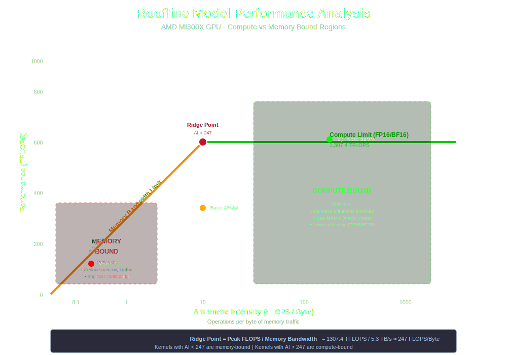
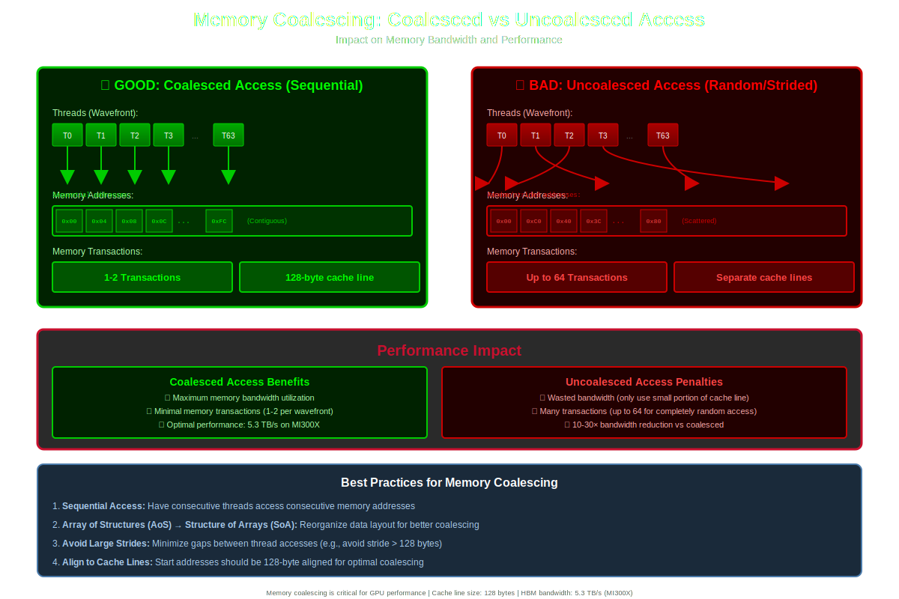

# Performance

Optimization concepts, performance metrics, and analysis techniques for AMD GPUs.

## Memory Bandwidth

The rate at which data can be transferred to/from GPU memory, measured in GB/s or TB/s.

**AMD Instinct GPUs:**
- MI300X: 5.3 TB/s (HBM3)
- MI250X: 3.2 TB/s (HBM2e)
- MI210: 1.6 TB/s (HBM2e)
- MI100: 1.2 TB/s (HBM2)

**Why it matters:**
- Often the primary bottleneck in GPU applications
- Determines achievable FLOPS for memory-bound kernels
- Critical for understanding roofline performance

**Measurement:**
```cpp
// Achieved bandwidth = (bytes_read + bytes_written) / time
```

**Related:** [HBM](#hbm-high-bandwidth-memory), [Memory Coalescing](#memory-coalescing), [Roofline Model](#roofline-model)

## Compute Throughput

The computational performance of the GPU, typically measured in FLOPS (Floating Point Operations Per Second).

**Peak theoretical performance (MI300X):**
- FP64: 163.4 TFLOPS
- FP32: 163.4 TFLOPS
- FP16: 653.7 TFLOPS
- INT8: 1307 TOPS

**Factors affecting achieved performance:**
- Memory bandwidth limitations
- Instruction mix (ALU vs memory operations)
- Occupancy and wavefront scheduling
- Divergence and control flow

**Related:** [Matrix Core Engine](#matrix-core-engine), [Roofline Model](#roofline-model)

## Roofline Model

A visual performance model that shows the achievable performance as a function of arithmetic intensity.



<details>
<summary>View ASCII diagram</summary>

```
Performance (TFLOPS)
     ▲
     │                   ┌─────────────────────
Peak │                  ╱  Compute Bound
FLOPS│                 ╱   (163.4 TFLOPS for MI300X FP64)
     │                ╱
     │               ╱
     │              ╱
     │             ╱  Memory Bound
     │            ╱   (Slope = Memory Bandwidth)
     │           ╱
     │          ╱
     │         ╱
     │        ╱
     │       ╱
     │      ╱
     │─────┴──────────────────────────────────────►
     0                                   Arithmetic Intensity
                                         (FLOPS/Byte)

     Ridge Point = Peak FLOPS / Memory Bandwidth

     If AI < Ridge: Memory Bound → Optimize memory access
     If AI > Ridge: Compute Bound → Optimize ALU usage
```

</details>

**Key concepts:**
- **Arithmetic Intensity**: FLOPS per byte of memory traffic
- **Compute Bound**: Limited by ALU throughput (flat part of roofline)
- **Memory Bound**: Limited by memory bandwidth (sloped part of roofline)

**Formula:**
```
Achievable FLOPS = min(Peak FLOPS, Bandwidth × Arithmetic Intensity)
```

**Usage:**
- Identify performance bottlenecks
- Guide optimization strategy
- Understand if kernel is compute or memory bound

**Related:** [Memory Bandwidth](#memory-bandwidth), [Compute Throughput](#compute-throughput), [rocprofiler-compute](#rocprofiler-compute)

## Occupancy

The ratio of active wavefronts to the maximum supported wavefronts per Compute Unit.

```
Compute Unit Occupancy Example
┌─────────────────────────────────────────────────┐
│  Max: 40 wavefronts per CU (CDNA 3)             │
├─────────────────────────────────────────────────┤
│                                                  │
│  Low Occupancy (25%): 10 wavefronts active      │
│  ┌──┐ ┌──┐ ┌──┐ ┌──┐ ┌──┐                      │
│  │W0│ │W1│ │W2│ │W3│ │W4│  ... (10 total)      │
│  └──┘ └──┘ └──┘ └──┘ └──┘                      │
│  [  Idle  ][  Idle  ][  Idle  ]  ← Wasted!     │
│                                                  │
│  High Occupancy (100%): 40 wavefronts active    │
│  ┌──┐┌──┐┌──┐┌──┐┌──┐┌──┐┌──┐┌──┐             │
│  │W0││W1││W2││W3││W4││W5││W6││W7│ ...          │
│  └──┘└──┘└──┘└──┘└──┘└──┘└──┘└──┘             │
│  ... (40 wavefronts total - fully utilized)     │
│                                                  │
│  Benefits of High Occupancy:                    │
│  • Hides memory latency                         │
│  • Better resource utilization                  │
│  • More wavefronts to schedule                  │
└─────────────────────────────────────────────────┘

Occupancy = Active Wavefronts / Max Wavefronts per CU
```

**Limits:**
- VGPR usage (higher usage = fewer concurrent wavefronts)
- LDS usage (shared among all active workgroups)
- Workgroup size
- Maximum wavefronts per CU (typically 32-40)

**Optimal occupancy:**
- Not always 100% - balance resource usage vs. parallelism
- Higher occupancy helps hide memory latency
- Use occupancy calculator tools

**Related:** [Wavefront](#wavefront), [VGPR](#vgpr-vector-general-purpose-register), [LDS](#lds-local-data-share)

## Latency Hiding

The technique of overlapping memory access latency with computation from other wavefronts.

**Mechanisms:**
- High occupancy (more wavefronts to switch between)
- Independent instruction scheduling
- Async memory operations
- Instruction-level parallelism

**Key principle:** While one wavefront waits for memory, others compute.

**Related:** [Occupancy](#occupancy), [Memory Latency](#memory-latency)

## Memory Latency

The time delay between requesting data from memory and receiving it.

**Typical latencies (cycles):**
- Registers/VGPRs: < 1
- LDS: ~25
- L1 Cache: ~50
- L2 Cache: ~150
- HBM (global memory): ~300-400

**Mitigation strategies:**
- Increase occupancy to hide latency
- Use LDS for frequently accessed data
- Prefetch data when possible
- Optimize memory access patterns

**Related:** [Memory Hierarchy](#memory-hierarchy), [Latency Hiding](#latency-hiding)

## Wave Occupancy

The number of active wavefronts scheduled on a Compute Unit at any given time.

**Measurement:**
```bash
# Using rocprofv3 with PMC counter collection
rocprofv3 --pmc --counter GRBM_GUI_ACTIVE,SQ_WAVES -- ./myapp

# Or collect occupancy-related counters
rocprofv3 --pmc --counter SQ_WAVE_CYCLES,SQ_BUSY_CYCLES -- ./myapp
```

**Impact on performance:**
- Low occupancy → poor latency hiding → memory-bound performance
- High VGPR/LDS usage → fewer concurrent wavefronts
- Small workgroups → wasted CU capacity

**Related:** [Occupancy](#occupancy), [Compute Unit](#compute-unit-cu), [rocprofiler-sdk](#rocprofiler-sdk)

## Memory Coalescing

Combining multiple memory accesses from a wavefront into fewer transactions.



<details>
<summary>View ASCII diagram</summary>

```
Coalesced vs Uncoalesced Memory Access

COALESCED (Good - Sequential):
Wavefront (64 threads):
T0  T1  T2  T3  T4  T5  ... T62 T63
│   │   │   │   │   │       │   │
▼   ▼   ▼   ▼   ▼   ▼       ▼   ▼
┌───┬───┬───┬───┬───┬───┬───┬───┬───┐
│ 0 │ 1 │ 2 │ 3 │ 4 │ 5 │...│62 │63 │  Memory
└───┴───┴───┴───┴───┴───┴───┴───┴───┘
└──────────────────────────────────┘
    1-2 Memory Transactions ✓


UNCOALESCED (Bad - Random/Strided):
Wavefront (64 threads):
T0    T1    T2    T3    T4   ... T63
│     │     │     │     │        │
▼     ▼     ▼     ▼     ▼        ▼
┌───┬───┬───┬───┬───┬───┬───┬───┬───┐
│   │ 0 │   │ 1 │   │ 2 │   │63 │   │  Memory
└───┴───┴───┴───┴───┴───┴───┴───┴───┘
  ▲     ▲     ▲     ▲     ▲      ▲
  │     │     │     │     │      │
  Separate Transactions (up to 64) ✗

Result: 10-30x bandwidth reduction!
```

</details>

**Best practices:**
```cpp
// Good: Sequential access (coalesced)
float val = input[threadIdx.x];

// Bad: Strided access (partially coalesced)
float val = input[threadIdx.x * stride];

// Bad: Random access (uncoalesced)
float val = input[indices[threadIdx.x]];
```

**Impact:**
- Coalesced: 1-2 transactions per wavefront memory access
- Uncoalesced: Up to 64 transactions (one per work-item)
- Can reduce effective bandwidth by 10-30x

**Related:** [Memory Bandwidth](#memory-bandwidth), [Wavefront](#wavefront)

## Arithmetic Intensity

The ratio of arithmetic operations to memory operations, measured in FLOPS/byte.

**Formula:**
```
Arithmetic Intensity = FLOPS / Bytes Transferred
```

**Examples:**
- Vector addition: ~0.125 FLOPS/byte (very low)
- Matrix multiplication (large): ~100+ FLOPS/byte (high)
- Convolution: 10-50 FLOPS/byte (medium-high)

**Importance:**
- Low intensity → memory bound
- High intensity → compute bound
- Guides optimization strategy

**Related:** [Roofline Model](#roofline-model), [Memory Bandwidth](#memory-bandwidth)

## Kernel Fusion

Combining multiple kernels into a single kernel to reduce memory traffic and kernel launch overhead.

**Benefits:**
- Fewer memory roundtrips (write then read intermediate data)
- Reduced kernel launch overhead
- Better cache utilization
- Improved arithmetic intensity

**Example:**
```cpp
// Before: Two kernels
kernel1<<<grid, block>>>(input, temp);
kernel2<<<grid, block>>>(temp, output);

// After: Fused kernel
fusedKernel<<<grid, block>>>(input, output);
```

**Related:** [Memory Bandwidth](#memory-bandwidth), [Kernel](#kernel)

## Concurrent Kernel Execution

Running multiple kernels simultaneously on the same GPU using different Compute Units or Async Compute Engines.

**Requirements:**
- Sufficient free resources (CUs, memory)
- Different streams
- Hardware support (Async Compute Engines)

**Benefits:**
- Better GPU utilization
- Hide small kernel overhead
- Overlap independent work

**Usage:**
```cpp
hipStream_t stream1, stream2;
hipStreamCreate(&stream1);
hipStreamCreate(&stream2);

kernel1<<<grid1, block1, 0, stream1>>>(args1);
kernel2<<<grid2, block2, 0, stream2>>>(args2);
```

**Related:** [Streams](#streams), [Async Compute Engines](#async-compute-engines-ace)

## Bank Conflicts (LDS)

When multiple work-items in a wavefront access different words in the same LDS memory bank, causing serialization.

**LDS organization:**
- Typically 32 banks
- 4-byte words
- Banks assigned round-robin

**Avoiding conflicts:**
```cpp
// Bad: All threads access same bank
__shared__ float data[64];
float val = data[threadIdx.x * 32]; // Conflict!

// Good: Sequential access to different banks
float val = data[threadIdx.x]; // No conflict
```

**Related:** [LDS](#lds-local-data-share), [Performance Optimization](#performance-optimization-strategies)

## Instruction-Level Parallelism (ILP)

Executing multiple independent instructions concurrently within a single thread.

**Techniques:**
- Loop unrolling
- Independent variable computation
- Multiple operations per iteration

**Example:**
```cpp
// Low ILP
for (int i = 0; i < n; i++) {
    sum += data[i];
}

// Higher ILP
for (int i = 0; i < n; i += 4) {
    sum0 += data[i];
    sum1 += data[i+1];
    sum2 += data[i+2];
    sum3 += data[i+3];
}
sum = sum0 + sum1 + sum2 + sum3;
```

**Related:** [Latency Hiding](#latency-hiding), [Optimization](#performance-optimization-strategies)

## Register Pressure

The demand for VGPRs by a kernel, which can limit occupancy if too high.

**Impact:**
- High VGPR usage → fewer active wavefronts per CU
- Compiler may spill to memory (very slow)
- Reduces occupancy and performance

**Management:**
- Reduce variable lifetimes
- Use compiler flags to limit registers
- Manually optimize hot loops

**Check usage:**
```bash
# Compile and check resource usage
hipcc --offload-arch=gfx90a -c kernel.cpp
llvm-objdump --disassemble kernel.o | grep vgpr
```

**Related:** [VGPR](#vgpr-vector-general-purpose-register), [Occupancy](#occupancy)

## Divergence Overhead

Performance cost when threads in a wavefront take different execution paths.

**Causes:**
- Conditional branches (`if/else`)
- Data-dependent loops
- Early thread exit

**Impact:**
- Both paths execute serially
- Effective parallelism reduced
- Can halve performance or worse

**Mitigation:**
```cpp
// Try to structure code to minimize divergence
// Use predication instead of branching when possible
result = condition ? value1 : value2; // Better than if/else
```

**Related:** [Wave Divergence](#wave-divergence), [Wavefront](#wavefront)

## Memory Prefetching

Loading data into cache or LDS before it's needed to hide memory latency.

**Techniques:**
- Manual prefetch to LDS
- Software pipelining
- Compiler-assisted prefetching

**Example (manual LDS prefetch):**
```cpp
__shared__ float tile[TILE_SIZE];

// Prefetch next tile while processing current
tile[lid] = input[nextTileOffset + lid];
__syncthreads();

// Process current tile
// ...
```

**Related:** [LDS](#lds-local-data-share), [Latency Hiding](#latency-hiding)

## Async Copy / DMA

Hardware-accelerated asynchronous data movement between global memory and LDS.

**Benefits:**
- Offload copy operations from compute units
- Overlap data movement with computation
- Reduce VGPR pressure

**Usage (ROCm 5.0+):**
```cpp
// Async copy from global to LDS
__builtin_amdgcn_global_load_lds(...);
```

**Related:** [LDS](#lds-local-data-share), [Memory Bandwidth](#memory-bandwidth)

## Mixed Precision Training

Using lower precision (FP16, BF16, FP8) for some operations to improve performance while maintaining model accuracy.

**Precision types:**
- **FP32**: Standard precision
- **FP16**: Half precision (2x faster, less memory)
- **BF16**: Brain Float 16 (better range than FP16)
- **FP8**: 8-bit float (CDNA 3, 8x faster)

**Typical strategy:**
- Forward/backward pass: FP16/BF16
- Weight updates: FP32
- Activations: Mixed

**Hardware support:**
- MI300X: FP8, BF16, FP16
- MI250X: BF16, FP16
- MI100+: FP16

**Related:** [Matrix Core Engine](#matrix-core-engine), [Deep Learning](#deep-learning-optimization)

## FLOPS Utilization

The percentage of peak theoretical FLOPS achieved by an application.

**Formula:**
```
Utilization = (Achieved FLOPS / Peak FLOPS) × 100%
```

**Typical ranges:**
- Memory-bound kernels: 5-20%
- Compute-bound kernels: 30-60%
- Highly optimized (GEMM): 70-95%

**Improving utilization:**
- Increase arithmetic intensity
- Reduce memory bottlenecks
- Use specialized units (Matrix Cores)
- Optimize for occupancy

**Related:** [Compute Throughput](#compute-throughput), [Roofline Model](#roofline-model)

## Multi-GPU Scaling

Performance improvements from using multiple GPUs together.

**Scaling efficiency:**
```
Efficiency = (Speedup / Number of GPUs) × 100%
```

**Factors affecting scaling:**
- Inter-GPU communication overhead
- Data transfer bandwidth
- Workload parallelizability
- Synchronization frequency

**Technologies:**
- RCCL for collective operations
- Infinity Fabric for high-bandwidth links
- Peer-to-peer memory access

**Related:** [RCCL](#rccl-rocm-communication-collectives-library), [Infinity Fabric](#infinity-fabric)

## Performance Counters

Hardware metrics exposed by AMD GPUs for detailed performance analysis.

**Categories:**
- Wavefront execution metrics
- Memory subsystem (L1, L2, HBM)
- Compute unit utilization
- Instruction mix
- Stalls and bottlenecks

**Access via:**
- [rocprofiler-sdk](https://github.com/ROCm/rocm-systems/tree/develop/projects/rocprofiler-sdk) - Command-line tool and API
- [rocprofiler-compute](https://github.com/ROCm/rocm-systems/tree/develop/projects/rocprofiler-compute) - High-level analysis
- rocprofiler-sdk API for programmatic access

### GFX9 Performance Counters

The following performance counters are available for GFX9 architecture GPUs (Vega, MI50, MI60):

#### ALU and Execution

- **ALUStalledByLDS** - The percentage of GPUTime ALU units are stalled by the LDS input queue being full or the output queue being not ready. If there are LDS bank conflicts, reduce them. Otherwise, try reducing the number of LDS accesses if possible. Value range: 0% (optimal) to 100% (bad).

- **SALUBusy** - The percentage of GPUTime scalar ALU instructions are processed. Value range: 0% (bad) to 100% (optimal).

- **SALUInsts** - The average number of scalar ALU instructions executed per work-item (affected by flow control).

- **VALUBusy** - The percentage of GPUTime vector ALU instructions are processed. Value range: 0% (bad) to 100% (optimal).

- **VALUInsts** - The average number of vector ALU instructions executed per work-item (affected by flow control).

- **VALUUtilization** - The percentage of active vector ALU threads in a wave. A lower number can mean either more thread divergence in a wave or that the work-group size is not a multiple of 64. Value range: 0% (bad), 100% (ideal - no thread divergence).

- **ValuPipeIssueUtil** - Unit: percent

#### Memory Instructions

- **FlatLDSInsts** - The average number of FLAT instructions that read or write to LDS executed per work item (affected by flow control).

- **FlatVMemInsts** - The average number of FLAT instructions that read from or write to the video memory executed per work item (affected by flow control). Includes FLAT instructions that read from or write to scratch.

- **GDSInsts** - The average number of GDS read or GDS write instructions executed per work item (affected by flow control).

- **LDSInsts** - The average number of LDS read or LDS write instructions executed per work item (affected by flow control). Excludes FLAT instructions that read from or write to LDS.

- **SFetchInsts** - The average number of scalar fetch instructions from the video memory executed per work-item (affected by flow control).

- **VFetchInsts** - The average number of vector fetch instructions from the video memory executed per work-item (affected by flow control). Excludes FLAT instructions that fetch from video memory.

- **VWriteInsts** - The average number of vector write instructions to the video memory executed per work-item (affected by flow control). Excludes FLAT instructions that write to video memory.

#### Memory Subsystem

- **L2CacheHit** - The percentage of fetch, write, atomic, and other instructions that hit the data in L2 cache. Value range: 0% (no hit) to 100% (optimal).

- **MemUnitBusy** - The percentage of GPUTime the memory unit is active. The result includes the stall time (MemUnitStalled). This is measured with all extra fetches and writes and any cache or memory effects taken into account. Value range: 0% to 100% (fetch-bound).

- **MemUnitStalled** - The percentage of GPUTime the memory unit is stalled. Try reducing the number or size of fetches and writes if possible. Value range: 0% (optimal) to 100% (bad).

- **MemWrites32B** - The total number of effective 32B write transactions to the memory

- **WriteUnitStalled** - The percentage of GPUTime the Write unit is stalled. Value range: 0% to 100% (bad).

- **FETCH_SIZE** - The total kilobytes fetched from the video memory. This is measured with all extra fetches and any cache or memory effects taken into account.

- **FetchSize** - The total kilobytes fetched from the video memory. This is measured with all extra fetches and any cache or memory effects taken into account.

- **WRITE_SIZE** - The total kilobytes written to the video memory. This is measured with all extra fetches and any cache or memory effects taken into account.

- **WriteSize** - The total kilobytes written to the video memory. This is measured with all extra fetches and any cache or memory effects taken into account.

- **WRITE_REQ_32B** - The total number of 32-byte effective memory writes.

#### Cache Counters (TCC - L2 Cache)

- **TCC_EA_RDREQ** - Number of TCC/EA read requests (either 32-byte or 64-byte)

- **TCC_EA_RDREQ_32B** - Number of 32-byte TCC/EA read requests

- **TCC_EA_RDREQ_32B_sum** - Number of 32-byte TCC/EA read requests. Sum over TCC instances.

- **TCC_EA_RDREQ_sum** - Number of TCC/EA read requests (either 32-byte or 64-byte). Sum over TCC instances.

- **TCC_EA_WRREQ** - Number of transactions (either 32-byte or 64-byte) going over the TC_EA_wrreq interface. Atomics may travel over the same interface and are generally classified as write requests. This does not include probe commands.

- **TCC_EA_WRREQ_64B** - Number of 64-byte transactions going (64-byte write or CMPSWAP) over the TC_EA_wrreq interface.

- **TCC_EA_WRREQ_64B_sum** - Number of 64-byte transactions going (64-byte write or CMPSWAP) over the TC_EA_wrreq interface. Sum over TCC instances.

- **TCC_EA_WRREQ_sum** - Number of transactions (either 32-byte or 64-byte) going over the TC_EA_wrreq interface. Sum over TCC instances.

- **TCC_EA_WRREQ_STALL** - Number of cycles a write request was stalled.

- **TCC_WRREQ_STALL_max** - Number of cycles a write request was stalled. Max over TCC instances.

- **TCC_HIT** - Number of cache hits.

- **TCC_HIT_sum** - Number of cache hits. Sum over TCC instances.

- **TCC_MISS** - Number of cache misses. UC reads count as misses.

- **TCC_MISS_sum** - Number of cache misses. UC reads count as misses. Sum over TCC instances.

#### LDS (Local Data Share)

- **LDSBankConflict** - The percentage of GPUTime LDS is stalled by bank conflicts. Value range: 0% (optimal) to 100% (bad).

- **SQ_LDS_BANK_CONFLICT** - The number of cycles LDS (local data store) is stalled by bank conflicts. This value is returned on a per-SE (aggregate of values in SIMDs in the SE) basis.

- **SQ_WAIT_INST_LDS** - Number of wave-cycles spent waiting for LDS instruction issue. In units of 4 cycles. (per-simd, nondeterministic)

#### SQ (Sequencer) Counters

- **SQ_ACTIVE_INST_VALU** - Number of cycles each wave spends working on a VALU instructions. This value represents the number of cycles each wave spends executing vector ALU instructions. On MI200 platforms, there are 4 VALUs per CU. High values indicates a large amount of time spent executing vector instructions. This value is returned on a per-SE (aggregate of values in SIMDs in the SE) basis with units in quad-cycles(4 cycles).

- **SQ_INSTS_FLAT** - Total number of FLAT instructions issued. When used in combination with SQ_ACTIVE_INST_FLAT (cycle count for executing instructions) the average latency of FLAT instruction execution can be calculated (SQ_ACTIVE_INST_FLAT / SQ_INSTS). This value is returned per-SE (aggregate of values in SIMDs in the SE).

- **SQ_INSTS_FLAT_LDS_ONLY** - Total number of FLAT instructions issued that read/wrote only from/to LDS (scratch memory). Values are only populated if EARLY_TA_DONE is enabled. This value is returned per-SE (aggregate of values in SIMDs in the SE).

- **SQ_INSTS_GDS** - Total number of GDS (global data sync) instructions issued. This value is returned per-SE (aggregate of values in SIMDs in the SE). See AMD ISAs for more information on GDS (global data sync) instructions.

- **SQ_INSTS_LDS** - Total number of LDS instructions issued (including FLAT). This value is returned per-SE (aggregate of values in SIMDs in the SE). See AMD ISAs for more information on LDS instructions.

- **SQ_INSTS_SALU** - Total Number of SALU (Scalar ALU) instructions issued. This value is returned per-SE (aggregate of values in SIMDs in the SE). See AMD ISAs for more information on SALU instructions.

- **SQ_INSTS_SMEM** - Total number of SMEM (Scalar Memory Read) instructions issued. This value is returned per-SE (aggregate of values in SIMDs in the SE). See AMD ISAs for more information on SMEM instructions.

- **SQ_INSTS_VALU** - The number of VALU (Vector ALU) instructions issued. The value is returned per-SE (aggregate of values in SIMDs in the SE). See AMD ISAs for more information on VALU instructions.

- **SQ_INSTS_VMEM_RD** - The number of VMEM (GPU Memory) read instructions issued (including FLAT/scratch memory). The value is returned per-SE (aggregate of values in SIMDs in the SE).

- **SQ_INSTS_VMEM_WR** - The number of VMEM (GPU Memory) write instructions issued (including FLAT/scratch memory). The value is returned per-SE (aggregate of values in SIMDs in the SE).

- **SQ_INST_CYCLES_SALU** - The number of cycles needed to execute non-memory read scalar operations (SALU). This value is returned on a per-SE (aggregate of values in SIMDs in the SE) basis with units in quad-cycles(4 cycles).

- **SQ_THREAD_CYCLES_VALU** - Number of thread-cycles used to execute VALU operations (similar to INST_CYCLES_VALU but multiplied by # of active threads). (per-simd)

#### Wave and Occupancy

- **SQ_WAVES** - Count number of waves sent to distributed sequencers (SQs). This value represents the number of waves that are sent to each SQ. This only counts new waves sent since the start of collection (for dispatch profiling this is the timeframe of kernel execution, for agent profiling it is the timeframe between start_context and read counter data). A sum of all SQ_WAVES values will give the total number of waves started by the application during the collection timeframe. Returns one value per-SE (aggregates of SIMD values).

- **SQ_WAVES_sum** - Gives the total number of waves currently enqueued by the application during the collection timeframe (for dispatch profiling this is the timeframe of kernel execution, for agent profiling it is the timeframe between start_context and read counter data). See SQ_WAVES for more details.

- **Wavefronts** - Total wavefronts.

#### Texture Addressing Unit (TA)

- **TA_BUSY_avr** - TA block is busy. Average over TA instances.

- **TA_BUSY_max** - TA block is busy. Max over TA instances.

- **TA_BUSY_min** - TA block is busy. Min over TA instances.

- **TA_TA_BUSY** - TA block is busy. Perf_Windowing not supported for this counter.

- **TA_FLAT_READ_WAVEFRONTS** - Number of flat opcode reads processed by the TA.

- **TA_FLAT_READ_WAVEFRONTS_sum** - Number of flat opcode reads processed by the TA. Sum over TA instances.

- **TA_FLAT_WRITE_WAVEFRONTS** - Number of flat opcode writes processed by the TA.

- **TA_FLAT_WRITE_WAVEFRONTS_sum** - Number of flat opcode writes processed by the TA. Sum over TA instances.

#### TCP (L1 Vector Cache) Counters

- **TCP_TCP_TA_DATA_STALL_CYCLES** - TCP stalls TA data interface. Now Windowed.

- **TCP_TCP_TA_DATA_STALL_CYCLES_max** - Maximum number of TCP stalls TA data interface.

- **TCP_TCP_TA_DATA_STALL_CYCLES_sum** - Total number of TCP stalls TA data interface.

#### GPU Utilization

- **GPUBusy** - The percentage of time GPU was busy.

- **GPU_UTIL** - Percentage of the time that GUI is active

- **GRBM_GUI_ACTIVE** - The GUI is Active

- **GRBM_COUNT** - Tie High - Count Number of Clocks

#### Hardware Configuration

- **CU_NUM** - Number of Compute Units

- **SE_NUM** - Number of Shader Engines

- **SIMD_NUM** - SIMD Number

- **MAX_WAVE_SIZE** - Max wave size constant

**Related:** [rocprofiler-sdk](#rocprofiler-sdk), [rocprofiler-compute](#rocprofiler-compute)

## rocprofv3

The command-line profiling tool for AMD GPUs that is part of ROCprofiler-SDK, providing low-level tracing and hardware performance counter collection.

**Key capabilities:**
- HIP/HSA API tracing
- Kernel dispatch profiling
- Hardware performance counter (PMC) collection
- Memory copy and allocation tracking
- PC sampling (instruction-level profiling)
- Thread trace (ATT)
- Process attachment for live profiling

**Basic usage:**

```bash
# Setup environment
source /opt/rocm/share/rocprofiler-sdk/setup-env.sh

# Runtime tracing (HIP API + kernels + memory)
rocprofv3 --runtime-trace -- ./myapp

# Collect hardware counters
rocprofv3 --pmc SQ_WAVES,SQ_INSTS_VALU,TCC_HIT -- ./myapp

# System-level tracing (includes HSA)
rocprofv3 --sys-trace -- ./myapp
```

**Common profiling workflows:**

1. **Quick performance overview:**
```bash
rocprofv3 --runtime-trace --summary -- ./myapp
```

2. **Detailed kernel analysis:**
```bash
# List available counters
rocprofv3-avail list --pmc

# Profile with specific counters
rocprofv3 --kernel-trace --pmc SQ_WAVES,TCP_PERF_SEL_TOTAL_CACHE_ACCESSES -- ./myapp
```

3. **Memory transfer analysis:**
```bash
rocprofv3 --memory-copy-trace --memory-allocation-trace -- ./myapp
```

4. **Targeted profiling (specific kernels):**
```bash
# Profile only iterations 10-20 of kernels matching pattern
rocprofv3 --kernel-trace --kernel-iteration-range 10-20 \
  --kernel-include-regex "matmul.*" -- ./myapp
```

**Output formats:**

```bash
# Default: rocpd database (SQLite3)
rocprofv3 --runtime-trace -- ./myapp
# Creates: hostname/pid_results.db

# Multiple formats at once
rocprofv3 --runtime-trace --output-format csv json pftrace otf2 -- ./myapp

# Convert existing rocpd database
rocpd convert -i results.db -f csv pftrace
```

**Advanced features:**

- **PC Sampling (Beta):** Instruction-level hotspot identification
```bash
rocprofv3 --pc-sampling-beta-enabled --pc-sampling-interval 1000 -- ./myapp
```

- **Process Attachment:** Profile running applications
```bash
# Attach to PID and profile for 10 seconds
rocprofv3 --pid 12345 --runtime-trace --attach-duration-msec 10000
```

- **MPI Applications:** Per-rank profiling
```bash
mpirun -n 4 rocprofv3 --runtime-trace --output-format csv -- ./mpi_app
```

- **ROCTx Markers:** Custom code annotations
```bash
rocprofv3 --marker-trace -- ./myapp
```

**Verifying counter compatibility:**

```bash
# Check if counters can be collected together
rocprofv3-avail pmc-check SQ_WAVES SQ_INSTS_VALU TCC_HIT

# List all available features
rocprofv3-avail list
```

**Output analysis:**

```bash
# Query rocpd database directly
sqlite3 hostname/12345_results.db "SELECT * FROM kernel_dispatch;"

# Generate summary statistics
rocprofv3 --runtime-trace --summary-per-domain \
  --summary-groups "KERNEL_DISPATCH|MEMORY_COPY" -- ./myapp

# Convert to Perfetto for visualization
rocpd2pftrace -i results.db -o perfetto_trace
```

**Common options:**
- `--runtime-trace`: HIP API + kernel + memory tracing (recommended)
- `--sys-trace`: System-level tracing (includes HSA API)
- `--pmc <counters>`: Collect hardware performance counters
- `--kernel-trace`: Trace kernel dispatches only
- `--hip-trace`: Trace HIP API calls only
- `--memory-copy-trace`: Trace memory copy operations
- `--output-directory <dir>`: Specify output location
- `--output-format <fmt>`: csv, json, pftrace, otf2, rocpd (default)

**Troubleshooting:**
- **Permission issues:** Ensure access to `/dev/kfd` and GPU devices
- **Counter collection fails:** Use `rocprofv3-avail pmc-check` to verify compatibility
- **Large output files:** Use `--minimum-output-data` to set thresholds
- **ROCm path issues:** Use `--rocm-root` to specify custom installation

**Related:** [Performance Counters](#performance-counters), [rocprofiler-sdk](#rocprofiler-sdk), [rocprofiler-compute](#rocprofiler-compute)

## rocprofiler-compute

A high-level system performance profiling tool for machine learning and HPC workloads running on AMD MI GPUs, providing detailed analysis and visualization of GPU performance.

**Target GPUs:** MI100, MI200, MI300, and MI350 series accelerators

**Key features:**
- Detailed GPU performance analysis with hundreds of metrics
- Web-based interactive dashboard for exploring profiling data
- Workload analysis by memory subsystem, compute pipeline, and dispatch
- Roofline analysis for identifying performance bottlenecks
- Performance comparison across multiple runs
- CSV and database export for custom analysis

**Usage workflow:**

1. **Profile application:**
```bash
# Basic profiling
rocprof-compute profile -d <output_dir> -- <application>

# Profile with specific kernel filtering
rocprof-compute profile --kernel-names <kernel_pattern> -d results -- ./myapp

# Profile with custom metrics
rocprof-compute profile --roof-only -d results -- ./myapp
```

2. **Analyze results:**
```bash
# Launch web interface
rocprof-compute analyze -d <output_dir>

# Export to CSV
rocprof-compute analyze -d <output_dir> --export csv
```

3. **View in browser:**
```
Open browser to http://localhost:8050
Navigate through different analysis panels
```

**Analysis categories:**
- **System Speed-of-Light:** Overall GPU utilization
- **Memory Chart Analysis:** L1, L2, LDS, and HBM metrics
- **Compute Pipeline:** VALU, SALU, MFMA utilization
- **Instruction Mix:** Distribution of instruction types
- **Wavefront Analysis:** Occupancy and scheduling
- **Resource Allocation:** VGPR, SGPR, LDS usage

**Metric groups:**
- Memory hierarchy (L1/L2/HBM bandwidth, hit rates)
- Compute unit utilization
- Instruction mix and throughput
- Wavefront occupancy
- LDS bank conflicts
- Shader engine utilization

**Common use cases:**

1. **Identify memory bottlenecks:**
```bash
rocprof-compute profile --mem-levels 0 1 2 -d results -- ./myapp
rocprof-compute analyze -d results
# Check Memory Chart Analysis panel
```

2. **Analyze compute utilization:**
```bash
rocprof-compute profile --roof-only -d results -- ./myapp
# View roofline chart in web UI
```

3. **Compare multiple runs:**
```bash
rocprof-compute profile -d run1 -- ./myapp_v1
rocprof-compute profile -d run2 -- ./myapp_v2
# Load both in analyze mode for comparison
```

**Configuration options:**
- `--roof-only`: Collect only roofline metrics (faster)
- `--kernel-names <pattern>`: Filter specific kernels
- `--dispatch-range <start:end>`: Profile specific dispatch range
- `--block-size <size>`: Workgroup dimension filter
- `--join-type <type>`: How to combine metrics across dispatches

**Output formats:**
- Interactive web dashboard (default)
- CSV export for spreadsheet analysis
- Database format for programmatic access

**Standalone binary:**
- Self-contained executable (~150 MB)
- Extracts to `/tmp/rocprof_compute_standalonebinary_<pid>`
- No Python installation required
- Requires glibc >= 2.28

**Documentation:** [ROCm Compute Profiler Documentation](https://rocm.docs.amd.com/projects/rocprofiler-compute/en/latest/)

**Related:** [rocprofv3](#rocprofv3), [Roofline Model](#roofline-model), [Performance Counters](#performance-counters)

## rocprof-sys

A comprehensive profiling and tracing tool for parallel applications (CPU and GPU) written in C, C++, Fortran, HIP, OpenCL, and Python.

**Key capabilities:**
- Full-stack profiling (CPU + GPU)
- Dynamic instrumentation without recompilation
- Statistical sampling for low-overhead profiling
- Causal profiling for optimization prediction
- Timeline visualization via Perfetto
- Hardware counter collection

**Data collection modes:**

1. **Dynamic instrumentation:**
```bash
# Runtime instrumentation
rocprof-sys-instrument -- ./myapp

# Binary rewriting (generate instrumented binary)
rocprof-sys-instrument -o myapp.inst -- ./myapp
./myapp.inst
```

2. **Statistical sampling:**
```bash
# Call-stack sampling (low overhead)
rocprof-sys-sample -- ./myapp
```

3. **Process-level sampling:**
```bash
# Background metrics collection
rocprof-sys-run --sample-process -- ./myapp
```

4. **Causal profiling:**
```bash
# Predict speedup from optimizations
rocprof-sys-causal -- ./myapp
```

**Parallelism API support:**
- HIP and HSA (GPU)
- MPI (distributed)
- OpenMP, Pthreads (CPU threading)
- Kokkos-Tools (KokkosP)

**GPU metrics:**
- HIP/HSA API tracing
- Kernel execution timing
- GPU hardware counters
- Memory usage, power, temperature
- PCIe and XGMI metrics

**CPU metrics:**
- Hardware counter sampling
- CPU frequency and utilization
- Memory usage and page faults
- Network and I/O statistics

**Setup:**
```bash
# Option 1: Source setup script
source /opt/rocprofiler-systems/share/rocprofiler-systems/setup-env.sh

# Option 2: Module
module use /opt/rocprofiler-systems/share/modulefiles
module load rocprofiler-systems

# Option 3: Manual
export PATH=/opt/rocprofiler-systems/bin:${PATH}
export LD_LIBRARY_PATH=/opt/rocprofiler-systems/lib:${LD_LIBRARY_PATH}
```

**Configuration:**
```bash
# Generate config file
rocprof-sys-avail -G rocprof-sys.cfg

# Generate verbose config with descriptions
rocprof-sys-avail -G rocprof-sys.cfg --all
```

**Common workflows:**

1. **Quick trace:**
```bash
rocprof-sys-run -- ./myapp
# View perfetto-trace.proto in https://ui.perfetto.dev
```

2. **Detailed instrumentation:**
```bash
rocprof-sys-instrument -M function -ME main -- ./myapp
```

3. **MPI application:**
```bash
mpirun -n 4 rocprof-sys-run -- ./mpi_app
```

**Output analysis:**
- Perfetto traces: Upload to https://ui.perfetto.dev
- Summary statistics in text/JSON
- Flamegraphs for call-stack visualization

**Documentation:** [ROCm Systems Profiler Documentation](https://rocm.docs.amd.com/projects/rocprofiler-systems/en/latest/)

**Related:** [rocprofv3](#rocprofv3), [rocprofiler-compute](#rocprofiler-compute)

## Thread Trace (ATT)

Advanced Thread Trace (ATT) is a shader execution tracing technique that provides near cycle-accurate instruction-level profiling of GPU wavefronts.

**Also known as:** SQTT (SQ Thread Trace)

**Capabilities:**
- Near cycle-accurate instruction tracing
- Exact thread/wave execution path
- Wave scheduling and stall timing analysis
- Instruction and source-level hotspots
- Extremely fast and granular counter collection (AMD Instinct)

**Supported devices:**
- AMD Instinct: MI200 and MI300 series
- AMD Radeon: gfx10, gfx11, and gfx12

**Prerequisites:**
- ROCm 7.x or later with aqlprofile
- ROCprof Trace Decoder library (`/opt/rocm/lib` or custom path)

**Basic usage:**

```bash
# Default thread trace collection
rocprofv3 --att -d <output_dir> -- <application>

# With activity counter streaming (MI series)
rocprofv3 --att --att-activity 8 -- ./myapp

# For Radeon GPUs
rocprofv3 --att --att-simd-select 0x0 -- ./myapp
```

**Key parameters:**

```bash
# Target specific compute unit
rocprofv3 --att --att-target-cu 1 -- ./myapp

# Select shader engines (bitmask)
rocprofv3 --att --att-shader-engine-mask 0x3 -- ./myapp

# Increase buffer size if data is lost
rocprofv3 --att --att-buffer-size 0x10000000 -- ./myapp

# Profile specific kernel iterations
rocprofv3 --att --kernel-iteration-range 10-20 \
  --kernel-include-regex "matmul.*" -- ./myapp

# Multiple consecutive kernel dispatches
rocprofv3 --att --att-consecutive-kernels 5 \
  --kernel-include-regex "my_kernel" -- ./myapp
```

**SIMD selection:**
- gfx9 (MI100, MI200): Bitmask `0xF` for all 4 SIMDs
- Navi/RDNA (Radeon): SIMD_ID `0x0` to `0x3`

**Performance counter streaming (gfx9/MI series only):**

```bash
# Stream SQ counters to trace buffer
rocprofv3 --att --att-perfcounters "SQ_WAVES,SQ_INSTS_VALU" \
  --att-perfcounter-ctrl 8 -- ./myapp

# Shorthand for activity counters (VALU, SALU, etc.)
rocprofv3 --att --att-activity 8 -- ./myapp
```

**Output:**
- Binary trace files (`.att`)
- Decoded trace data
- Statistics CSV
- UI-ready files for ROCprof Compute Viewer

**Profiling workflow:**

1. **Collect trace:**
```bash
rocprofv3 --att --att-activity 8 -d trace_out -- ./myapp
```

2. **Decode (automatic):**
- rocprofv3 automatically decodes using ROCprof Trace Decoder
- Creates human-readable output

3. **Visualize:**
- Use ROCprof Compute Viewer for interactive analysis
- View instruction timing, stalls, and execution flow

**Use cases:**
- Identify instruction-level bottlenecks
- Analyze wave scheduling efficiency
- Debug stalls and serialization
- Optimize instruction mix
- Fine-tune shader performance

**Limitations:**
- Low-level profiling suitable for 1-10 kernel dispatches
- Large trace files for long-running kernels
- May impact application performance during collection

**Tips:**
- Start with small kernel iteration ranges
- Use `--kernel-include-regex` to target specific kernels
- Increase `--att-buffer-size` if seeing "Data Lost" warnings
- Lower `--att-perfcounter-ctrl` value if streaming causes data loss

**Related:** [rocprofv3](#rocprofv3), [Wavefront](#wavefront), [Performance Counters](#performance-counters)

## ROCprof Compute Viewer

Web-based interactive visualization tool for thread trace data collected from AMD GPUs.

**Purpose:** Visualize and analyze instruction-level profiling data from Thread Trace (ATT)

**Features:**
- Interactive timeline view of wave execution
- Instruction-level timing and stall analysis
- Wave scheduling visualization
- Performance counter overlays
- Source code correlation
- Hotspot identification

**Access:**
- Integrated with rocprofiler-compute web interface
- Standalone viewer for `.att` trace files
- Browser-based (no installation required)

**Usage workflow:**

1. **Collect thread trace data:**
```bash
rocprofv3 --att --att-activity 8 -d trace_results -- ./myapp
```

2. **Launch viewer:**
```bash
rocprof-compute analyze -d trace_results
# Opens web interface at http://localhost:8050
```

3. **Navigate UI:**
- Timeline view: See wave execution over time
- Instruction view: Examine individual instructions
- Stall analysis: Identify where waves are waiting
- Counter view: Overlay performance metrics

**Visualization capabilities:**
- **Timeline:** Wave lifecycle from launch to completion
- **Instruction trace:** Every instruction executed by traced waves
- **Stalls:** Visual indicators of LDS, VMEM, ALU stalls
- **Occupancy:** Wave scheduling density
- **Performance counters:** SQ metrics overlaid on timeline

**Analysis features:**
- Zoom and pan through instruction-level timeline
- Filter by wave ID, SIMD, or compute unit
- Compare multiple kernel dispatches
- Identify serialization and divergence
- Source code mapping (when debug info available)

**Typical analysis workflow:**

1. **Overview:** Identify problem areas in timeline
2. **Drill down:** Zoom into specific wave execution
3. **Instruction analysis:** Find hot instructions
4. **Stall identification:** Determine bottleneck type
5. **Optimization:** Apply fixes and re-profile

**Browser requirements:**
- Modern web browser (Chrome, Firefox, Edge)
- JavaScript enabled
- Sufficient memory for large traces

**Performance tips:**
- Limit trace to specific kernels to reduce data size
- Use kernel iteration ranges for targeted profiling
- Close other browser tabs when viewing large traces

**Related:** [Thread Trace](#thread-trace-att), [rocprofv3](#rocprofv3), [rocprofiler-compute](#rocprofiler-compute)

## Profiling and Analysis

The process of measuring and understanding GPU application performance.

**Tools:**
1. **[rocprofiler-sdk](https://github.com/ROCm/rocm-systems/tree/develop/projects/rocprofiler-sdk)**: Low-level profiling, hardware counters, API tracing
2. **[rocprofiler-compute](https://github.com/ROCm/rocm-systems/tree/develop/projects/rocprofiler-compute)**: High-level analysis with web UI
3. **Manual timing**: Using HIP events

**Methodology:**
1. Identify hotspots (most time-consuming kernels)
2. Analyze bottlenecks (compute vs memory bound)
3. Check occupancy and resource usage
4. Optimize critical kernels
5. Measure improvement

**Related:** [rocprofiler-sdk](#rocprofiler-sdk), [rocprofiler-compute](#rocprofiler-compute)

## Performance Optimization Strategies

High-level approaches to improving GPU application performance.

**Common strategies:**

1. **Memory optimization**
   - Coalesce memory accesses
   - Use LDS for frequently accessed data
   - Minimize global memory traffic
   - Prefetch data

2. **Compute optimization**
   - Maximize occupancy
   - Reduce divergence
   - Use appropriate precision (FP16/BF16)
   - Leverage Matrix Cores for GEMM

3. **Algorithmic optimization**
   - Kernel fusion
   - Tiling/blocking
   - Increase arithmetic intensity
   - Overlap computation and communication

4. **Launch configuration**
   - Tune workgroup size
   - Balance CU utilization
   - Use streams for concurrency

**Related:** [Roofline Model](#roofline-model), [Profiling](#profiling-and-analysis)
